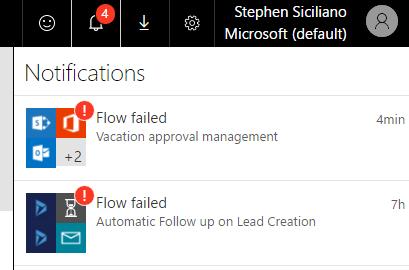
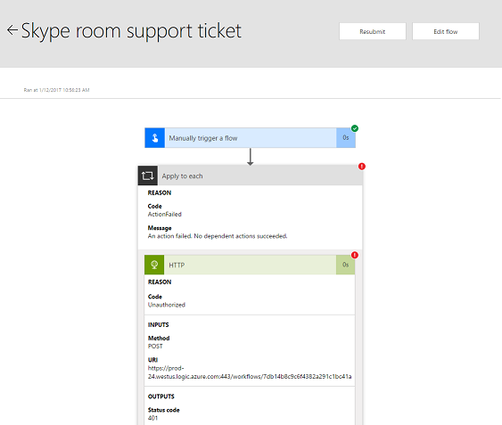

# Troubleshooting a flow
## Identify the error
Before you can fix a flow, you must identify why it failed. Click or tap the notifications icon at the top of the web portal (or open the **Activity** tab in the mobile app), and then click or tap your flow in the list that appears.

Details about the flow appear, and at least one step shows a red exclamation icon. Open that step, and review the error message.

## Authentication failures
In many cases, flows fail because of an authentication error. If you have this type of error, the error message contains **Unauthorized** or an error code of **401** or **403** appears. You can usually fix an authentication error by updating the connection:

1. At the top of the web portal, click or tap the gear icon to open the  **Settings** menu, and then click or tap **Connections**.
2. Scroll to the connection for which you saw the **Unauthorized** error message.
3. Next to the connection, click or tap the **Verify password** link in the message about the connection not being authenticated.
4. Verify your credentials by following the instructions that appear, return to your flow-run failure, and then click or tap **Resubmit**.
   
    The flow should now run as expected.

## Action configuration
Flows also fail if a setting in an action of the flow doesn't function as expected. In this case, the error message contains **Bad request** or **Not found**, or an error code of **400** or **404** appears.

The error message should specify how to correct the failure. You'll need to click or tap the **Edit** button and then correct the problem inside the flow definition. Save the updated flow, and then click or tap **Resubmit** to try the run again with the updated configuration.

## Other failures
If the error code **500** or **502** appears, the failure is temporary or transient. Click or tap **Resubmit** to try the flow again.

If you encounter some other problem, [please ask our community](https://go.microsoft.com/fwlink/?LinkID=787467) because others may have encountered a similar problem.

