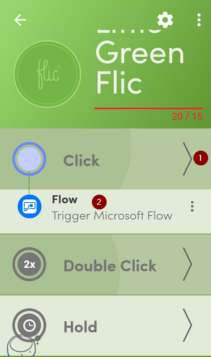
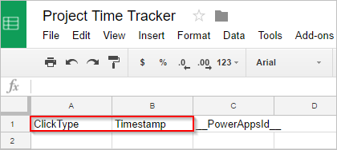
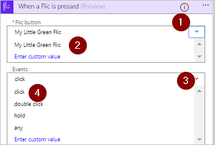
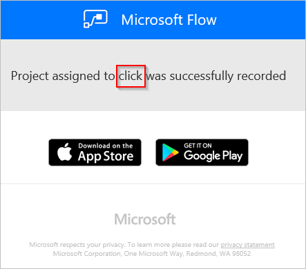

<properties
    pageTitle="Start button flows with physical buttons from Flic by Shortcut Labs.| Microsoft Flow"
    description="Easily start button flows with physical buttons from Flic by Shortcut Labs."
    services=""
    suite="flow"
    documentationCenter="na"
    authors="msftman"
    manager="anneta"
    editor=""
    tags=""/>

<tags
   ms.service="flow"
   ms.devlang="na"
   ms.topic="article"
   ms.tgt_pltfrm="na"
   ms.workload="na"
   ms.date="04/30/2017"
   ms.author="deonhe"/>

# Run your flows with buttons from Flic by Shortcut Labs

Microsoft Flow has partnered with [Flic by Shortcut Labs](https://flic.io/) (bttn), one of the leading physical button manufacturers. With this partnership, you can trigger your flows by touching a physical button. For example, you can press a flic to track your working hours, block your calendar, count visitors and guests at an event, or save geographical locations.

>[AZURE.IMPORTANT]Configure all Flic properties by using Flic's mobile app for [Android](https://play.google.com/store/apps/details?id=io.flic.app) or [iOS](https://itunes.apple.com/us/app/flic-app/id977593793?ls=1&mt=8) before you create your flow.

Microsoft Flow also partners with [Bttn by The Button Corporation](./bttn-button-flows.md), another leading manufacturer that allows you to run your flows with a bttn.

## Prerequisites

To use Flics with Microsoft Flow, you must have:

- Access to [Microsoft Flow](https://flow.microsoft.com).

- Downloaded Flic's [Android](https://play.google.com/store/apps/details?id=io.flic.app) or [iOS](https://itunes.apple.com/us/app/flic-app/id977593793?ls=1&mt=8) mobile app, and used it to pair one or more Flics.

## Configure Flic properties

Use Flic's mobile app to program the Flic's events. The events are click (single quick press), double-click (two quick presses), and hold (long press). This screenshot shows a sample of what your Flic configuration process might be like:

After you've configured the properties for a Flic, you can select your Flics as triggers for your flows. You will see how to do this later in this document.

## Create a flow that's triggered by a Flic

In this walkthrough, we use a Flic to run a flow that records the amount of time a consultant spends at each client. The consultant pushes the Flic once upon arrival, and then pushes it again, just before departure from a client. Each push starts a run of the flow to which it's connected. The flow saves the current time in Google Sheets, and then sends an email notification that contains details about the flow run.

Note: Be sure you've used the Flic mobile app to pair, and configure at least one Flic's **click** action to trigger Microsoft Flow. In this screenshot, I've configured the **click** action to trigger Microsoft Flow. Later in this walkthrough we configure our flow to trigger when the Flic is pressed once (clicked).

     

Let's get started creating our flow.

### Start with a template

1. Go to [Microsoft Flow](https://flow.microsoft.com), select **Sign in**, and then provide your credentials.

     

1. Enter **flic** into the search box, and then select the search icon.

     

1. Select the **Track your working hours with Flic smart button** template.

     

### Create a Google Sheet

1. Review the template's details and note that this template requires a Google Sheet.

   

1. Create a Google Sheet with two columns named **ClickType** and **Timestamp**.

      Tip: You name columns in Google Sheets by entering the column name at the top of the column. So, your Google Sheet should appear like this screenshot:

   

   Note: You will use this Google Sheet later in this walkthrough.

### Add the Flic trigger to your flow

1. Provide your credentials for the services that your selected template uses, and then select **Continue**.

     **Continue** is enabled after you sign into all required services for the template.

     

1. Enter **flic** into the search box, and then select the **Flic - When a Flic is pressed** trigger.

     

1. Select the Flic you want to use from the **Flic button** list on the **Flic - When a Flic is pressed** card.

1. Select **click** from the **Events** list to indicate that you want to trigger the flow  when the Flic is pressed once.

     

   Optionally, you can select **any** to indicate that each Flic event (click, double-click, or hold) triggers the flow. **Double-click** indicates that the flow triggers when the Flic is quickly pressed two times. **Hold** indicates that a long press on the Flic triggers the flow. You're free to create other flows and trigger them using the other events in the **Events** list. For example, you can use the **click** event to record the time you arrive at a client, and the **double-click** event to record the time you leave a client.

### Configure the Google Sheet settings

   On the **Insert row** card:

1. Select the Google Sheet you created earlier from the **File** list.

1. Select the worksheet from the **Worksheet** list.

   Note: Two boxes will appear on the **Insert row** card after you select the worksheet. These boxes represent each of the two columns in the Google Sheet you created earlier.

1. Select the **ClickType** box, and then select the **Click type** token.

1. Select the **Timestamp** box, and then select the **Click time** token.

     

### Confirm the email settings are correct

1. Confirm the **Send me an email notification** card looks like this screenshot.

     

### Save your flow and test it

1. Give your flow a name, and then save your flow.

     

If you've followed along, pressing the Flic once triggers the flow. The flow then records the click type and the current time in the Google Sheet, and then sends an email to you.

1. Press your Flic once.

1. Open your Google sheet. You should see the **ClickType** and the **Timestamp** columns populated with the "click" and the time, respectively.

     

1. You can also see the results of the run from the Microsoft Flow website or the Microsoft Flow mobile app. Here's a screenshot of my test run.

     

1. Here's what the body of the notification email looks like.

     

For extra credit, consider extending the flow to automatically record your location (latitude and longitude) when the Flic is pressed.

## More information

- Use [bttns](./bttn-button-flows.md) to trigger flows.
- [Share button flows](./share-buttons.md).
- Learn to use [button trigger tokens](./introduction-to-button-trigger-tokens.md) to send current data when your button flows are executed.
- [Install the Flow app for Android](https://play.google.com/store/apps/details?id=com.microsoft.flow).
- [Install the Flow app for iOS](https://appsto.re/us/5M0qbb.i).
