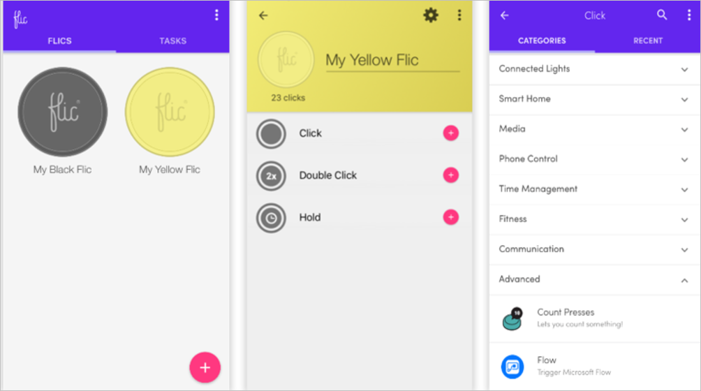
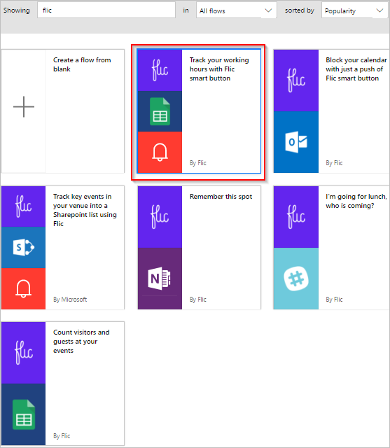

<properties
    pageTitle="Start button flows with physical buttons from Flic by Shortcut Labs.| Microsoft Flow"
    description="Start button flows with physical buttons from Flic by Shortcut Labs."
    services=""
    suite="flow"
    documentationCenter="na"
    authors="msftman"
    manager="anneta"
    editor=""
    tags=""/>

<tags
   ms.service="flow"
   ms.devlang="na"
   ms.topic="article"
   ms.tgt_pltfrm="na"
   ms.workload="na"
   ms.date="04/24/2017"
   ms.author="deonhe"/>

# Start button flows with physical buttons

It's easy to trigger Microsoft Flow buttons from the Microsoft Flow mobile app on [Android](https://aka.ms/flowmobiledocsandroid) and [iOS](https://aka.ms/flowmobiledocsios), or from [Microsoft Flow](https://flow.microsoft.com).

We've now added new triggers that allow you to create flows that can be triggered by touching a physical button. That's right, you can call your helpdesk, send an email to your team, block your calendar, or reorder supplies by pressing a physical button that executes a flow. Currently, Microsoft Flow partners with [Bttn by The Button Corporation](https://my.bt.tn/) (bttn) and [Flic by Shortcut Labs](https://flic.io/) (flic), two of the leading physical button manufacturers. Visit their websites to learn more about their products, and then integrate your physical buttons with your button flows.

## Prerequisites

To use physical buttons with Microsoft Flow, you must have:

- Access to [Microsoft Flow](https://flow.microsoft.com).

- Access to [bttn](https://my.bt.tn/) or [Flic](https://flic.io/).

- [Registered](https://my.bt.tn/) one or more bttns on bttn's website, or

- Paired one or more Flic buttons by using Flic's [Android](https://play.google.com/store/apps/details?id=io.flic.app) or [iOS](https://itunes.apple.com/us/app/flic-app/id977593793?ls=1&mt=8) mobile app.

## Use Flic physical buttons in a flow

In this walkthrough, we use a [Flic by Shortcut Labs](https://flic.io/) (Flic) physical button to track the amount of time a consultant spends at each client. The consultant will need to push the button when she arrives, and then when she leaves a client. The flow gets triggered with each push of the button, and then saves the time information in Google Sheets. ******************

Note: While we use a preconfigured template in this walk-through, you are free to use the blank template, which gives you full control over all aspects of your flow.

## Configure Flic button properties

Configure all Flic button properties by using Flic's mobile app for [Android](https://play.google.com/store/apps/details?id=io.flic.app) or [iOS](https://itunes.apple.com/us/app/flic-app/id977593793?ls=1&mt=8) before you create your flow.

You can program Flic buttons for clicks, double-clicks, and hold. This screenshot shows a sample of what your Flic configuration process might be like:

Ater you've configured the properties for a Flic button, you can access your registered Flics by signing into the Flic service through [Microsoft Flow](https://flow.microsoft.com).

## Create a flow that uses Flic buttons

Now that you've registered and configured your Flic, let's get started creating our flow.

1. Sign into [Microsoft Flow](https://flow.microsoft.com).

     

1. Enter **flic** into the search box, and then select the search icon.

     

1. Select the **Track your working hours with Flic smart button** template.

     

1. Review the template's details, and then create a Google Sheet with a **ClickType** column, and a **Timestamp** column.

   

     You will use this Google Sheet later in this walkthrough.

    You name columns in Google Sheets by entering the column name at the top of the column. So, your Google Sheet should appear like this:

    

1. Provide your credentials for the services that your selected template uses, and then select **Continue**.

     **Continue** is enabled after you sign into all required services for the template.

     

1. Enter **flic** into the search box, and then select the **Flic - When a Flic is pressed** trigger.

     

1. Select the Flic you want to use in the flow from the **Flic button** list on the **Flic - When a Flic is pressed** card.

     

   On the **Insert row** card:

1. Select the Google Sheet you created earlier from the **File** list.

1. Select the worksheet from the **Worksheet** list.

   Note: Two boxes will appear on the **Insert row** card after you select the worksheet. These boxes represent each of the two columns in the Google Sheet you created earlier.

1. Select the **ClickType** box, and then enter select the **Click type** token.

1. Select the **Timestamp** box, and then enter select the **Click time** token.

     

1. Confirm that the **Send me an email notification** card looks like this screenshot.

     

Congrats, you've configure your Flic successfully.

For extra credit, consider extending the flow to automatically record your location (latitude and longitude) when the Flic button is pressed.

## More information

- [Share button flows](./share-buttons.md)
- Learn to use [button trigger tokens](./introduction-to-button-trigger-tokens.md) to send real-time data when your button flows are executed
- [Install the Flow app for Android](https://play.google.com/store/apps/details?id=com.microsoft.flow)
- [Install the Flow app for iOS](https://appsto.re/us/5M0qbb.i)
