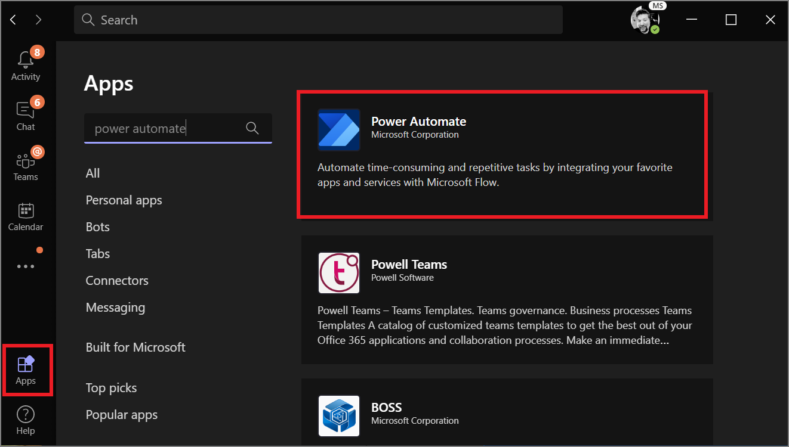
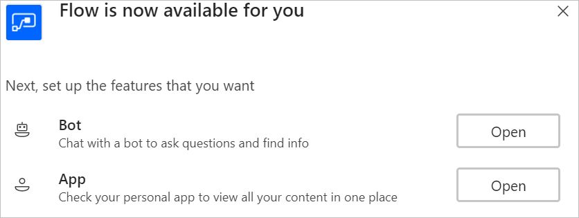
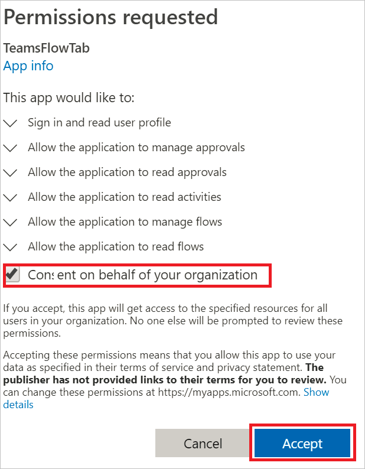
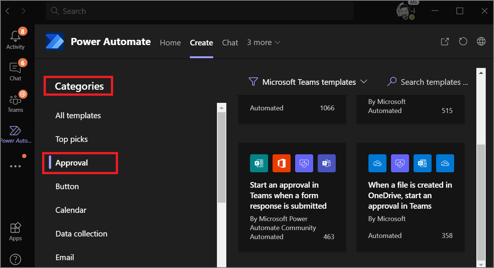
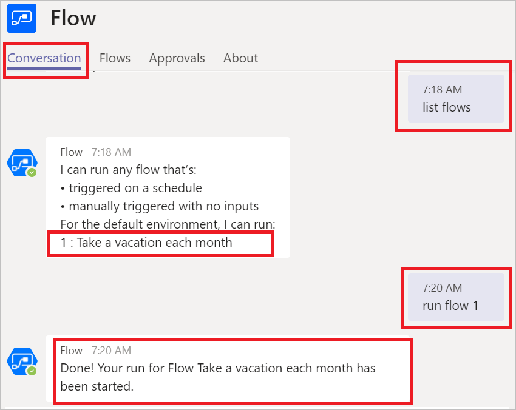

# Power Automate in Teams
[!INCLUDE [view-pending-approvals](includes/cc-rebrand.md)]

### Prerequisites

1. Access to Microsoft Teams.
1. Access to Power Automate.

## Install the Power Automate app in Teams

Follow these steps to install the Power Automate app in Microsoft Teams.

1. Sign in to Microsoft Teams.

1. Tap the **Apps** icon at the lower left of the Teams navigation bar.

    

1. Select the **Flow** app. You might need to search for **Flow** if you don't see it.

    

1. Select **Install**.

    

1. Power Automate is now installed.

    


## Create a flow in Teams

1. Sign in to Microsoft Teams.

1. Select the **More added apps** link (...) on the navigation bar and then select the **Flow** app.

    

1. If you haven't done so before, you might need to sign in and grant permissions.

    


    Notice the following tabs:

    

    Name|Purpose
    ----|-----|
    Conversation|Interact with the Flow bot.
    Flows|Create and manage flows.
    Approvals|Lists received and sent approval requests.
    About|Displays version and other information about Power Automate.


    You now see all flows you've created from the Power Automate designer (if any). 

    You can also create flows from a custom template or from a blank template, just like you do from the Power Automate designer. 

## Manage approvals

You can manage [approvals](modern-approvals.md) in Microsoft Teams, just like you would do in Power Automate. Follow these steps to manage your approvals:

1. Sign in to Microsoft Teams.
1. Select the **Approvals** tab.

    

    You'll notice the following subtabs:

    Tab|Purpose
    ----|-----|
    Received|Lists approval requests you've received and are pending action from you.
    Sent|Lists approval requests you've sent and are pending action from others.
    History|Lists received and sent approval requests.
    Create approval flow|Create approval flows.

1. Select the **Received**, **Sent**, or **History** tabs to learn more.

    

1. Select **Create approval flow** to create an approval flow.

    

## Use the bot with flows

### List and launch flows with the bot

> [!TIP]
> The bot lists and runs flows that are triggered by a schedule, or manually triggered without user input.

1. Sign in to Microsoft Teams.
1. Select the **More added apps** link (...) on the navigation bar and then select the **Flow** app.

    
    
1. Select the **Conversation** tab.

    

On the **Conversation** tab, you can send commands to the bot, which responds by performing the actions you command it to run. For example, to list your flows and run the flow with index 1, run the following commands:

- ```List flows``` - The bot displays a list of your flows, prefixed by an index number.
- ```Run flow 1``` - Runs flow number 1. Here, *1* is the index number of the flow you want to run.

   

### Get the description for flows

To get the description for the flow with index 1 from your list of flows, run ```describe flow 1```. The bot response will be similar to this image:

   

### Get the list of commands for the bot

To get the list of commands the bot handles, ask it with this command: ```learn more``` 

The bot response will be similar to this image:

 
