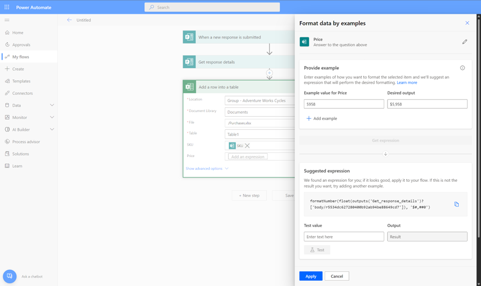
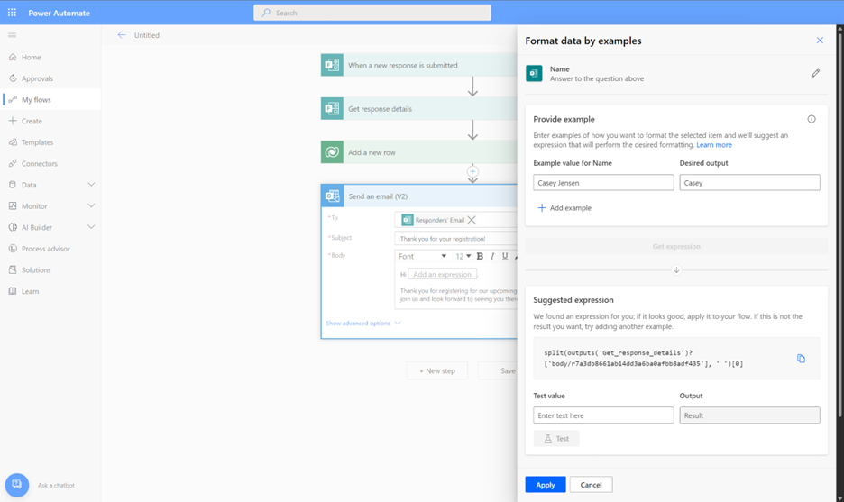

# Format data by examples (preview)

[This article is pre-release documentation and is subject to change.]

[Expressions](./use-expressions-in-conditions.md) in Power Automate is a powerful way to perform operations over data. You can use the *Format data by examples* feature to access these expressions without knowing the different functions and corresponding syntax that's needed to create the expressions that you want. To format text, dates, and numbers, you can just provide examples of the output format that you want the flow to produce, and Power Automate will automatically generate the expression formula to use.

> [!IMPORTANT]
>
> - This is a preview feature.
> - [!INCLUDE[cc_preview_features_definition](includes/cc-preview-features-definition.md)]

## Format dates by examples

In this sample scenario, imagine that there's a Microsoft list with products that you've purchased. You want to send an email whenever the list gets updated with new products. By default, the SharePoint formats dates like this: *2022-09-18*, but you'd like it to display as *September 18* in the email notification message. Let’s see how to change the format of the date with format data by examples.

1. Edit your flow in the Power Automate designer.
1. Select the action into which you want to insert the formatted date, and then select any text field on the card.
1. On the window that opens, select **Expression** > **Format data by examples**.

   

   A list displays all items in your flow that can be formatted.

1. Select the item that you want to transform.
1. Provide an example of the original data for the item that you've selected in the previous step.

   >[!TIP]
   >You can go to the original data source or review a previous flow run to copy an example value for the previous step.

1. Provide a sample of how you’d like the flow to transform the example.  

    

1. Select **Get expression**.

   Power Automate displays the expression that it recommends that you use to get the output you want. You can test it with another value to confirm that the expression does what you expect.

   >[!TIP]
   >If the expression that Power Automate recommends isn't what you expect, you can add more examples to refine the expression that it recommends.

   

1. Select **Apply** when the results of the expression match your expectations.

   Power Automate adds the expression to the flow.

Congratulations! You’ve built an expression by providing an example.  

## Format numbers by examples

In this example, imagine you have a number that comes from a Microsoft Forms survey as 5958. You want to format the number as a currency value before you store it in an Excel file, like this $5,958. To direct your flow to format the number as a currency value, provide an example of how Microsoft Forms returns the number and an example of how you want your flow to format the number. Power Automate uses the information you provide and then it suggests the expression that does the transformation, as the following screenshot displays.

## Format text by examples

In the following scenario, imagine you have a registration form in which participants provide their full name and you want to send a registration confirmation email with just the first name. Instead of greeting the person by their full name, for example Casey Jensen, we just want to say Casey. Just provide an example and Power Automate suggests the right expression to achieve this transformation, as the following screenshot displays.

## Limitations

- Format data by examples can format one text, number, or date at a time. More complex structures like arrays aren't supported.
- Format data by examples isn't available in environments based in South Africa, GCC, GCC High, and DoD.

### See also

[PROSE](https://www.microsoft.com/research/project/prose-framework/), a technology that enables programming by example, powers format data by examples.
