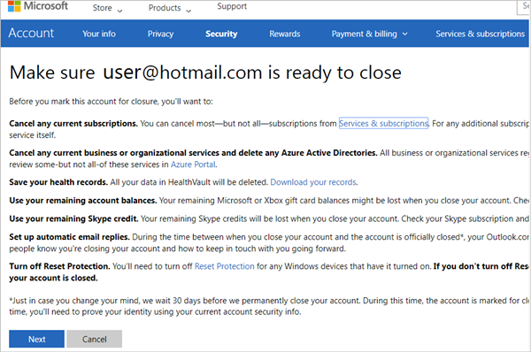

# Responding to GDPR Data Subject Account Close Requests for Power Automate
[!INCLUDE [view-pending-approvals](includes/cc-rebrand.md)]

The **right to erasure** of personal data is a key protection in the GDPR. This right includes removing all personal data except audit log information. When users decide to close their Microsoft Account (MSA), the user's underlying data is also deleted.

These resources contain personal data that are automatically deleted when a user closes an MSA:

|Resources containing personal data|
|------|
|Product and service activity|
|Run history|
|Flows|
|Activity Feed|
|User details|
|Connections|

## Account Close requests

These steps describe how to self-serve Account Close requests for GDPR.

1. Sign into the [Microsoft Account Close Portal](https://go.microsoft.com/fwlink/?LinkId=523898) using your Microsoft Account, and then select **Next**.

    > [!NOTE]
    > You're reminded to cancel existing subscriptions or to export data from existing services to which you may have subscribed.
    >
    >

    

1. Acknowledge that you understand the impact of closing your MSA, and then select **Mark account for closure**.

    A notification appears, indicating that your account will be closed in 30 days. You may reopen this account at any time during this 30-day period.

    

    At the end of this 30-day window, the process to delete all Power Automate resources for this MSA begins.

## Learn more

* Get started with [Power Automate](getting-started.md)
* Learn [what's new](release-notes.md) with Power Automate
