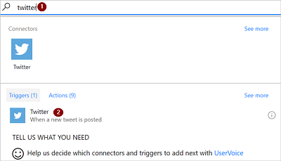
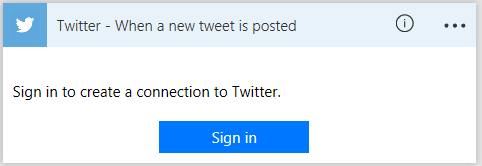
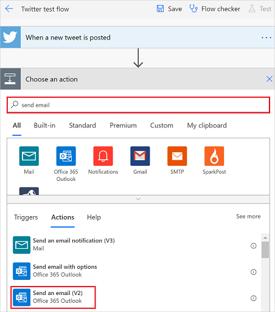
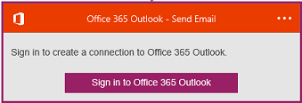
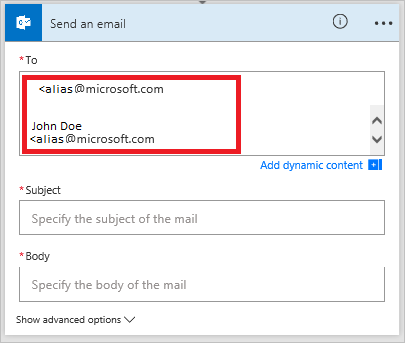
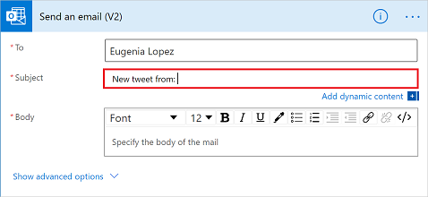

<properties
    pageTitle="Automate tasks by creating a flow | Microsoft Flow"
    description="Create a flow to automatically perform one or more actions, such as sending mail, when events occur, such as someone adding a row to a SharePoint list."
    services=""
    suite="flow"
    documentationCenter="na"
    authors="aftowen"
    manager="dwrede"
    editor=""
    tags=""
 />
<tags
    ms.service="flow"
    ms.devlang="na"
    ms.topic="get-started-article"
    ms.tgt_pltfrm="na"
    ms.workload="na"
   ms.date="04/24/2016"
    ms.author="anneta"/>

# Create a flow in Microsoft Flow#

[AZURE.VIDEO nb:cid:UUID:b95d313a-0d00-80c4-bb62-f1e5920004d6]

Create a flow to perform one or more tasks automatically when you want an event to kick off an action. For example, create a flow that notifies you by mail as soon as someone sends a tweet that contains a keyword you specify. In this example, sending a tweet is the event, and sending mail is the action.

**Prerequisites**

- An account on [flow.microsoft.com](https://flow.microsoft.com)
- An Twitter account
- Office 365 credentials

## Specify an event

First, you will need to select what starting action, or *trigger*, will start your flow.

1. In [flow.microsoft.com](https://flow.microsoft.com), select **My Flows** in the top navigation bar, and then select **Create new flow**.

	

1. In the box that says **How would you like to start?**, type or paste **Twitter**, and then select **Twitter - When a new tweet appears**.

	

5. If you haven't already connected your Twitter account to Microsoft Flow, select **Sign in to Twitter**, and then provide your credentials.

    

6. In the **Query text** box, type the keyword that you want to find.

	

## Specify an action ##
1. Under the event that you created in the previous procedure, select the "+" button.

	

2. Select **Add an action**.

3. In the box that shows **What would you like to do next?**, type or paste **send email**, and then select **Office 365 Outlook - Send Email**.

	

4. If prompted, select the sign-in button, and then provide your credentials.

	

5. In the form that appears, type or paste your email address in the **To** box.

	

1. In the **Subject** box, type or paste **New tweet from:**, type a space, and then select the **Tweeted by** parameter to add a placeholder for it.

	

1. In the **Body** box, select the **Tweet text** parameter to add a placeholder for it, and then type the end of your message, including any other parameters you want to include.

1.  Near the bottom of the screen, name your flow, and then select **Create Flow**.

	

1. Finally, you can select **Done**, and the list of your flows will reflect your changes.

1. Send a tweet with the keyword that you indicated.

	Within a minute, an email message notifies you of the new tweet.

## Manage a flow ##
1. In [flow.microsoft.com](https://flow.microsoft.com), select **My Flows** in the top navigation bar.

2. In the list of flows, do any of the following:

	- To pause your flow, select the icon that looks like a pause button next to the flow that you want to pause.

	

	- To resume a flow, select the icon that looks like a play button next to the flow that you want to resume.  

	  

	- To change a flow, select the icon that looks like a pencil next to the flow that you want to change.  

	  

	- To delete a flow, select the icon that looks like a trash can next to the flow that you want to delete, and then select **OK**.
	
	  
		
Note that you can only have up to **25** different flows in your account. If you already have 25, you will need to delete one to create another.

## Next steps ##

- [Add steps](multi-step-logic-flow.md), such as different ways to be notified, to your flow.

- [Run tasks on a schedule](run-tasks-on-a-schedule.md), when you want an action to occur every day, on a certain date, or after a certain number of minutes.

- [Add a flow to an app](https://powerapps.microsoft.com/en-us/tutorials/using-logic-flows/) to allow your app to kick off logic in the cloud.
