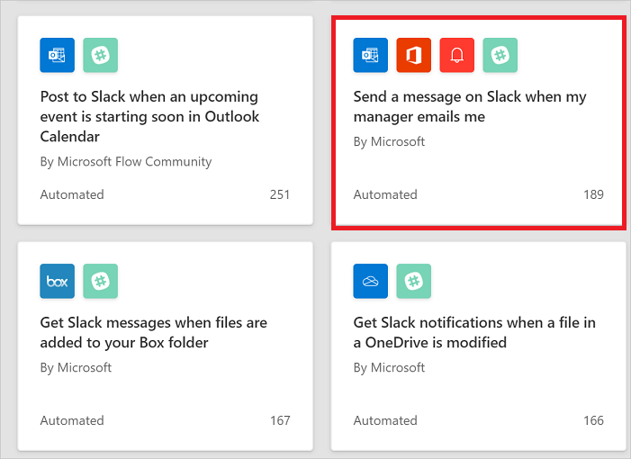
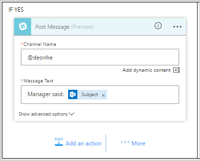

<properties
    pageTitle="Create a flow from a template | Microsoft Flow"
    description="Create a flow from any of several built-in templates."
    services=""
    suite="flow"
    documentationCenter="na"
    authors="aftowen"
    manager="erikre"
    editor=""
    tags=""
 />

<tags
  ms.service="flow"
    ms.devlang="na"
    ms.topic="article"
    ms.tgt_pltfrm="na"
    ms.workload="na"
   ms.date="04/23/2016"
   ms.author="anneta"/>

# Create a flow from a template in Microsoft Flow #
Create a flow from one of many built-in templates that can, for example, send you a Slack message when your manager sends you an email in Office 365.

**Note:** [Create a flow from scratch](https://flow.microsoft.com/documentation/get-started-logic-flow/) if you already have a process in mind and can't find a template for it.

**Prerequisites**

- An account on [flow.microsoft.com](https://flow.microsoft.com)
- A Slack account
- Office 365 credentials

## Choose a template

1. In [flow.microsoft.com](https://flow.microsoft.com), select **Browse** in the top navigation bar, and then search for a template, such as by typing **Slack**.

1. You'll see only templates related to Slack, so you can now select **Send a message on Slack when my manager emails me**.

	

1. If prompted, connect to Office, Slack, or both by selecting **Add new connection** in the drop-down list for each connection and then following the prompts.

	

1. Select **Open flow**.

	Your flow appears, showing each action with a orange or blue title bar.

	

## Customize your flow ##
1. Select the title bar for an event to expand it, and then customize it (for example, by specifying a filter on the email that interests you).

1. Actions that require input from you will automatically be expanded.

	For example, the **Post message** action is expanded because you need to enter a channel, such as your *@username*. You can also customize the message content. By default, the message will contain just the subject, but you can include other information.

	

1. Near the bottom of the screen, specify a name for your flow, and then select **Create Flow**.

1. Finally, if you're happy with your flow, select **Done**.

	

Now, when your manager sends you an email, you'll receive a Slack message that contains the information that you specified.

## Next steps ##
- [Watch your flow in action](https://flow.microsoft.com/documentation/see-a-flow-run/)
- [Publish your own template](https://flow.microsoft.com/documentation/publish-a-template/)
