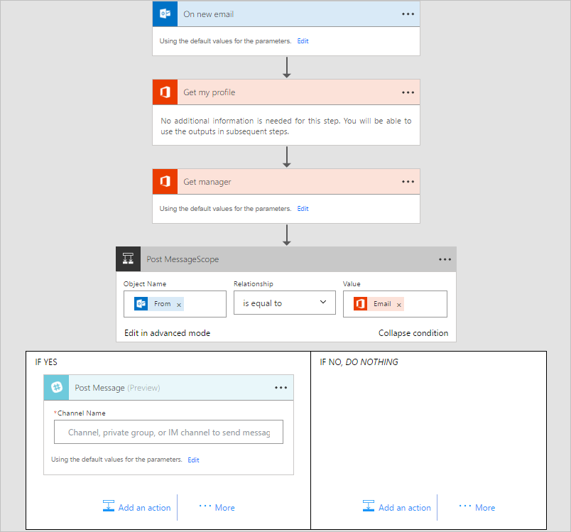

# Create a cloud flow from a template in Power Automate

A good way to get started is to use a template that is suited to your organization's scenario. You can choose from a collection of templates to find the one that best matches your scenario. Search [all templates](https://flow.microsoft.com/templates/) or browse by category to find your scenario, and then follow the steps in the template to create a cloud flow from the template.

>[!VIDEO https://www.microsoft.com/videoplayer/embed/RWKZQv]

You can tweak templates by adding, editing, or removing triggers and actions to create your own flows. You can [copy paste actions](/business-applications-release-notes/april19/microsoft-flow/copy-paste-actions) in the same flow or across flows to speed up the your tweaks.

Create a cloud flow from one of many built-in templates that can, for example, send you a Slack message when your manager sends you an email in Microsoft 365.

>[!TIP]
>[Create a cloud flow from scratch](get-started-logic-flow.md) if you already have a process in mind and can't find a template for it.

Here, we'll follow an example that uses a template to create a flow that sends you a Slack message when your manager sends you an email in Microsoft 365.

## Prerequisites

To complete this example, you'll need accounts with access to the following:

- [Power Automate](https://flow.microsoft.com).
- Slack.
- Microsoft 365.

## Choose a template

1. Sign into [Power Automate](https://flow.microsoft.com), and then select **Templates** in the left-side navigation pane.
1. Use the search bar to search for **slack manager** to find the **Send a message on Slack when my manager emails me** template, and then select it.
1. If you aren't signed into Office or Slack, select **Sign in** and then follow the prompts.
1. After you confirm your connections, select **Continue**.

    Your flow appears, showing each action with an orange title bar.

    

## Customize your flow

1. Select the title bar for an event to expand it, and then customize it (for example, by specifying a filter on the email that interests you).
1. Actions that require input from you will automatically be expanded.
  
    For example, the **Post message** action is expanded because you need to enter a channel, such as your *\@username*. You can also customize the message content. By default, the message will contain just the subject, but you can include other information.

1. Near the top of the screen, specify a name for your flow, and then select **Create flow**.
1. Finally, if you're happy with your flow, select **Save**.

Now, when your manager sends you an email, you'll receive a Slack message that contains the information that you specified.

## More information

- [Watch your flow in action](see-a-flow-run.md)
- [Publish your own template](publish-a-template.md)
- [Use a template with Microsoft Dataverse](common-data-model-intro.md)
- [Get started with team flows](create-team-flows.md) and invite others to collaborate with you to design flows.

[!INCLUDE[footer-include](includes/footer-banner.md)]
