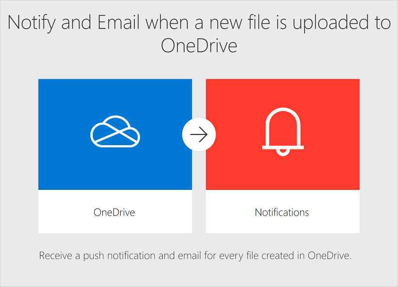
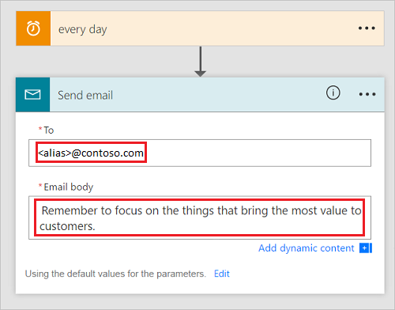
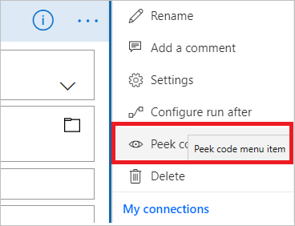
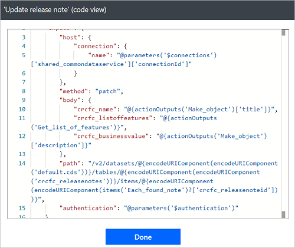
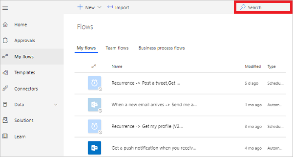

# Get started with Power Automate 

[!INCLUDE [view-pending-approvals](includes/cc-rebrand.md)]

 
<iframe width="1129" height="635" src="https://www.youtube.com/embed/hCuxuUaGC6Y" frameborder="0" allow="accelerometer; autoplay; encrypted-media; gyroscope; picture-in-picture" allowfullscreen></iframe>

Welcome! Power Automate is a service that helps you create automated workflows between your favorite apps and services to synchronize files, get notifications, collect data and more.

## Types of flows

Power Automate is one of the pillars of Power Platform. It provides a low code platform for workflow and process automation. Here's a list of the different types of flows:

| **Flow type**                                                                       | **Use case**                                                                                  | **Target**                                                                             |
|-------------------------------------------------------------------------------------------|-----------------------------------------------------------------------------------------------|----------------------------------------------------------------------------------------|
| [Automated flows](get-started-logic-flow.md)                 | Create a flow that performs one or more tasks automatically after it's triggered by an event. | [Connectors](https://docs.microsoft.com/connectors/) for cloud or on-premises services. |
| [Button flows](introduction-to-button-flows.md)              | Run repetitive tasks from anyplace, at any time, via your mobile device.                        |                                                                                        |
| [Scheduled flows](run-scheduled-tasks.md)                    | Create a flow that performs one or more tasks on a schedule.             |                                                                                        |
| [Business process flows](business-process-flows-overview.md) | Define a set of steps for people to follow to take them to a desired outcome.                 | Human processes                                                                        |
| [UI flows (Preview)](ui-flows/overview.md)                                                | Record and automate the playback of manual steps on legacy software.                    | Desktop and Web applications that do not have APIs available for automation.    |

You can create and manage all flows from the **My flows** tab in Power Automate.

If you are a Dynamics 365 user, you may also be familiar with Classic Common Data Service processes which include, [workflows](configure-workflow-steps.md), [actions](create-actions.md), [mobile task flows](create-mobile-task-flow.md), and [dialogs](use-cds-for-apps-dialogs.md).

The first step is to [sign up](sign-up-sign-in.md), or, if you already have an account with Power Automate, [sign in](https://flow.microsoft.com/signin) on your tablet, desktop computer, or even your phone.

## Check out the start page ##

[On the start page](https://flow.microsoft.com) for Power Automate, you can [explore a diverse set of templates](https://flow.microsoft.com/templates) and learn about the key features for Power Automate. You can get a quick sense of what's possible and how Power Automate could help your business and your life.

With Power Automate, you can:

- Easily search for templates and services.

    

- Choose from the most popular services.

    

- See an overview of each flow.

    

Each template is designed for a specific purpose. For example, there are templates for sending you a text message when your boss emails you, adding Twitter leads to Dynamics 365, or backing up your files. These templates are just the tip of the iceberg. They're intended to inspire you to create customized flows for the exact processes you need.

## Create your first flow ##

1. Select a template that's useful for you. A simple template is [**Get daily reminders in Email**](https://flow.microsoft.com/galleries/public/templates/45a3399aa29345308f08b6db0a9c85b9/):

    

1. Select **Continue**.

    

1. Enter the email addresses to which the daily reminder will be sent. Next, enter the reminder message. Finally, select **Create flow**, and then verify that your flow is running as expected.

    

    > [!NOTE]
    > You can explore the conditions that trigger the flow and the action that results from that event. Play around with the settings to make the flow your own. You can even add or delete actions.

1. Select **Done**.

[Follow this tutorial](get-started-logic-template.md) to learn more about creating flows from templates.

## Get creative ##

Now that you've created your first flow from a template, use any of the more than [150 data sources](https://flow.microsoft.com/connectors/) that Power Automate supports to [create your own flows from scratch](get-started-logic-flow.md).

When you create a flow from scratch, you control the entire workflow. Here are a few ideas to get your started:

- [Flows with many steps](multi-step-logic-flow.md).
- [Run tasks on a schedule](run-scheduled-tasks.md).
- [Create an approval flow](wait-for-approvals.md).
- [Watch a flow in action](see-a-flow-run.md).
- [Publish a template](publish-a-template.md).
- [Create flows from a Microsoft Teams template](https://flow.microsoft.com/connectors/shared_teams/microsoft-teams/).

## Peek at the code

You don't need to be a developer to create flows, however, Power Automate does provide a **Peek code** feature that allows anyone to take a closer look at the code that's generated for all actions and triggers in a flow. Peeking at the code could give you a clearer understanding of the data that's being used by triggers and actions. Follow these steps to peek at the code that's generated for your flows from within the Power Automate designer: 

1. Select the **...** menu item at the top right corner of any **action** or **trigger**. 
1. Select **Peek code**.

    

1. Notice the full JSON representation of the actions and triggers. This includes all inputs, such as the text you enter directly, and expressions used. You can select expressions here and then paste them into the **Dynamic Content** expression editor. This can also give you a way to verify the data you expect is present in the flow.

    
   

## Find your flows easily

When your creative juices start *flowing*, you might create many flows. Don't worry, finding your flows is easy - just use the search box on the **My flows**, **Team flows**, **Connections**, or **Solutions** screen to display only flows that match the search terms you enter.

 
> [!NOTE]
> The search filter only finds flows that have been loaded into the page. If you don't find your flow, try selecting **Load more** at the bottom of the page.

## Get notifications when something's wrong

Use the Power Automate notification center (located at the top right of the designer) to quickly see a list of flows have failed recently. The notification center displays a number that indicates the number of flows that failed recently.

From the notification center, you can navigate to the **Activity** page of Power Automate to see all your flows that recently ran, sent notifications, or failed.

## Use the mobile app ##

Download the Power Automate mobile app for [Android](https://aka.ms/flowmobiledocsandroid), [iOS](https://aka.ms/flowmobiledocsios), or [Windows Phone](https://aka.ms/flowmobilewindows). With this app, you can [monitor flow activity](mobile-monitor-activity.md), [manage your flows](mobile-manage-flows.md) and [create flows from templates](mobile-create-flow.md).

## We're here to help ##

We're excited to see what you do with Power Automate, and we want to ensure you have a great experience. Be sure to check out our [guided learning](https://flow.microsoft.com/guided-learning/) tutorials and [join our community](https://go.microsoft.com/fwlink/?LinkID=787467) to ask questions and share your ideas. [Contact support](https://go.microsoft.com/fwlink/?LinkID=787479) if you run into any issues.
