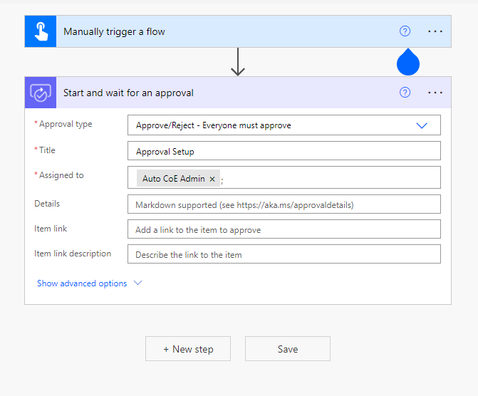
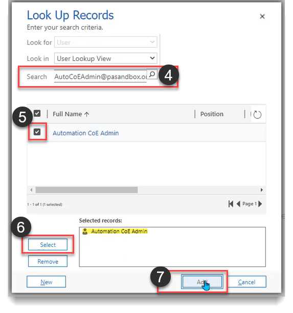
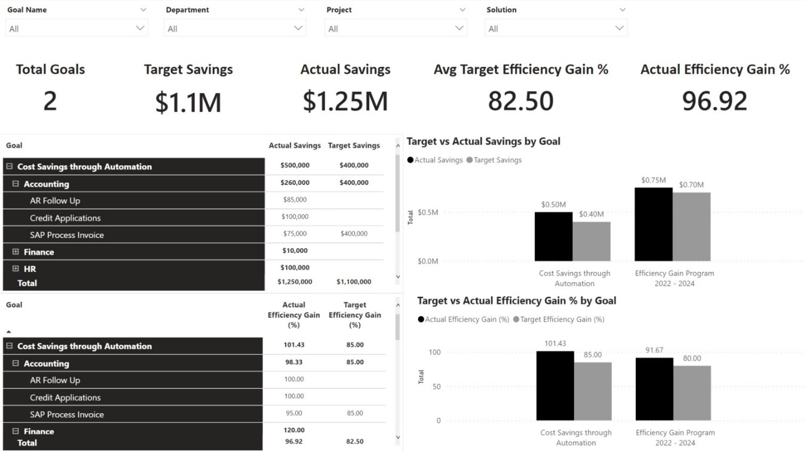
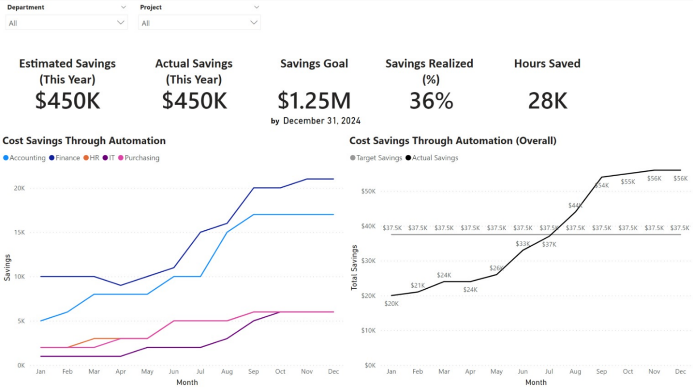
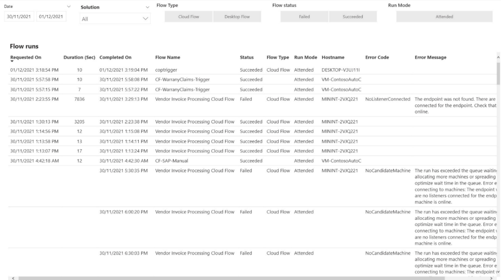
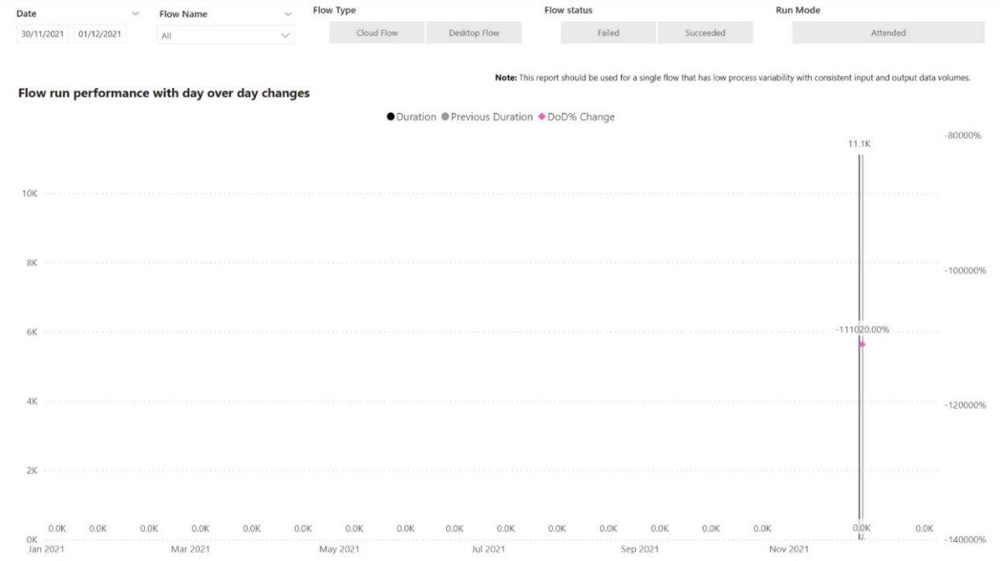
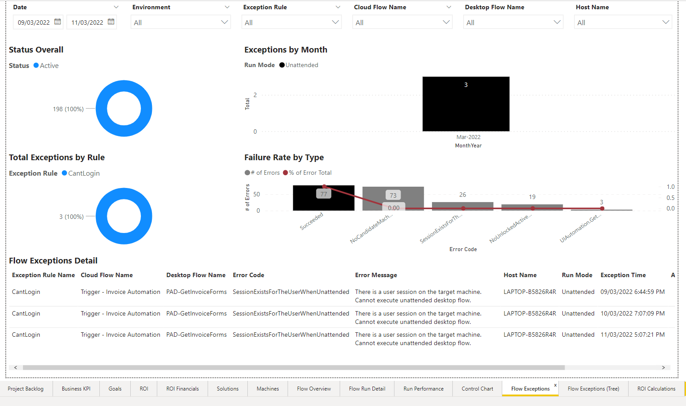
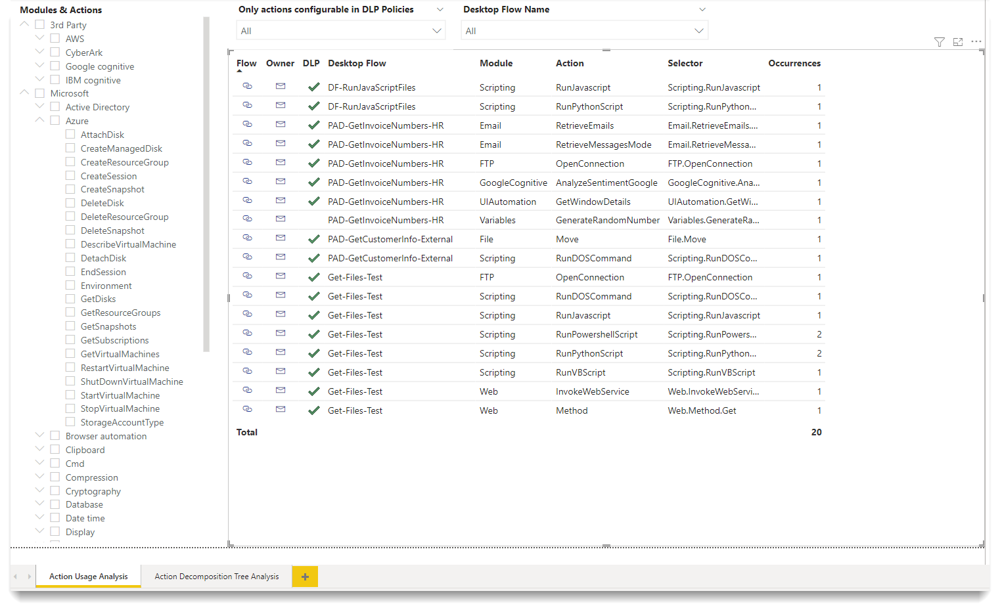
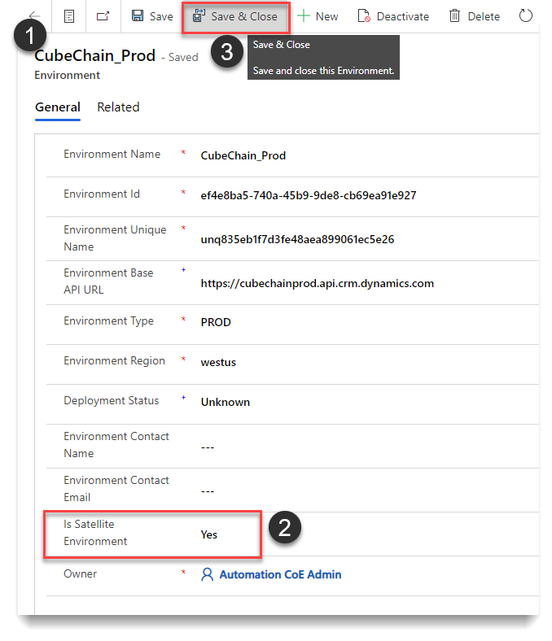
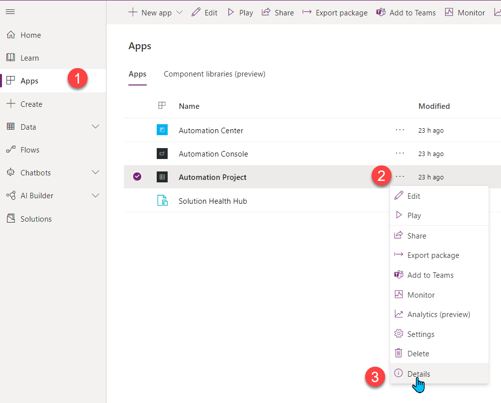

# Setup Automation CoE Toolkit
============================

Setup Checklist
---------------

This is a checklist for initially setting up the Automation CoE Toolkit. **Use
this checklist with the below docs.**

#### Prerequisites

-   Admin Account with premium license

-   Environment called Main (example: "orgname_Main")

-   Azure Key Vault configured

#### Import main solution

-   Import **AutomationCoEMain_x_x_x_x_managed** into your “**main**”
    environment

-   Provision Approvals Solution (Optional)

-   Confirm all Flows are turned on

-   Assign Security Roles

-   Share the apps with appropriate users

#### Import satellite solution

-   Create Azure AD App Registration (Dataverse API) for each Satellite

-   Define satellite environments (new or existing)

-   Create Application user in all satellite environments

-   Import AutomationCoESatellite_x_x_x_x_managed

-   Configure environment variables

-   Confirm all Flows are enabled

-   Share the app with appropriate users

#### Define configuration data

-   General data configured; ROI data configured; Console data configured

-   Flow Exception Rules Framework

Setup Main
----------

All steps should be done using the "Auto CoE Admin" account that is mentioned in
the prerequisites.

#### Import main solution into the main environment

1.  Create an environment in which to set up the CoE.

    1.  Go to the [Power Platform admin
        center](https://admin.powerplatform.microsoft.com/).

    2.  Select Environments \> + New, and then enter a name, type, and purpose.

    3.  Select Yes for creating the database, and then select Next.

    4.  Leave Sample apps and data set to No

    5.  Select Save.

2.  Go to your new environment.

    1.  Go to [flow.microsoft.com](https://flow.microsoft.com/).

    2.  Go to the environment you just created in which the Main solution will
        be installed. For this example, we're importing to the environment named
        **Contoso_Main**.

1.  On the left pane, select Solutions.

2.  Select Import, and then Browse.

3.  Select the Automation CoE Main solution from File Explorer
    (**AutomationCoEMain_x_x_x_x_managed.zip**).

4.  When the compressed (.zip) file has been loaded, select Next.

5.  Review the information, and then select Next.

6.  Establish connections to activate your solution. If you create a new
    connection, you must select

7.  Refresh. You won't lose your import progress.

8.  Select Import

9.  The import process can take 5-10 minutes to complete. Once complete verify
    all the Flows are **turned on** and **share the apps** with the appropriate
    users. We will assign the [security roles](#_Assign_Security_Roles) in the
    next steps.

#### Provision Approvals Solution (Optional)

This step is completely optional. The only reason for doing this is to speed up
the setup process.

In new environments, Power Automate Approvals is not configured. Once Power
Automate initiates an approval, that's when the Approvals solution gets created.

This process usually takes 5-10 min. So, we can easily do this step as our Main
solution is importing.

1.  Go to [flow.microsoft.com](https://flow.microsoft.com/). (Where Main is
    being installed)

2.  Select the "My flows" tab on the left \> Select + New flow \> Instant cloud
    flow

3.  Under the button trigger, add a Start and wait for approval action to the
    Flow

4.  Fill in your details, just enough to trigger the Flow.

Here is an example:

[Learn more about Approvals
Provisioning](https://support.microsoft.com/en-us/topic/power-automate-approvals-provisioning-overview-and-troubleshooting-2306313a-49fa-efde-c716-a34c573ec942).

#### Assign Security Roles

**Once the import is complete**, assign security roles to members of the
organization. The main solution comes with three (3) security roles:

Review roles below and assign roles based on responsibility:

**Automation Project Admin** - Maintaining configuration data in the Automation
CoE + Mapping automation projects to environments.

**Automation Project Contributor** - Generating / Requesting new automation
projects.

**Automation Project Viewer** - Business Process Owner, approving or rejecting
automation project requests.

1.  Navigate to the [Power Platform Admin
    Center](https://admin.powerplatform.microsoft.com/).

2.  Select your main environment.

3.  Click See all Security roles under the Access card.

1.  Click the Security role \> add members.

#### Sync Environments

Inside the main solution there is a cloud flow called **Sync Environments**.
Click on this flow and trigger it if it hasn’t run already.

Wait for it to complete.

#### Import Desktop Flow Actions csv

Next, we want to import all the **Desktop Flow Actions**, the hard work has been
done, all that is needed is an import of an included csv file into the **Desktop
Flow Action** table.

This must be done for all environments that the Automation CoE will sync from
and to.  
(**Main and all Satellites**)

1.  Open a browser, navigate to <https://flow.microsoft.com> and sign-in with
    your account.

2.  Navigate to your environment where the solution is installed.

3.  Select **Solutions** tab.

4.  Find and select **Automation CoE Main** solution**.**

5.  Select the table, **Desktop Flow Action**.

6.  Click the **Data** tab.

7.  Click the **Data dropdown** near the top.

8.  Under **Get data**, select **Get data from Excel**.

1.  Once the popup opens, click the Upload button, and upload the included Excel
    file.  
    (autocoe_desktopflowactions.csv)

1.  Wait for the **Mapping status** to show as successful.

2.  Click **Import**.

1.  Once the import is complete, verify data has been imported.

Verify the Desktop Flow Actions.

1.  Under Tables, select the Desktop Flow Action table.

2.  Under the Data tab verify there is data.

Setup Satellite
---------------

#### Create an Azure AD app registration to connect to Dataverse Web API

Use the below steps to create an app registration that will be used by Flows in
the Satellite environment.

1.  Sign in to [portal.azure.com](https://portal.azure.com/).

2.  Go to **Azure Active Directory** \> **App registrations**.

3.  Select **+New Registration**.

4.  Enter a name (for example, Automation CoE Dataverse API), **leave everything
    else** and click **Register**.

5.  In the **Overview tab**, click on **Add an Application ID URI** \> Click
    **Set**, leave the default, and click **Save**.

1.  Next select **Certificates & secrets tab.**

2.  Select **+New client secret.**

1.  Enter description (for example, Auto CoE Dataverse), Select appropriate
    Expires value.

2.  Click **Add**.

3.  Copy down the **secret Value** that gets generated. This secret will be
    added to **Azure Key Vault** in a later step.

4.  Go back to the **Overview tab** and copy down the following:

    -   Application (client) ID

    -   Directory (tenant) ID

1.  Next go to your **Azure Key Vault**, this is where we will store the values
    so Power Automate can use them to call the Dataverse Web API.

Create secrets for the copied values from before, Client ID, Tenant ID, Secret.

1.  Inside the **Secrets** tab, click **Generate/Import**.

1.  Use a descriptive name for each secret. For example:

    -   KVS-AutomationCoE-ClientID

    -   KVS-AutomationCoE-TenantID

    -   KVS-AutomationCoE-Secret

#### Create or use an existing environment for your Satellite

It's recommended that you have the Satellite solution imported inside your
production environment (Where you expect the Production versions of the
Automations to be).

Follow the [same steps](#import-main-solution-into-the-main-environment) as
creation of the main environment if creating a new environment.

#### Create Application user inside Dataverse (Per Satellite Env)

1.  Go to the [Power Platform admin
    center](https://admin.powerplatform.microsoft.com/).

2.  Select the Satellite environment \> Click Settings.

3.  Select Users + permissions \> Application Users \> + New app user.

4.  Click **+Add an app**. Select the App registration that was created in
    previous steps.  
    (Verify by AppID if needed or unsure)

5.  Select a **Business unit**.

6.  Add the **System Administrator** security role.

7.  Click **Create**.

Once created your Application user will be displayed.

#### Import satellite solution into the satellite environment

1.  Go to flow.microsoft.com.

2.  Select your designated environment for the Satellite solution. For this
    example, we're importing to the environment named **Contoso_Prod.**

3.  On the left pane, select **Solutions**.

4.  Select **Import**, and then **Browse**.

5.  Select the Automation CoE Satellite solution from File Explorer
    (**AutomationCoESatellite_x_x_x_x_managed.zip**).

6.  When the compressed (.zip) file has been loaded, select **Next**.

7.  Review the information, and then select **Next**.

8.  Establish connections to activate your solution. If you create a new
    connection, you must select Refresh. You won't lose your import progress.

9.  Next, we configure the **environment variables**.  
    (See next page)

#### Environment Variables

1.  To get the information for the environment variables, open a new tab

2.  Navigate to the Satellite environment from the [Maker
    Portal](https://make.powerapps.com).

3.  Select the Settings cog in the top right nav bar \> select Developer
    Resources and Session details.

Next, we need to get the **URL path** for our **Azure Key Vault secrets**.

The Azure Key Vault secrets are using the new Environment variable type. These
environment variables need to be in the following format:  
  
**/subscriptions/{Subscription ID}/resourceGroups/{Resource Group
Name}/providers/Microsoft.KeyVault/vaults/{Key Vault Name}/secrets/{Secret
Name}**

Follow the steps below to get the format easily.

1.  Go to [Azure Portal](https://portal.azure.com/#home), navigate to your Key
    Vault with the secrets for your [App
    Registration](#create-an-azure-ad-app-registration-to-connect-to-dataverse-web-api).

2.  Click the **Secrets** tab.

3.  Copy the **URL**.

1.  Paste the URL in a notepad.

2.  Remove everything from **https://** to **/resource**.

1.  At the end of the URL, add **/{SecretName}**. Replace **{secretname}** with
    your **secret name**.

1.  Do this for all three Azure Key Vault secrets (Client ID, Client Secret,
    Tenant ID).  
    See example below. These reference strings are needed for three (3)
    environment variables.

**Use this information for the environment variables below:**

| **Environment Variable Name**         | **Description**                                                                                                                                                                                                                                                                                                                                                                                       |   |
|---------------------------------------|-------------------------------------------------------------------------------------------------------------------------------------------------------------------------------------------------------------------------------------------------------------------------------------------------------------------------------------------------------------------------------------------------------|---|
| AKV Client Id Secret                  | Azure Key Vault secret for Client ID (Application ID) from App Registration: /subscriptions/{Subscription ID}/resourceGroups/{Resource Group Name}/providers/Microsoft.KeyVault/vaults/{Key Vault Name}/secrets/{Secret Name}                                                                                                                                                                         |   |
| AKV Client Secret Secret              | Azure Key Vault secret for Secret from App Registration                                                                                                                                                                                                                                                                                                                                               |   |
| AKV Tenant Id Secret                  | Azure Key Vault secret for Tenant ID from App Registration                                                                                                                                                                                                                                                                                                                                            |   |
| Automation CoE Alert Email Recipient  | The email address where operational reports and alerts should be sent to, for this environment. **(**[See Exception Framework](#flow-exception-rules-framework)**)**                                                                                                                                                                                                                                  |   |
| Automation Project App ID             | Enter the **Automation Project** App ID of the Power Apps that is deployed with the main solution (Main Environment)                                                                                                                                                                                                                                                                                  |   |
| Desktop Flows Base URL                | Open a new tab \> Navigate to [Power Automate](https://flow.microsoft.com/) . Select the environment where you’re installing the solution.                                                                                                                                                                                                                                                            |   |
| Environment Id                        | Use **Session details** to find this value from current environment that you are importing into (Satellite)                                                                                                                                                                                                                                                                                           |   |
| Environment Name                      | Display name of the current environment (Satellite)                                                                                                                                                                                                                                                                                                                                                   |   |
| Environment Region                    | Region of the Satellite. Can be found in the Power Platform admin center                                                                                                                                                                                                                                                                                                                              |   |
| Environment Unique Name               | Use **Session details** to find this value from the current environment that you are importing into (**Satellite**) Also must add **.crm** to the end of the string. Example: unq08ed139e532b4edc8f38851fd1bb3279.crm. Please note that the extension 'crm', 'crm[x]' etc. is region dependent.                                                                                                       |   |
|                                       | [See Datacenter regions](https://docs.microsoft.com/en-us/power-platform/admin/new-datacenter-regions)                                                                                                                                                                                                                                                                                                |   |
| \*Environment Unique Name of CoE Main | Use **Session details** to find this value **from Main**. Also must add **.crm** to the end of the string. Example: unq08ed139e532b4edc8f38851fd1bb3279.crm. Please note that the extension 'crm', 'crm[x]' etc. is region dependent.                                                                                                                                                                 |   |
|                                       | [See Datacenter regions](https://docs.microsoft.com/en-us/power-platform/admin/new-datacenter-regions)                                                                                                                                                                                                                                                                                                |   |
| Environment URL                       | Open a new tab \> navigate to [Power Platform Admin Center](https://microsoft.sharepoint.com/teams/AutomationCOE/Shared%20Documents/General/Releases/PAD%20DLP%20Impact%20Analysis/Docs/aka.ms/ppac).                                                                                                                                                                                                 |   |
| Flow Session Trace Record Owner Id    | This is the UserID (guid) from the Users table inside the Satellite environment for the admin account. Select Tables under Data on the left \> User \> Data \> Change view to **"All columns"** Find the Auto CoE Admin account and copy the value under **User**. Flow User ID (guid):                                                                                                               |   |

1.  Click **My flows** tab.

2.  Copy the web address up to …environments/

3.  You can also get the **environment id** from this URL too.

1.  Select your environment.

2.  Right click Environment URL

3.  Copy link

1.  After all the environment variables have been configured, select **Import.**

2.  Once solution has successfully imported, verify / turn on all the Flows.

1.  **Share all apps** with appropriate users.

#### Assign Security Roles

Once the import is complete, assign the roles below based on responsibility:

**Flow Session Exception Admin** – Admin role which provides full CRUD
permissions to the Flow Session Exception data captured in the tables below:

-   Flow Session Exception Rule Configuration

-   Flow Session Exception

**Desktop Flow Definition Admin** – Role which provides full CRUD permissions to
the tables below:

-   Desktop Flow Action

-   Desktop Flow Definition

-   Desktop Flow DLP Impact Profile

1.  Navigate to the [Power Platform Admin
    Center](https://admin.powerplatform.microsoft.com/).

2.  Select your main environment.

3.  Click See all Security roles under the Access card.

1.  Click the Security role \> **Search for and assign roles defined above.**

#### Assign Column security profiles

Inside the solution, there is a column security profile. This profile enables
users to see the Script field inside the **Desktop Flow Definition table**. This
role should only be assigned to CoE Admins, due to the sensitive information
that may be visible.

The script field is synced and stored inside the Desktop Flow Definition table
by default. If you would like to **not** sync this information, follow the steps
[here (Disabling Sync of Script
field](#disable-syncing-of-desktop-flow-script-optional)).

Otherwise follow the steps below.

To assign the Security profile:

1.  Click on the Column security profile **Desktop Flow Script Field Security**.

2.  Under Members, select **Users**.

3.  Click **Add**.

4.  Once the popup opens, **search** for the user you want to assign this
    profile to.

5.  Select the **checkbox** for the user.

6.  Click **Select**, the user should show in the **Selected records** list.

Click **Add**. (See example - Image Below)

Done, next we need to add

#### Import Desktop Flow Actions csv

Next, we want to import all the **Desktop Flow Actions**, the hard work has been
done, all that is needed is an import of an included csv file into the **Desktop
Flow Action** table.

1.  Open a browser, navigate to <https://flow.microsoft.com> and sign-in with
    your account.

2.  Navigate to your environment where the solution is installed.

3.  Select **Solutions** tab.

4.  Find and select **Automation CoE Satellite** solution**.**

5.  Select the table, **Desktop Flow Action**.

6.  Click the **Data** tab.

1.  Click the **Data dropdown** near the top.

2.  Under **Get data**, select **Get data from Excel**.

1.  Once the popup opens, click the Upload button, and upload the included Excel
    file.  
    (autocoe_desktopflowactions.csv)

1.  Wait for the **Mapping status** to show as successful.

2.  Click **Import**.

1.  Once the import is complete, verify data has been imported.

Verify the Desktop Flow Actions.

1.  Under Tables, select the Desktop Flow Action table.

2.  Under the Data tab verify there is data.

#### Disable Syncing of Desktop Flow Script (Optional)

By default, the Desktop Flow Definition Script is stored inside the Desktop Flow
Definition table. This field could contain sensitive information.

**IMPORTANT – System Administrators and higher can view these tables and fields
by default.**

In the environment where the solution is installed

1.  Click the Solutions tab.

2.  Select the Default Solution and click Environment Variables.

3.  Find and select Store Extracted Script.

1.  Under **Current value**, click **+New value**.

2.  Change to **No**.

3.  Click **Save**.

**Note** that changing any environment variables requires all flows that are
using it, to be Turned off, and back on again to get the new value. [See
Limitations](#limitations).

Important: The script field is not synced back to main due to security.
Everything is in place to sync the data back to main if needed by extending the
Automation CoE.

Setup Automation CoE Power BI dashboard
---------------------------------------

To launch the Power BI Dashboard for the Automation Center of Excellence, you
will require the environment URL for your Main environment (Where **Automation
CoE Main** is installed).

To obtain the environment URL, navigate to the Power Platform Admin Center, go
to Environments, select the environment, and note the Environment URL:

Enter the environment URL upon launching the Power BI template:

#### Main Dashboard

The main Power BI dashboard has the following sections:

1.  **Home** - Overview of key KPIs for the Automation CoE.

1.  **Project Backlog** - Details the Ideas/Projects submitted, status, and
    ranks based on Estimated Savings and Complexity

1.  **Business KPI** - Business details for Savings Realized, Efficiency, Hours
    Saved, and other business metrics

1.  **Goals** - Outlines savings and efficiency goals for the organization, and
    the status by Department and Project

1.  **ROI** - Overall ROI for the Projects implemented

1.  **ROI Financials** - Information regarding ROI Actuals vs Estimates by Year,
    Quarter, and Month

1.  **Solutions** - Overview of Solutions in Production, Hours Saved, Error
    Rates, and Bot success KPIs

1.  **Machines** - Detailed information on Machine utilization and activity

1.  **Flow Overview** - Summary of Flows Created, Runs, Status, and Top 10
    Makers, Machines, and Flows

1.  **Flow Run Detail** - Detailed information on Flow Runs, durations, status,
    run modes, hosts, and errors.

1.  **Run Performance** - Graphical display of run performance day over day

1.  **Control Chart** - Overview of Flow processing time averages and
    operational performance within control points.

1.  **Flow Exceptions** – Enables you to filter by Date, Exception Rule, Cloud
    Flow Name, Desktop Flow Name, or Host Name

1.  **Flow Exceptions Tree Diagram –** Displays and allows you to drill into
    specific Flows organized into the following categories: Cloud Flow Name,
    Desktop Flow Name, Error Code, Error Message, Run Mode, or Host Name.

1.  **Action Usage Analysis** – Just like the Power App but with added filters
    and an email owner button.

1.  **Action Decomposition Tree Analysis** – Tree like diagram that shows how
    each action module or Flow related in a tree like diagram

1.  **ROI Calculations** - Contains examples on how calculations related to ROI
    and Efficiency are determined throughout the dashboards

Every detail page consists of:

-   Filters (Department, Project, Solution)

-   High-level statistics

-   Useful visuals

#### ROI Calculations

Example data:

| **Cost Element**       | **Input** |
|------------------------|-----------|
| FTE Cost               | \$50/hr   |
| Time to Process (mins) | 60 mins   |
| Frequency              | Daily\*   |
| \# of FTEs to Process  | 1         |
| Error Rate (%)         | 10%       |
| \# of FTEs to Fix      | 1         |
| Time to Fix (mins)     | 25        |
| Overhead               | 15%       |

**\*Hourly = 2008, Daily = 251, Weekly = 52, Monthly = 12, Quarterly = 4**

#### ROI Calculation Formula

**Total Cost per Year** = Cost to Complete (per Year) + Cost to Remediate (per
Year)

**Cost to Complete (per Year):**

((((FTE Cost/60) x \# of FTEs to Process) x Time to Process (mins)) x Frequency)

**Cost to Remediate (per Year):**

(((Frequency x (Error Rate/100)) x Time to Fix (mins)) x FTE Cost/60) x \# of
FTEs to Fix))

**Full Formula:**

((((FTE Cost/60) x \# of FTEs to Process) x Time to Process (mins)) x Frequency)
+ (((Frequency x (Error Rate/100)) x Time to Fix (mins)) x FTE Cost/60) x \# of
FTEs to Fix))

#### ROI Calculation Example

Summary of Cost Calculations:

| **Cost Element**                 | **Calculation**                                                                                      |
|----------------------------------|------------------------------------------------------------------------------------------------------|
| Cost to Complete (per Year)      | \$12,550 (((FTE Cost/60) x \# of FTEs to Process) x Time to Process) x Frequency                     |
| Cost to Remediate (per Year)     | \$522.92 ((Frequency x (Error Rate/100)) x Time to Fix (mins)) x ((FTE Cost/60) x \# of FTEs to Fix) |
| Cost to Remediate (per Instance) | \$20.83 (Cost to Remediate (per Year) / (Frequency x (Error Rate/100))                               |
| Total Cost per Year              | \$13,072.92 (Cost to Complete (per Year) + Cost to Remediate (per Year)                              |
| Total Cost per Month             | \$1,089.41 (Cost to Complete per Year / 12)                                                          |
| Cost per Instance                | \$52.08 (Cost to Complete per Year / Frequency)                                                      |

Summary of Savings per Instance for Bot:

| **Run Detail**            | **Total Savings** | **Description**                                 |
|---------------------------|-------------------|-------------------------------------------------|
| Successful Run, no errors | \$44.27           | Cost per Instance minus Overhead %              |
| Failure                   | \-\$28.65         | Cost to Remediate per Instance minus Overhead % |

Configure Automation CoE Toolkit
================================

#### Define configuration data

Using the Automation CoE Admin account, navigate to the Main environment. You
want to open the app

**Automation Center**, this is where we configure how several aspects of the
Automation CoE will function.

When the app opens, your left navigation should look like this:

There are a few things we need to setup/configure when you first import the
Toolkit.

First, we are going to add an Automation Goal. Follow these steps to add an
Automation Goal.

1.  Inside the Automation Center Click Corporate Goals tab.

2.  Click + New

3.  Fill in the required fields (Sample data provided below)

| **Field**                | **Value**                       |
|--------------------------|---------------------------------|
| Goal Name                | Cost Savings through Automation |
| Period From              | 11/1/2021                       |
| Period To                | 11/1/2022                       |
| Target Efficiency Gain % | 20                              |
| Target Total Savings     | 50000                           |

Click **Save & Close**.

Next, we will configure some configurations

These configurations are split into **3** sections

1.  General - configurations that are related to resources and processes

2.  ROI Calculation - configurations that will be used as a scoring metric to
    better determine estimated ROI and complexity of an Automation Project

3.  Configuration - info pertaining to the Automation CoE Toolkit apps. Will be
    used to build a Console where users can launch related apps

#### Steps to configure general

Select **"Automation Center"** in the bottom navigation bar \> Switch
to **"Setup"**

#### Environments

1.  Inside the environment tab select a Satellite environment.

2.  Change **Is Satellite Environment** to **Yes**.

3.  Click **Save & Close.**

4.  Do this for all your **Satellite environments** (DEV, TEST, PROD, Etc.)

#### Departments

1.  Inside the department tab select **+ New**

2.  Create as many departments as your organization may need. Here is a sample
    of the departments:

-   Accounting

-   Enterprise Integration

-   Finance

-   Human Resources

-   Information Technology

-   Logistics

-   Operational Change Management

-   Purchasing

#### Process Categories

1.  Inside the process categories tab select **+ New**

2.  Create top level categories that will have child categories (subcategories).
    Here is a sample:

-   Artificial Intelligence

-   Claims

-   Invoicing

-   Legacy System

#### Process Sub categories

1.  Either inside the process sub categories tab or directly inside a Process
    category. You want to define sub processes that relate in some way.

2.  Click **New Process Sub Category**.

3.  Sample data is below

4.  Artificial Intelligence

    -   Forms Processing

    -   Forms Validation

5.  Claims

    -   Return

    -   Warranty

6.  Invoicing

    -   Internal

    -   External

    -   Other

7.  Legacy System

    -   Complex

    -   No API

    -   Other

#### Roles (App Roles)

These roles do not give access to anything, only used as lookups for the
fallback record if needed.

1.  Create the **Automation CoE Admin** account as the **CoE Owner**

| **Field**           | **Value**                 |
|---------------------|---------------------------|
| Display Name        | Anything (Auto CoE Owner) |
| Type                | **CoE Owner**             |
| User Principal Name | The email of the user     |

2.  Create **CoE Admins** - At least 1 **CoE Admin** must be initialized to
    configure the **fallback**

| **Field**           | **Value**                 |
|---------------------|---------------------------|
| Display Name        | Anything (Auto CoE Admin) |
| Type                | **CoE Admin**             |
| User Principal Name | The email of the user     |

#### Base Configuration - Fallback

This table should only have 1 record defined. This record is used if any of the
values that are needed to complete processing is null or not defined

1.  Define 1 fallback record (See screenshot below for example)

Steps to configure ROI calculation
----------------------------------

Still inside the **"Setup"** page you can find the ROI calculation
configurations. These tables are used to calculate the complexity of
each **Automation Project** (scores). Some values are also being used for
estimated ROI and savings

#### Processing Frequency Scores

This table has a value and score for each record. Below are values that should
be used, scores can be modified.

| **Value** | **Score** |
|-----------|-----------|
| Daily     | 12        |
| Hourly    | 18        |
| Monthly   | 3         |
| Quarterly | 1         |
| Weekly    | 5         |

#### Average Automation Steps Scores

This table can be fully customizable based on your organizations needs/process.
Table is used to get the **Score** for the **Average Automation Steps** which is
inputted by the user when a new **Automation Project** is requested. Below are
some examples, but more or less can be added.

| **Range**     | **Value From** | **Value To** | **Score** |
|---------------|----------------|--------------|-----------|
| \>= 1, \< 5   | 1              | 5            | 1         |
| \>= 250       | 250            | 999999999    | 10        |
| \>= 5, \< 250 | 5              | 250          | 5         |

#### Processing Peaks Scores

This table has a value and score for each record. Below are values that should
be used, scores can be modified.

| **Value** | **Score** |
|-----------|-----------|
| daily     | 15        |
| hourly    | 20        |
| monthly   | 5         |
| quarterly | 2         |
| weekly    | 10        |

Configuration - Console
-----------------------

These tables are used by the **Automation Console** app, as well as
the **Project Approval** automation.

| **Name**           | **App Description**                                           | **AppID / App Link**                                        |
|--------------------|---------------------------------------------------------------|-------------------------------------------------------------|
| Automation Project | Create and manage your automation projects                    | [See Below (Next page)](#how-to-get-canvas-app-urlid)       |
| Automation Center  | Manage and configure all aspects of your automation resources | [See Below (Next page)](#how-to-get-model-driven-app-urlid) |

#### How to get canvas app URL/ID

Inside the [Maker Portal](https://make.powerapps.com/)

1.  Select **Apps** tab on the left navigation

2.  Click the 3 dots (more commands) on the app

3.  Click details

#### How to get model driven app URL/ID

Inside the [Maker Portal](https://make.powerapps.com/)

1.  Select **Apps** tab on the left navigation

2.  Click the 3 dots (more commands) on the app

3.  Click details

4.  Copy **AppID**

5.  Click the **Web Link**

6.  Click Properties

7.  Copy Unified Interface URL (Reference the screenshots below for the steps)

<!-- todo: -->

<!-- > [!div class="nextstepaction"]
> [Next step: Core components for Power Automate RPA SAP GUI automation](core-components.md) -->
