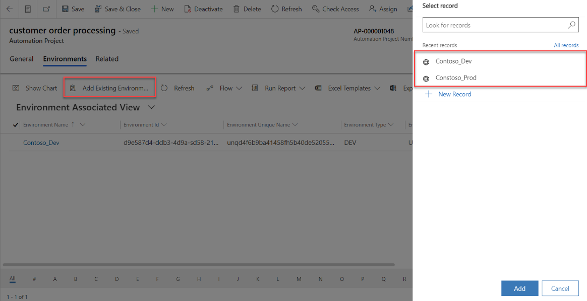
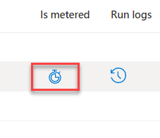

# How to use
==========

This section will go over how to use each Component in the Automation CoE
Toolkit. Each section will contain: Functionality and features.

Automation Console
------------------

#### Functionality

The Automation Console app is currently only used to launch Automation CoE
specific apps. The information for the apps must be updated manually. [The setup
process goes over configuring the Automation Console](#configuration---console)

#### Features

-   Console like dashboard of all apps to be launched in one place.

-   Documentation linked

Automation Project
------------------

#### Functionality

The purpose of this app is to request and approve new Automation Projects. The
automation approver also will receive a deep link to the Project screen to view
all Automation project details.

### Features

#### Project Dashboard (Home Screen)

Depending on your role. When opening the app, you will see:

| **Role**            | **What you see**                                          |
|---------------------|-----------------------------------------------------------|
| Project Admin       | Every Automation Project request                          |
| Project Contributor | Only Automation Project requests that were created by you |
| Project Viewer      | Can see all Automation Projects, only in view mode        |

Some features include:

1.  Command bar - Filter Automation project by status. **"+"** bring you to
    the **New Project** screen.

2.  Details side bar - gives overview of all the Automation projects you can see
    (based on role).

3.  Automation Project details card - overview of the requested project details.
    Click the icon to view more or edit.

#### New Project screen

This screen is used for a couple of different things. The first being creating a
new Automation project, editing an existing Automation project, and viewing
details.

1.  Project information section - fill out information as it relates to the
    Automation project.

2.  Business owner field - this is the approver for the request. If no business
    owner is selected, the fallback is used.

3.  ROI information section - fill out information as it relates to ROI for the
    Automation project.

4.  Command bar - New, save, edit, and submit the form. Submit button is
    available after the Automation project has been saved.

Some fields are required to save the form. This is because when submitting a
request, a Flow (**Calculate ROI Saving Potential for Automation Project**) is
kicked off. This Flow calculates the Complexity score and populates this
information when the "Save" button is clicked.

Automation Center
-----------------

#### Functionality

The Automation Center app is used by CoE Admins to maintain the configuration
and map Automation projects to environments. Flow sessions and metered artifacts
can also be viewed here.

### Features

#### Create / maintain configuration data

This is explained in more detail when [setting up the Automation CoE
Toolkit](#_Configure_Automation_CoE)

#### Map Automation projects to environments

CoE Admins will map Automation projects when the request has been approved.

1.  Inside the **Automation Projects** tab.

2.  Click on the desired record to map.

3.  Click "Related" tab \> Environments

1.  Click "Add Existing Environments"

2.  Select the desired environment or create a new one.

3.  Click "Add" \> **"Save & Close"**.

Automation Solution Manager
---------------------------

#### Functionality

The Automation Solution Manager app is used by **System Admins (System
Administrator)** to enable the metering of solutions and its artifacts. Once a
solution and artifact has been metered. Data will be synced between the
environment and main in near real time!

### Features

#### Meter a Solution

Once a solution has been created in the environment it will show up in the list.
When a solution has metering turned off the icon "+" will show.

1.  Click the **"+"** on the solution you want to meter.

2.  In the new screen, there is a dropdown. Select your Automation project. If
    its not listed, click the **"Refresh"** button.

3.  Click "Submit", a popup confirmation appears. Select **"Yes"**

Next screen is where you meter artifacts.

#### Rename cloud flow to match convention

Renaming a cloud flow to match the [naming
convention](#cloud-flows-must-follow-specific-naming-convention-before-they-can-be-used-for-metering)
is easy.

From the Automation Solution Manager app home screen.

1.  Click inside one of the solutions by clicking the 3 dots […].

2.  **Select** the **cloud flow** that you want to rename.

3.  A pencil icon should appear (Only available on unmanaged) **Click the
    pencil.**

1.  The [naming
    convention](#cloud-flows-must-follow-specific-naming-convention-before-they-can-be-used-for-metering)
    should apply automatically, Click the **save button.**

Note, the last 3 digits will default to 001. If you have multiple solutions for
a single project, you could increase that number by 1 for each additional
solution if you wish to distinguish them.  
Read more about the [naming
convention](#cloud-flows-must-follow-specific-naming-convention-before-they-can-be-used-for-metering).

#### Meter solution artifacts

This is where we meter the artifacts for the Flow Sessions to show up in our
main environment. We can get to the solution screen from the Home screen by
clicking the 3 dots. **". . ."**

1.  Under the "Is metered" column, select the **"+"** icon to add to metering.
    If this option is grayed out, then the cloud flow does not follow the
    [naming
    schema](#cloud-flows-must-follow-specific-naming-convention-before-they-can-be-used-for-metering).
    [Rename the cloud flow](#rename-cloud-flow-to-match-convention) if needed.

1.  Once selected the **"+"** icon switches to a meter. And now data will
    be **flowing** to main (flow sessions).

#### Bypass Flow naming convention

There is an option to bypass the naming convention.

To bypass the naming convention, click on the ‘i’ icon. Acknowledge the warning.

Now you can meter the flow.  

