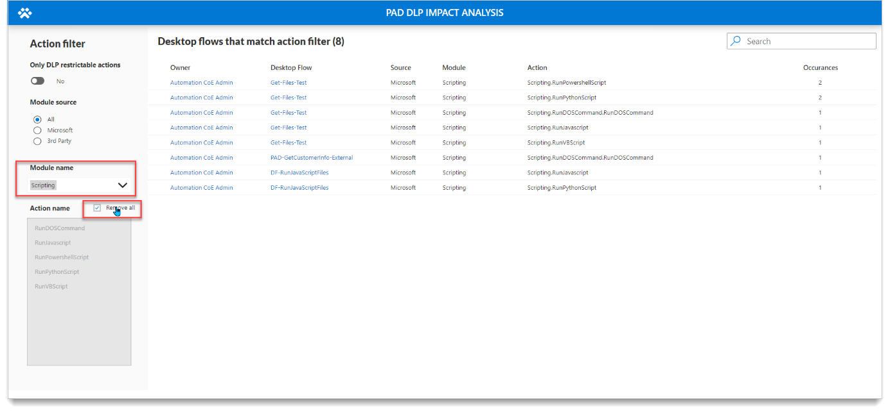
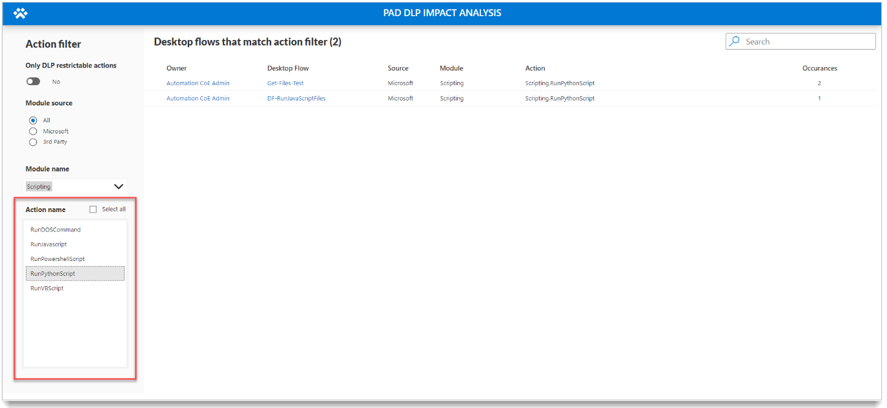

# DLP impact analysis for desktop flows

## Feature details

The recently launched preview for [DLP support for Power Automate for desktop actions](../../desktop-flows/data-loss-prevention.md) is a critical and highly requested governance feature addition, as most organizations expect the same governance breadth and depth for RPA as we have for the Desktop Power Automate based flows.

This new DLP support allows even the most risk-averse organizations to enable Power Automate for desktop.  Power Automate for desktop enables citizen automation developers to achieve unprecedented productivity gains and save thousands of hours by automating highly repetitive and error-prone tasks, leading to higher employee and customer satisfaction.

Administrators and CoE teams can define which action groups and individual actions can be used as part of desktop flows created with Power Automate for desktop. In the case of policy violations (for example, VBScript isn't allowed but it's used in a desktop flow), the platform notifies the maker that the action is disabled by the policy, and prevents the flow from being saved. However, it’s important to note that bots that are already developed and deployed might also be affected by policy changes, potentially causing production bots to stop without prior notice.

### Components

Component|Description
---------|-----------
Canvas App|DLP Impact Analysis for Power Automate for desktop
Cloud Flows|- Remove Deleted Action from DLP Profile  - Sync Flow Definition
Column security profiles|Desktop Flow Script Field Security
Custom API|Desktop Flow Definition Analysis
Custom API Request Parameter|- Desktop Flow Definition Id  - Store Extracted Desktop Flow Script
Environment variables|- Desktop Flows Base URL - Environment Id - Environment URL - Store Extracted Script
Plug-in assemblies|AutoCoE.Extensibility.Plugins
Security roles|Desktop Flow Definition Admin
Tables|- Desktop Flow Action  - Desktop Flow Definition  - Desktop Flow DLP Impact Profile
Power BI|Advanced Power Automate for desktop DLP Impact Analysis

## How to use DLP impact analysis

The canvas app is a single screen app that's used for basic filtering and visibility into the actions used in desktop flows. With this app, we can easily see which desktop flows will be impacted if we decide to disable specific modules or actions within the [Data loss prevention (DLP) policies (preview)](/power-automate/desktop-flows/data-loss-prevention).

You can access this app in the main or any satellite environment.

Some of the fields in the filter include the following.

- Module – This is the module to which the action belongs, for example, the scripting module.
- Action – The individual actions that are under **Module** > **Scripting**. These include, Run DOS command, Run JavaScript, Run Python script, etc.

<!--todo: removing this. Why is it needed here, it seems it needs context: **Occurrences** are how many times the action is used in the desktop flow. -->

### Scenario – Analyze impact of the scripting module

>[!NOTE]
>The Power Automate for desktop DLP impact analysis app is in both main and satellite environments. The satellite versions only display desktop flows that are in the current environment. Open the app from main to get an overview of all the satellite environments.

>[!NOTE]
>The script field in the Desktop Flow Definitions table doesn't sync to main from satellite environments.  

Use the filter pane on the left to filter by **Scripting** module, to see which desktop flows would be impacted.

#### All scripting actions

The following screenshot display all scripting actions.

#### Only Python actions

The following screenshot displays only the Python actions.

>[!TIP]
>Select the desktop flow name to go directly to the flow.

## Advanced Power Automate for desktop DLP Impact Analysis Dashboard

You can visualize the data by using the [Automation CoE main dashboard](./setup-automation-kit.md#main-dashboard).
