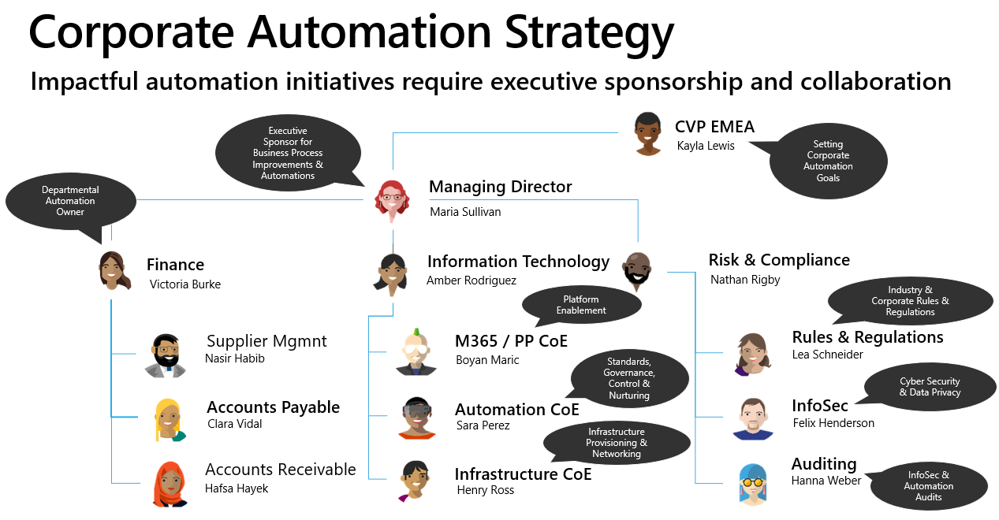
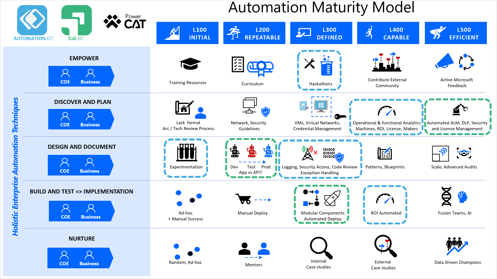

# Automation Center of Excellence strategy with the Automation Kit

The Automation Kit, along with the [ALM Accelerator](/power-platform/guidance/coe/almacceleratorpowerplatform-components) from the [Power Platform CoE Kit](/power-platform/guidance/coe/starter-kit), supports your Automation Center of Excellence strategy.

## Corporate automation strategy

Impactful automation requires executive sponsorship and deep collaboration across many roles in the organization.

The process can start by setting goals for your overall automation ambitions, such as target savings over one, two, or three years, or target efficiency gains.

The executive sponsor from a business unit, who could be a manager or managing director, would collaborate to share responsibility and own the overall business process improvement ambitions.

The automation owner, who could be the head of an individual department (for example, Finance) or sub-department (for example, Accounts Payable), specifies and develops the automation solutions.

The automation team often needs collaboration with the Microsoft 365 or Power Platform Center of Excellence team to enable the Automation Center of Excellence. These teams can provide guardrails, governance, and best practices. For unattended automation, they will need infrastructure provisioning, networking, and security to support the operation of the deployed solutions.

For the risk and compliance side of the diagram, the corporate rules, regulations, cyber-security, data privacy, and auditing requirements owners must be consulted and involved in the process.

## Automation lifecycle

The Automation Kit supports the journey from ideation and project definition to production automation with SLA and ROI measured with near real-time reporting.

Here is a summary of the relevant roles:

- **CVP or Area Manager** - Defines the automation goals
- **Process Owner** - Creates the Automation Projects in the system, defining process volume / frequency, characteristics of current throughput of current process, and the expected ROI
- **Reviewer / Approver** - Validates idea to approve that the idea should be implemented and is justifiable from an effort, maintenance, and compliance perspective
- **Automation CoE** - Sets up and maps solution to a specific environment
- **Process Owner** - Builds the solution, promotes to User Acceptance Testing (UAT) and Production. Maps the deployed solution to the Automation Project for metering. Metering allows report on overall status and how often the actions are carried out and measures the automation against the SLA and expected ROI and corporate automation goals.

## Automation Center Of Excellence

This diagram describes many of the components and activities that are involved with an Automation CoE and how these map to the Automation Kit and the ALM Accelerator.

The left side of the diagram shows various stakeholders or participants in the process. The center of the diagram displays specific components that are related to each part of the process.

### Stakeholders and partners of the Automation CoE

#### Bot developers

This includes citizen developers who need a guided experience to go from identifying an opportunity for building a bot, to building, deploying, and maintaining it.

#### Automation CoE members

Automation CoE members can build out patterns and templates that allow citizen developers to focus on solving the business problems.

The Automation CoE team deals with automation of DevOps pipelines and code review processes to accelerate the Citizen developers' bot building journey.

#### Infrastructure Ops

Partner with the infrastructure operations team to ensure that an efficient provisioning process exists.

This could include provisioning virtual machines, which could be unattended in production or attended in development. Plan for keeping the operating system and Power Automate for desktop software up to date.

#### Power Platform and Microsoft 365 CoEs

Collaborate with your Power Platform or Microsoft 365 Center of Excellence teams for environment management and creation of Data Loss Prevention (DLP) policies that need to be put in place for the organization to scale.

An Automation CoE may not not always have full access to perform these activities.

#### Executive sponsors

Monitor and track outcomes against goals. The Automation Kit helps you track projects from early in the bot development lifecycle. Key elements can include assigning the business case to the project and tracking the impact that the automation project it's delivering.

In the Automation Kit dashboards, you can view the outcome for a particular use case and the value that's being obtained through the investments.

### How the Automation Kit and the Power Platform CoE Starter Kit support the strategy

The Automation Kit and components of the CoE Starter Kit, including the ALM Accelerator, can be mapped to the Automation Center Of Excellence diagram as follows.

#### Bot Development Lifecycle

- **Ideation** – The Automation Kit provides a process to create potential automation projects and an approval process to determine which automation projects need investments.
- **Build** – The ALM Accelerator provides the ability to build a managed deployment of an RPA solution with versioning applied from solutions stored in source control.
- **Deploy** – The ALM Accelerator helps you configure and deploy solutions between the development, test, and production environments. The deployment process makes use of Azure DevOps and includes the ability to apply branching and merging to apply a source-controlled governance and a review process as a deployment progresses to production.

#### ALM components

- **Code Review** – Reviews for solutions in Azure DevOps with the ALM Accelerator. The ALM Accelerator Azure DevOp extensions allow the solution to be unpacked and the script definition from the exported solution versions to be compared for changes side by side.
- **Monitoring** – The Automation Kit provides a near real-time tracking process to measure the impact of deployed solutions.
- **Data Loss Prevention** – Determine the impact of DLP rules on deployed desktop flows using the Automation Kit.
- **Dashboard and Data ETL** – Synchronize data from multiple environments to a centralized dashboard to monitor the impact of deployed solutions.

## Automation Maturity Model and the Automation Kit

The [Power Platform automation maturity model](/power-platform/guidance/automation-coe/automation-maturity-model-overview) describes the capabilities and the levels in organizational automation maturity.

The Automation Kit and the ALM Accelerator can be combined to help customers grow their maturity in adopting best practices.

The dotted blue boxes indicate the maturity model areas that the Automation Kit addresses using the [Holistic enterprise automation techniques (HEAT)](https://docs.microsoft.com/power-platform/guidance/automation-coe/heat). Dotted green boxes indicate areas address by the ALM Accelerator.

### Empower

The Automation Kit can be used with Hackathons to help validate possible automation projects and monitor the impact of the Hackathon experiments.

### Discover and plan

Use the Automation Kit to plan for automation projects and potential impact. Use the approval process to determine which projects to invest in and monitor the impact.

The ALM Accelerator enables profiles to be created that enable RPA solutions to be deployed between development, test and production environments.

### Design and document

Design and document enables makers to quickly experiment in development environments and then measure the impact of their experiments to assess which viral automation projects are making large impact.

Use the ALM Accelerator to define deployment environments and deployment settings for machines and machine groups along with environment variables.

### Build and implement

Use the ALM Accelerator to automate the deployment of RPA solutions so that the Automation Kit can monitor them.

Use the near real-time ROI automation to monitor the impact of automation projects.

### See also

- [ALM Accelerator for Power Platform](/power-platform/guidance/coe/almacceleratorpowerplatform-components) - The ALM Accelerator is released as part of the [CoE Kit](/power-platform/guidance/coe/starter-kit) and provides tools and templates to provide enterprise-scale end-to-end Application Lifecycle Management.
- [Admin and Governance Whitepaper](https://aka.ms/autocoeadminwhitepaper)
- Manage Power Automate for desktop on Windows https://aka.ms/padonwindowspnp
- RPA Migration Whitepaper [https://aka.ms/PAD/RPAMigrationWhitepaper](https://aka.ms/PAD/RPAMigrationWhitepaper)
