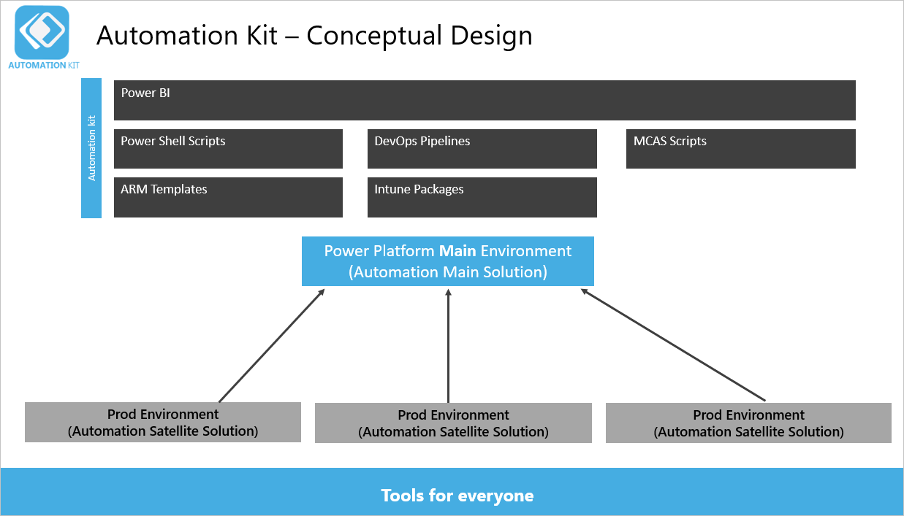
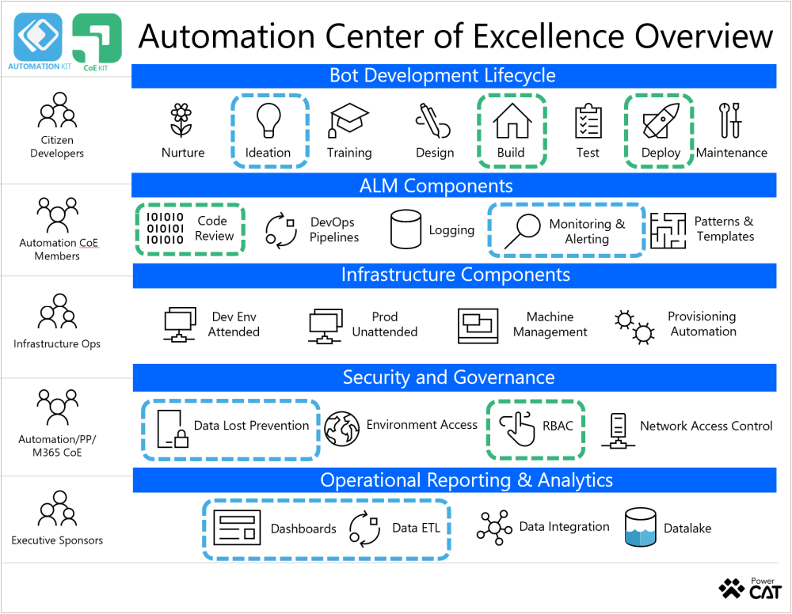

# Automation Center of Excellence Strategy Using Automation Kit

As part of setting up your Automation Center of Excellence strategy you can combine the Automation Kit and together with the [ALM Accelerator](http://www.github.com/microsoft/coe-starter-kit) from the CoE Kit to provide key elements of your Automation Center of Excellence strategy.

## Automation Kit

The goal of Automation Kit is to enable organizations to manage, govern and scale automation platform adoption based on industry’s best practices. At a high level the Automation Kit supports your Automation Center of Excellence by providing:

- **Near-real time ROI / SLA** - Short and long-term analytics to drive towards your business goals.

- **Tools for all Users** - A set of read made tools for Makers (citizen & pro), Automation CoE team, Exec sponsors

- **End-end automation lifecycle** - Tools to automate & manage all aspects of Hyper-automation scenarios including ALM, templates to drive consistency

- **Enterprise readiness** - Secure, govern, audit and monitor your Automation deployment

## Corporate Automation Strategy

In order to define impact for automation, it requires executive sponsorship and deep collaboration across many roles across the organization.

The process can start with settings goals for overall automation ambitions, like target savings over one, two or three years or targeted efficiency gains.

The executive sponsor from a business unit which could be a manager or managing director would collaborate to share responsibility and own overall business process and improvement ambitions.

Individual department leads (For example Finance) or sub departments (For example Accounts Payable) who may be the automation owner can specify and develop the automation solutions.

The collaboration often needs collaboration with the Microsoft 365 or Power Platform Center of Excellence team to enable the Automation Center of Excellence. These teams can provide guardrails, governance and setting best practices. For unattended automations they will need infrastructure provisioning, networking and security to support operation of the deployed solutions.

For the Risk and Compliance side of the diagram the corporate rules, regulations, cyber-security, data privacy and auditing requirements will need to be consulted and involved in the process.

## Demo Lifecycle

Using the Automation Kit allows a journey from Project Definition or Ideation to SLA & ROI based near-real-time reporting.

- **CVP or Area Manager** - Define the automation goals

- **Process Owner** - Create the Automation Projects in the system, defining process volume / frequency, characteristics of current throughput of current automation and the expected ROI.

- **Review and Approval** - Validate idea for approval to ensure that the idea should be implemented and is justifiable from a effort, maintenance and compliance perspective.

**Automation CoE** - Setup and map solution to a specific environments.

**Process Owner** - Build the solution, promote to User Acceptance Testing (UAT) / Production. Finally map the deployed solution to the Automation Project for metering. Metering allows report on overall status and hoe often the actions carried out and measure against SLA and expected ROI at the start of the project and corporate automation goals.

## Conceptual Design

The Automation Kit has the following conceptual design components

The key element of the solution is the Power Platform Main Environment.

There are different normally different satellite production environments that execute deployed automation projects. Depending on your environment strategy these could also be Development or Test Environments.

Between these environments there is a near real time synchronization process that includes Cloud or Desktop flow telemetry, machine and machine group usage and audit logs.

This information is reflected in the Automation Kit Power BI dashboard to the impact of the deployed solutions.

## Near Real Time Data Synchronization

The synchronization processes only the bare minimum required to calculate the ROI and SLA, it does not focus on creating complete inventory of all low code assets.

The components in the satellite environments could be organized by geography or capability. Cloud flows in these environments push information in near real time to the Automation Main environment to metered Cloud and Desktop flows.

## Automation Center Of Excellence

The diagram that follows describes many of the different components or activities that are involved with an Automation Center Of Excellence and how these map to the Automation Kit and the ALM Accelerator.

The left side of the diagram shows various stakeholders or participants in process could exist.

In the center of the diagram contain the specific components within a specific layer.

### Stakeholders or participants

#### Bot Development Cycle

Include Citizen developers who need a guided experience in terms of how they go from identifying an opportunity with building a bot, to going ahead and deploying it and maintaining it.

#### Automation CoE Members

Automation CoE members can build out patterns and templates that allow Citizen Developers to go ahead and focus on the business problems.

The Automation CoE team can deal with automation of DevOps pipelines and Code review processes to accelerate the Citizen developers bot building journey.

#### Infrastructure Ops

Naturally when we discuss RPA we also need to think about infrastructure. Partnering with the infrastructure operations team to ensure that we have got a provisioning process that exists in an efficient manner.

This could include provisioning virtual machines. These machines could be unattended in production or attended in development.

This also includes how we want to keep the Operating System, Power Automate for Desktop software up to date. Including this update process so you can take advantages of the investments Microsoft is making.

#### Automation / Power Platform / Microsoft 365

Collaboration with Power Platform or Microsoft 365 Center of Excellence teams for Environment Management, Data Loss Prevention Policies that need to be put in place for the organization to scale.

An Automation CoE may not not always have full access to perform these activities.

#### Executive Sponsors

This is where you get to see the outcomes of the prior stages. It allows projects tracked from early in the Bot development lifecyle. Key elements can include assigning the business case to the project and tracking the impact that the automation project is delivering.

Using Dashboards you can view the outcome for a particular use case and the value that is being obtained through the investments.

As the organization grows in size in scale, providing the ability to manage and govern data retention and integrate with Data lake can allow organizations to gain long term insights from the results of Automation Projects.

### Automation / CoE Kit Mapping

The Automation Kit and components of the CoE Kit including the ALM Accelerator can be mapped to the Automation Center Of Excellence diagram as follows

#### Bot Development Lifecycle

- **Ideation** – The automation kit provides a process to create potential automation projects and give an approval process to determine which automation projects to invest time in.

- **Build** – The ALM Accelerator provides the ability to build a managed deployment of a RPA solution with versioning applied from solutions stored in Source Control.

- **Deploy** – The ALM Accelerator has the ability to configure and deploy solutions between development, test and production environments. The deployment process makes use of Azure DevOps and includes the ability to apply Branching and Merging to apply a source controlled governance and review process as a deployment progresses to production.

#### ALM Components

- **Code Review** – For solutions stored in Azure DevOps with the ALM Accelerator. ALM Accelerator Azure DevOp extensions allow the solution to be unpacked the script definition from the exported solution versions to be compared for changes side by side.

- **Monitoring** – The Automation kit provides a near real time tracking process to use executions information to measure the impact of deployed solutions.

- **Data Loss Prevention** – Determine the impact of DLP rules on deployed desktop flows using the Automation Kit.

- **Dashboard and Data ETL** – Synchronize data from multiple environments to a centralized dashboard to monitor the impact of deployed solutions.

## Automation Maturity Model

The [Power Platform automation maturity model](https://docs.microsoft.com/power-platform/guidance/automation-coe/automation-maturity-model-overview) describes capabilities in organizational automation maturity.

The model provides a framework to look at how the Automation Kit and the ALM Accelerator can be combined to help customers grow their maturity in adopting Center of Excellence practices.

The Automation Kit can also be mapped against the Automation Maturity Model to assist customers to rapidly shift right to a more mature operational model (Level 300 - Level 500). Dotted blue boxes indicate areas that the existing Automation Kit addresses in the maturity model using the [Holistic enterprise automation techniques (HEAT)](https://docs.microsoft.com/power-platform/guidance/automation-coe/heat).

### Empower

Currently the Automation Kit can be used for Hackathons to help validate possible automation projects and monitor the impact of the Hackathon experiments.

### Discover and Plan

Use the Automation kit to plan for Automation projects and potential impact. Use the approval process to determine which projects to invest in and monitor the impact.

The ALM Accelerator enables profiles to be created that define environments that enables RPA solutions to be deployed between Validation, Test and Production environments.

### Design and Document

Enable makers to quickly experiment in development environments and then measure the impact of the experiments to see which viral automation projects are making large impact.

Use the ALM Accelerator to define deployment environments and deployment settings for Machines and Machine groups along with environment variables

### Build and Implement

Use the near real time ROI automation to monitor the impact of automation projects.

Use the ALM Accelerator to automate the deployment of RPA solutions so that the Automation Kit can monitor them.

## Related Content

- ALM Accelerator for Power Platform - The ALM Accelerator is released as part of the [CoE Kit](http://www.github.com/microsoft/coe-starter-kit) and provides tools and templates to provide Enterprise scale end to end Application Lifecycle management.

- [Admin and Governance Whitepaper](https://aka.ms/autocoeadminwhitepaper)

- Manage Power Automate for Desktop on Windows https://aka.ms/padonwindowspnp

- RPA Migration Whitepaper [https://aka.ms/PAD/RPAMigrationWhitepaper](https://aka.ms/PAD/RPAMigrationWhitepaper)
