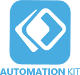

# Overview of the Automation Kit

The Automation Kit is set of tools to accelerate the use and support of Power Automate for desktop for automation projects. The kit provides tools that help you manage automation projects and monitor them to estimate money saved and return on investment (ROI).

The Automation Kit supports your organization applying the [HEAT (Holistic Enterprise Automation Techniques)](https://docs.microsoft.com/power-platform/guidance/automation-coe/heat).

The kit is especially useful to an Automation Center of Excellence (CoE) team, a team of experts who support automation within your organization. They have good knowledge about Power Automate for desktop, set up and maintain the Automation Kit, and maintain the configuration data such as departments, process categories, goals, and more.

The goal of Automation Kit is to enable organizations to manage, govern, and scale automation platform adoption based on best practices. The Automation Kit supports your Automation Center of Excellence by providing:

- **Near-real time ROI / SLA** - Short- and long-term analytics to drive towards your business goals

- **Tools for all users** - A set of ready-made tools for Makers (citizen & pro developers), your Automation CoE team, & executive sponsors

- **End-to-end automation lifecycle** - Tools to automate & manage all aspects of hyperautomation scenarios, including ALM and templates to drive consistency

- **Enterprise readiness** - Secure, govern, audit, and monitor your automation deployment

## Automation Kit components

The Automation Kit supports an automation CoE with the following components.

1. Automation Project: A canvas app that supports requesting automation projects and submitting them for approval.
1. Automation Center: A model-driven app for creating and maintaining automation assets such as master data records, mapping resources and environments, and assigning roles to employees.
1. Automation Solution Manager: Canvas app in Satellite environments to enable the metering of solutions and their artifacts.
1. Cloud flows that sync data from satellite environments in near real time to the main environment using Dataverse tables.
1. A Power BI dashboard to provide insights and monitor your automation assets.

The components of the kit are contained in the following two solutions.

- Main solution, deployed in the main environment
- Satellite solution, deployed in each satellite environment

A satellite environment is where the automation projects are developed, tested, and then deployed to production. The production satellite is configured to monitor and meter solutions and solution artifacts for an automation project. 

The data from the metered solutions syncs to the main environment in near real time for monitoring on a dashboard.

## Conceptual Design

The Automation Kit has the following conceptual design components.

The key element of the solution is the Power Platform Main Environment.

There are usually several satellite production environments that execute deployed automation projects. Depending on your environment strategy, these could also be Development or Test environments.

Between these environments there is a near-real-time synchronization process that includes cloud or desktop flow telemetry, machine and machine group usage, and audit logs.

This information is reflected in the Automation Kit's Power BI dashboard.

## Near-Real-Time Data Synchronization

The synchronization processes only the bare minimum data required to calculate the ROI and SLA. It does not create a complete inventory of all Low Code assets.

The components in the satellite environments could be organized by geography or capability. Cloud flows in these environments push information about metered cloud and desktop flows in near real time to the Automation Main environment.