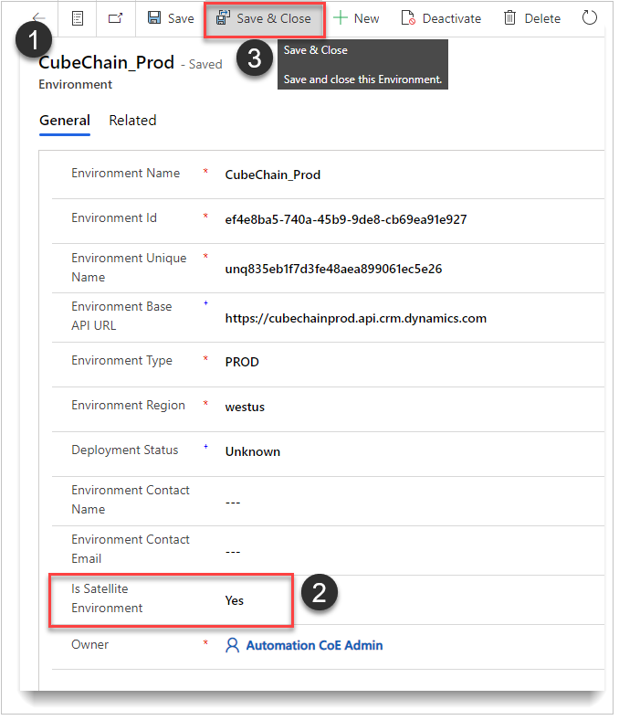
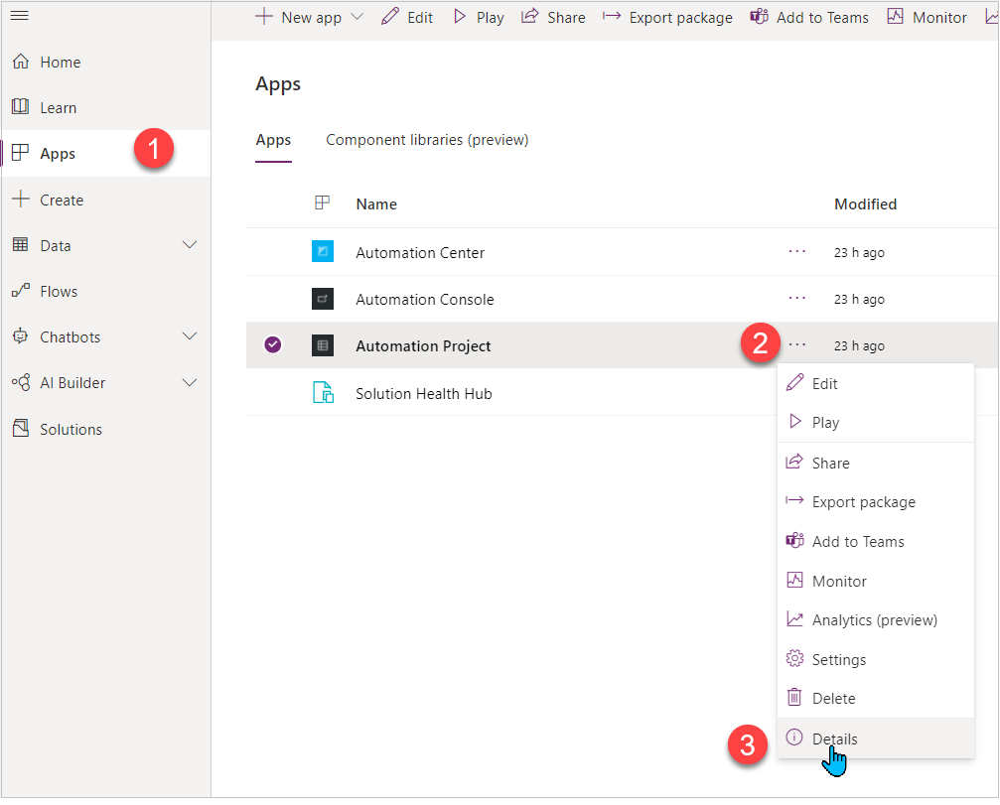

# Configure Automation Kit

## Define configuration data for the Automation Kit

Use the Automation Kit admin account, navigate to the main environment and open the automation center app.

The **Automation Center** is where we configure how several aspects of how the Automation Kit functions.
  
There are a few things you need to configure when you first import the kit.

First, add an automation goal. Follow these steps to add an automation goal.

1. Inside the Automation Center, select the **Corporate Goals** tab.
2. Select **New**.
3. Fill in the required fields. The following table presents some sample data for these fields.

    | **Field**                | **Value**                       |
    |--------------------------|---------------------------------|
    | Goal Name                | Cost savings through automation |
    | Period From              | 11/1/2021                       |
    | Period To                | 11/1/2022                       |
    | Target Efficiency Gain % | 20                              |
    | Target Total Savings     | 50000                           |

4. Select **Save & Close**.

Next, we will make further configurations. This configuration is split into the following three sections.

1. [General](#steps-to-configure-general) - Configuration that's related to resources and processes.
1. [ROI Calculation](#steps-to-configure-roi-calculation) - Configuration that's used as a scoring metric to better determine estimated ROI and the complexity of an automation project.
1. [Configuration](#configuration---console) - Information that pertains to the Automation Kit apps. This information is used to build a console from which users can launch related apps.

### Steps to configure general

Select **"Automation Center"** in the bottom navigation bar > **Setup**.

#### Environments

1. On the environment tab select a satellite environment.
1. Change **Is Satellite Environment** to **Yes**.
1. Select **Save & Close.**
1. Do this for all your satellite environments, including dev, test, prod, etc.

   

#### Departments

1. On the department tab, select **New**.
1. Create as many departments as your organization needs. Here is a sample of the departments that an organization may need.

- Accounting
- Enterprise Integration
- Finance
- Human Resources
- Information Technology
- Logistics
- Operational Change Management
- Purchasing

#### Process categories

1. On the process categories tab select **New**.
1. Create top level categories that will have subcategories. Here are sample names of subcategories that your organization may need.

- Artificial Intelligence
- Claims
- Invoicing
- Legacy System

#### Process subcategories

Either on the process subcategories tab or directly in a process category, define sub-processes that are related in some way.
<!--todo: this is not clear to me. Where is the sample data?-->
1. Select **New Process Sub Category**.
1. Sample data is below
1. Artificial Intelligence

    - Forms Processing
    - Forms Validation

1. Claims

    - Return
    - Warranty

1. Invoicing

    - Internal
    - External
    - Other

1. Legacy System

    - Complex
    - No API
    - Other

#### App roles

These roles do not give access to anything, they're used as lookups for the fallback record if needed.

1. Create the **Automation CoE Admin** account as the **CoE Owner**.

    | **Field**           | **Value**                 |
    |---------------------|---------------------------|
    | Display Name        | Anything (Auto CoE Owner) |
    | Type                | CoE Owner                 |
    | User Principal Name | The email of the user     |

1. Create **CoE Admins** - At least 1 **CoE Admin** must be initialized to configure the fallback.

    | **Field**           | **Value**                          |
    |---------------------|------------------------------------|
    | Display Name        | Anything (Auto CoE Admin)          |
    | Type                | CoE Admin                          |
    | User Principal Name | The email address for the user     |

#### Base configuration - fallback

This table should only have 1 record defined. This record is used if any of the values that are needed to complete processing is null or not defined.

1. Define on fallback record. Use the following screenshot as a guide for your fallback record.

   

## Steps to configure ROI calculation

Still inside the **Setup** page you can find the ROI calculation configuration. These tables are used to calculate the complexity of each **Automation Project** (scores). Some values are also used for estimated ROI and savings.

### Processing frequency scores

The following table displays a value and score for each record. You must use these values. You can modify the scores.

| **Value** | **Score** |
|-----------|-----------|
| Daily     | 12        |
| Hourly    | 18        |
| Monthly   | 3         |
| Quarterly | 1         |
| Weekly    | 5         |

### Average automation steps scores

The following table contains some examples and it's fully customizable, based on your organization's needs and processes. The table is used to get the score for the average automation steps which the user inputs when they request a new automation project. You can or remove items from this table per your needs.

| **Range**     | **Value From** | **Value To** | **Score** |
|---------------|----------------|--------------|-----------|
| \>= 1, \< 5   | 1              | 5            | 1         |
| \>= 250       | 250            | 999999999    | 10        |
| \>= 5, \< 250 | 5              | 250          | 5         |

### Processing peaks scores

This table has a value and score for each record. Below are values that should be used, scores can be modified.

| **Value** | **Score** |
|-----------|-----------|
| daily     | 15        |
| hourly    | 20        |
| monthly   | 5         |
| quarterly | 2         |
| weekly    | 10        |

## Configuration - console

The automation console app and the project approval automation use these tables.

| **Name**           | **App description**                                           | **AppID / app link**                                        |
|--------------------|---------------------------------------------------------------|-------------------------------------------------------------|
| Automation Project | Create and manage your automation projects                    | [How to get canvas app URL/Id](#how-to-get-canvas-app-urlid)       |
| Automation Center  | Manage and configure all aspects of your automation resources | [How to get model driven app URL/ID)](#how-to-get-model-driven-app-urlid) |

### How to get canvas app URL/ID

Sign into the [maker portal](https://make.powerapps.com/), and then perform the following steps.

1. Select **Apps** tab on the left navigation.
1. Select ... (more commands) on the app.
1. Select **Details**.

   

### How to get model driven app URL/ID

Sign into the [maker portal](https://make.powerapps.com/), and then perform the following steps.

1. Select the **Apps** tab on the left navigation.
1. Select ... (more commands) on the app.
1. Select **Details**.

   
1. Copy the **AppID**.
1. Select the **Web Link**.

1. Select Properties.
1. Copy Unified Interface URL.
