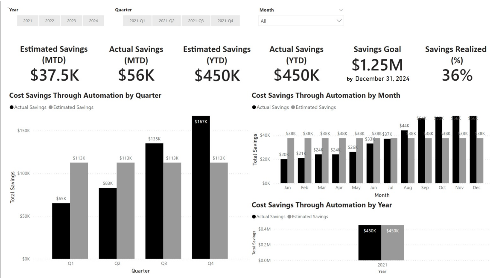
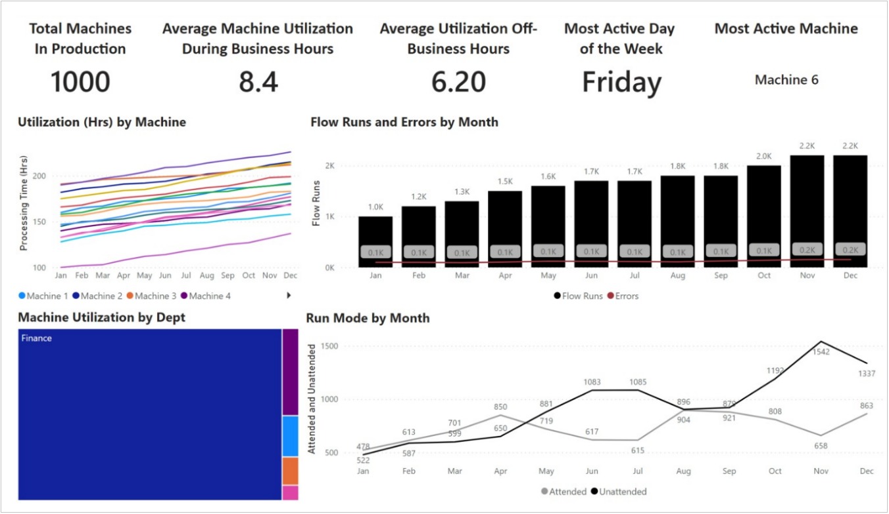
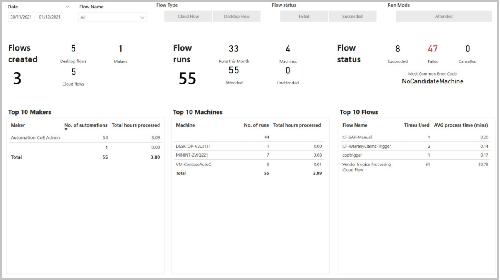
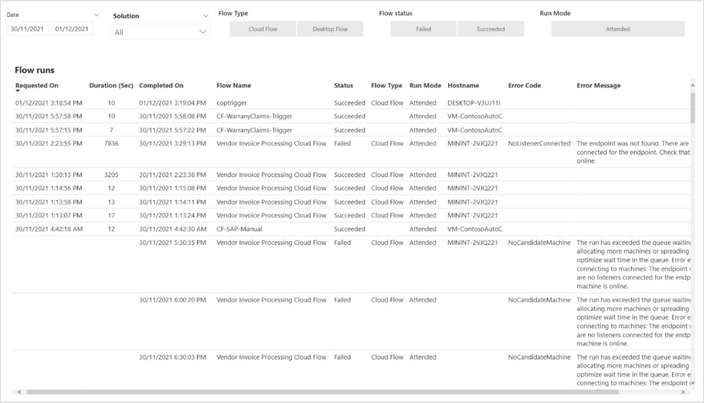
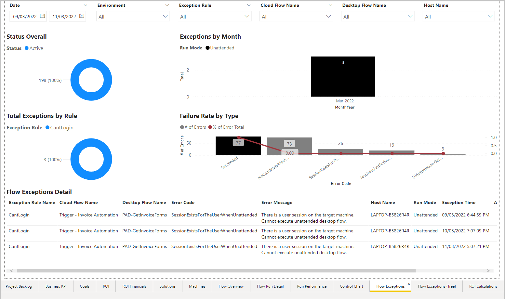
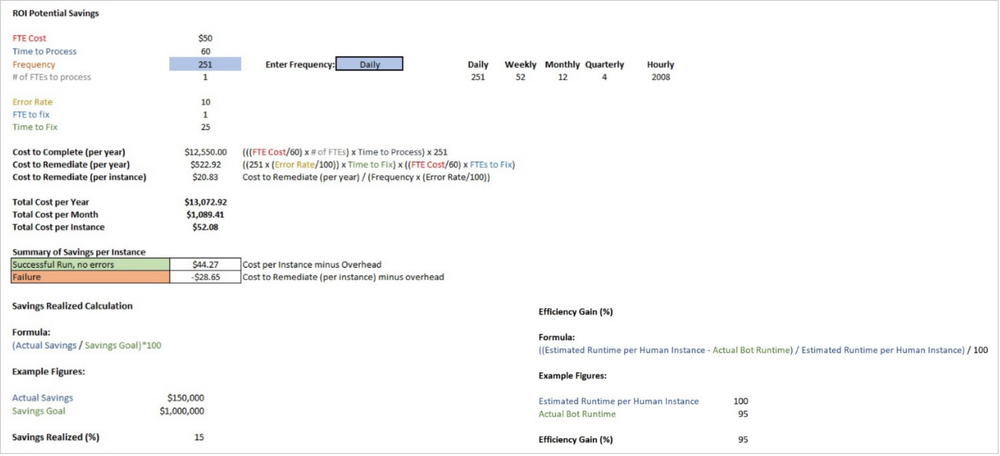

## Import the desktop flow actions csv

Follow these steps to import all the desktop flow actions from the included csv file into the **Desktop Flow Action** table.

1. Open a browser, navigate to [Power Automate](https://flow.microsoft.com) and sign-in with your account.
2. Navigate to your environment where the solution is installed.
3. Select Solutions tab.
4. Find and select Automation CoE main or satellite solution.
5. Select the table, Desktop Flow Action.
6. Click the Import dropdown near the top.
7. Select Import data from Excel.
8. After the popup opens, select the **Upload** button, and then upload the included Excel file (autocoe_desktopflowactions.csv).
9. Wait for the **mapping status** to show as successful.
10. Select **Import**.
11. After the import completes, verify that the data was imported.

## Setup the Automation CoE Power BI dashboard

To launch the Power BI dashboard for the Automation Center of Excellence, you will need the environment URL for your main environment (the environment where **Automation CoE Main** is located).

1. To obtain the environment URL, sign into the Power Platform admin center > Environments > select the environment, and then note the **Environment URL**.

   

1. Launch the Power BI template and then enter the environment URL.

   

### Main dashboard

The main Power BI dashboard has the following sections.

1. **Home** - This screen provides an overview of key KPIs for the Automation CoE.

   

1. **Project Backlog** - Provides details of the ideas and projects submitted, status, and ranks based on estimated savings and complexity.

   

1. **Business KPI** - Displays business details for savings realized, efficiency, hours saved, and other business metrics.

   

1. **Goals** - Outlines savings and efficiency goals for the organization, and the status by department and project.

   

1. **ROI** - Overall ROI for the Projects implemented.

   

1. **ROI Financials** - Displays information regarding ROI *actual* vs *estimate* by year, quarter, and month.

   

1. **Solutions** - Provides an overview of solutions in production, hours saved, error rates, and bot success KPIs.

   

1. **Machines** - Displays detailed information on machine utilization and activity.

   

1. **Flow Overview** - Summarizes the number flows created, runs, status, and top 10 makers, machines, and flows.

   

1. **Flow Run Detail** - Detailed information on flow runs, durations, status, run modes, hosts, and errors.

   

1. **Run Performance** - Shows a graphical display of run performance day over day.

   

1. **Control Chart** - Displays an overview of flow processing time averages and operational performance within control points.

   

1. **Flow Exceptions** – Enables you to filter by date, exception rule, cloud flow name, desktop flow name, or host name.

   

1. **Flow Exceptions Tree Diagram –** Displays and allows you to drill into specific flows organized by categories, including cloud flow name, desktop flow name, error code, error message, run mode, or host name.

   

1. **Action Usage Analysis** – Just like the Power App but with added filters and an email owner button. <!--todo: I am not following this-->

   

1. **Action Decomposition Tree Analysis** – Tree like diagram that shows how each action module or flow relates in a tree-like diagram.

   

1. **ROI Calculations** - Contains examples on how calculations related to ROI and efficiency are determined throughout the dashboards.

   

Every detail page consists of the following items.

- Filters (Department, Project, Solution).
- High-level statistics.
- Useful visuals.

