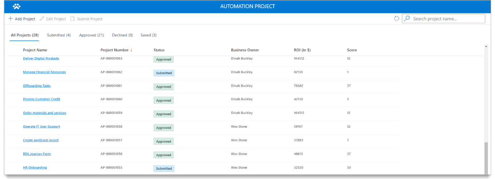
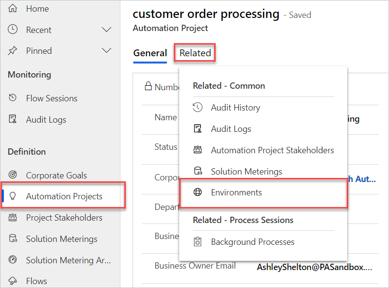
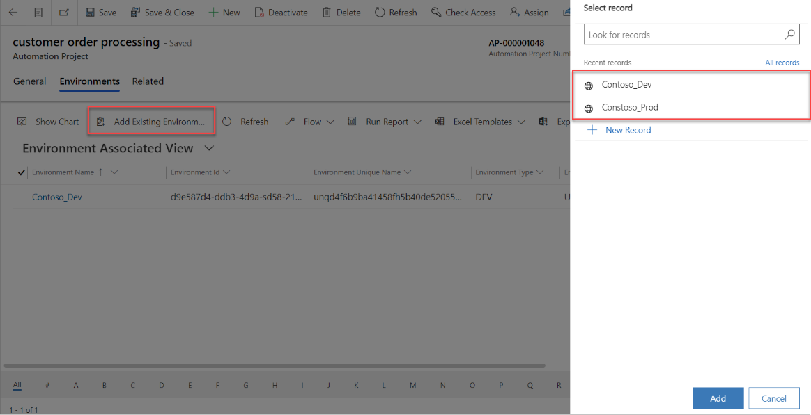
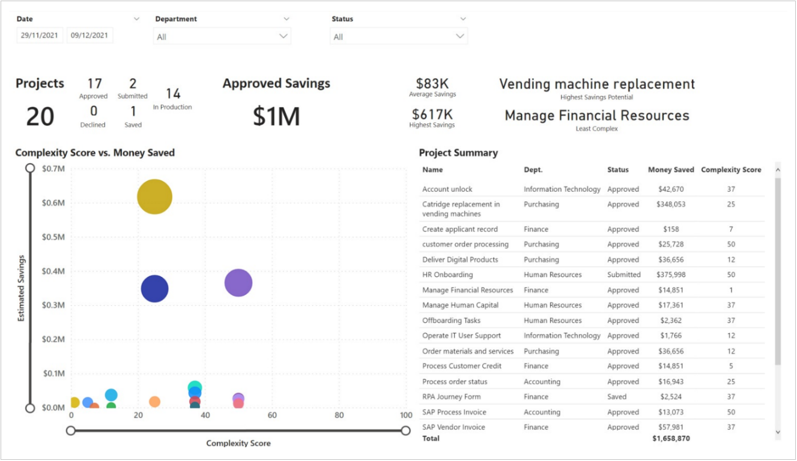
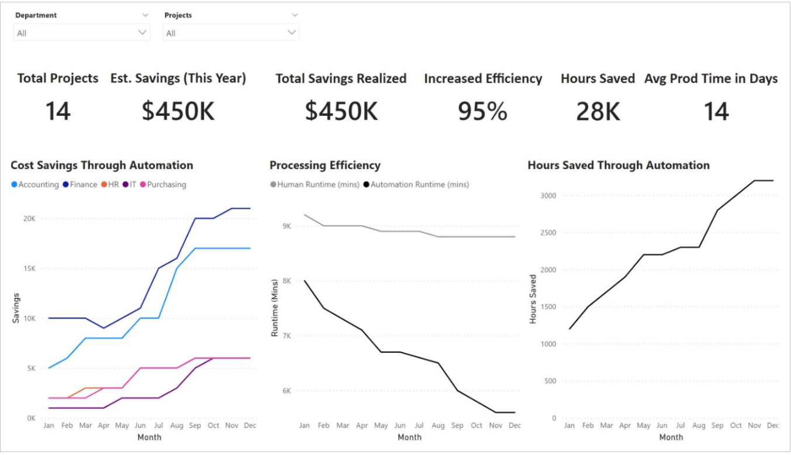
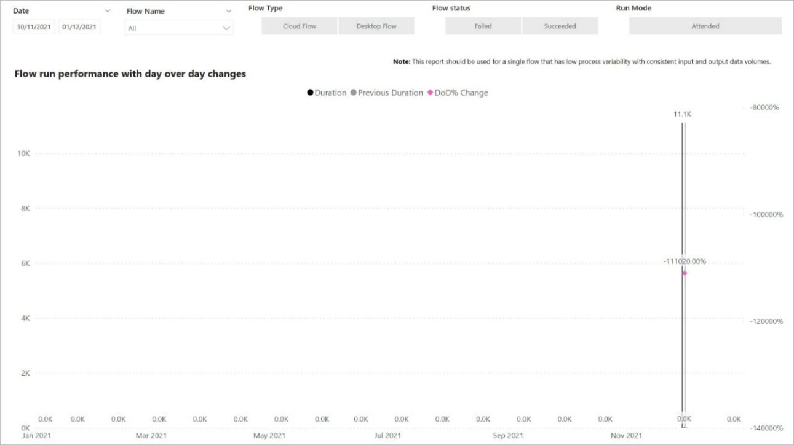
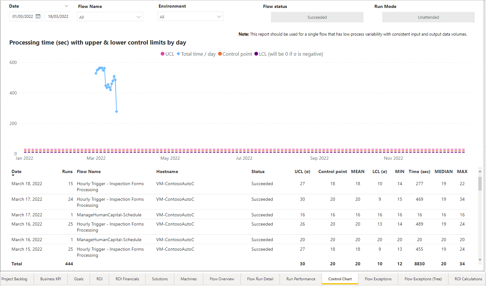
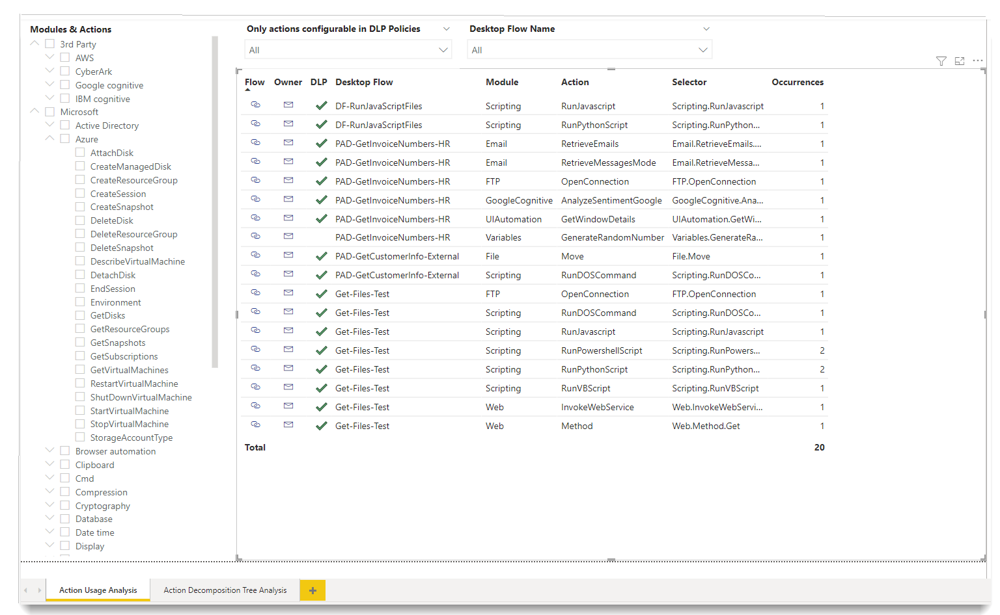
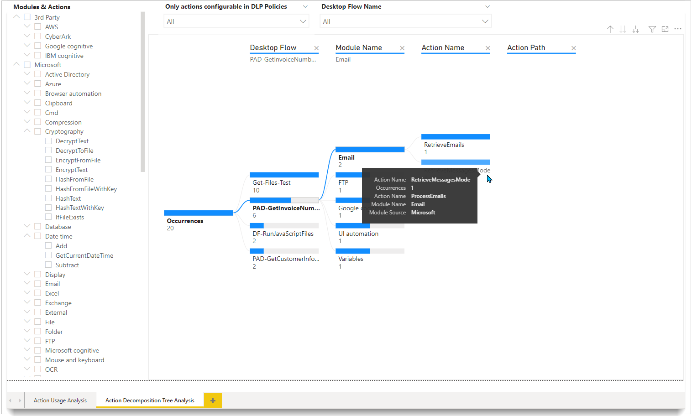

# Use the Automation Kit

This article details how to use each component in the Automation Kit:

- [Automation Console app](#automation-console-app)
- [Automation Project app](#automation-project-app)
- [Automation Center app](#automation-center-app)
- [Automation Solution Manager app](#automation-solution-manager-app)
- [Automation Kit Power BI dashboard](#automation-kit-power-bi-dashboard)

## Automation Console app

### Functionality

The Automation Console app is used to launch Automation Kit apps. You must update the information for the apps manually. [The setup process goes over configuring the Automation Console](./configure-automation-coe.md#console-configuration)

### Features

The automation console is a console-like dashboard of all apps to enable you to launch any of them from one place.

## Automation Project app

The purpose of the Automation Project app is to request and approve new automation projects. The approver receives a deep link to the project screen to view all automation project details.

Employees can submit an idea for an automation project. 

The project submitter enters data to enable the solution to calculate:

- The complexity score
- The money saved

The designated business owner must approve the automation project before development begins.

The [Power BI dashboard](#automation-kit-power-bi-dashboard) contains a scatter plot of all saved or submitted automation projects, which is useful to decide which automation projects are good candidates to develop.

### Project Dashboard (Home Screen)

| **Role**            | **What you see**                                          |
|---------------------|-----------------------------------------------------------|
| Project Admin       | See all automation project requests.                          |
| Project Contributor | Sees only automation project requests that you created.|
| Project Viewer      | Sees all automation projects in view mode.       |

### Main screen

On this screen, you can perform the following tasks.

- Create a new automation project.
- Edit an existing automation project.
- View project details.

1. Project information section - Fill out the information as it relates to the automation project.
1. Business owner field - This is the approver for the request. If no business owner is selected, the fallback is used.
1. ROI information section - Provide this information as it relates to ROI for the automation project.
1. Command bar - Use for new, save, edit, and submit tasks on the form. This submit button is available after the automation project has been saved.

Some fields are required to save the form. This is because when you submit a request, a flow (**Calculate ROI saving potential for automation project**) runs. This flow calculates the complexity score and then populates this information when you select the save button.

## Automation Center app

CoE admins use the Automation Center app to maintain the configuration and map automation projects to environments. You can also access flow sessions and metered artifacts in the automation center app.

Learn more about how to create and maintain the configuration data in [setting up the Automation Kit](./configure-automation-kit.md).

### Map automation projects to environments

CoE admins will map automation projects to environments after the request is approved.

1. Select **Automation Projects** tab.
1. Select the record you want to map.
1. Select the **Related** tab > **Environments**.

   

1. Select **Add Existing Environments**.
1. Select the environment you want to use, or create a new one.
1. Select **Add** > **"Save & Close"**.

<!--todo: steps seems missing or screens needs to be updated-->

## Automation Solution Manager app

System Administrators (Sys Admins)) use the Automation Solution Manager app to enable the metering of solutions and their artifacts.

After a solution is created in or imported into the satellite environment, a CoE admin maps the solution to an automation project.

Data syncs from the satellite environment to the main environment using real-time trigger flows inside of the satellite. Only solutions that have been mapped (using the Automation Solution Manager app) will sync data back to the main satellite environment.

### Turn on metering for a solution

After you create a solution in an environment, it appears in the list. The **+** icon displays when metering is turned off for a solution.

1. Select the **"+"** on the solution you want to meter.
1. In the new screen, select your automation project from the list. If it's not listed, select the **Refresh** button until it appears.
1. Select **Submit**, and then select **Yes** on the confirmation screen that appears.

   

### Rename a cloud flow to match naming convention

Follow these steps to rename a cloud flow to match the [naming convention](./test-end-to-end.md#cloud-flows-must-follow-specific-naming-convention-before-they-can-be-used-for-metering) from the Automation Solution Manager app home screen.

1. Click inside one of the solutions by clicking the solution name.
1. Select the cloud flow that you want to rename.
1. Click rename flow (only available to unmanaged solutions). The naming convention should apply automatically.
1. Click Save.

   The [naming convention](./test-end-to-end.md#cloud-flows-must-follow-specific-naming-convention-before-they-can-be-used-for-metering) should apply automatically.

>[!NOTE]
The last 3 digits will default to 001. If you have multiple solutions for a single project, you could increase that number by 1 for each additional solution if you wish to distinguish them. Read more about the [naming convention](./test-end-to-end.md#cloud-flows-must-follow-specific-naming-convention-before-they-can-be-used-for-metering).

### Meter solution artifacts

<!--todo: I don't understand this. please clarify.-->
This is where we meter the artifacts for the Flow Sessions to show up in our main environment.

1. We can get to the solution screen from the home screen by selecting the name of the mapped solution.

1. Once selected the "+" icon switches to a meter. And now data will be flowing to main (flow sessions). If this option is grayed out, then the cloud flow does not follow the [naming schema](./test-end-to-end.md#cloud-flows-must-follow-specific-naming-convention-before-they-can-be-used-for-metering). [Rename the cloud flow](#rename-a-cloud-flow-to-match-convention), if needed.

1. After you select the **+** icon, the meter icon appears.

   Now data will be **flowing** to main (flow sessions).

   

### Bypass Flow naming convention

There is an option to bypass the naming convention.

1. To bypass the naming convention, select the “Disable flow naming convention” checkbox. Acknowledge the warning.

2. Now you can meter the flow.

Now you can meter the flow.

## Automation Kit Power BI dashboard

You use the Automation Kit's Power BI dashboard to monitor your automation projects in production.

### Main dashboard

The main Power BI dashboard has the following sections.

- **Home** - This screen provides an overview of key KPIs for the Automation Kit.

   

- **Project Backlog** - Provides details of the ideas and projects submitted, status, and ranks based on estimated savings and complexity.

   

- **Business KPI** - Displays business details for savings realized, efficiency, hours saved, and other business metrics.

   

- **Goals** - Outlines savings and efficiency goals for the organization, and the status by department and project.

   

- **ROI** - Overall ROI for the Projects implemented.

   

- **ROI Financials** - Displays information regarding ROI *actual* vs *estimate* by year, quarter, and month.

   

- **Solutions** - Provides an overview of solutions in production, hours saved, error rates, and bot success KPIs.

   

- **Machines** - Displays detailed information on machine utilization and activity.

   

- **Flow Overview** - Summarizes the number flows created, runs, status, and top 10 makers, machines, and flows.

   

- **Flow Run Detail** - Detailed information on flow runs, durations, status, run modes, hosts, and errors.

   

- **Run Performance** - Shows a graphical display of run performance day over day.

   

- **Control Chart** - Displays an overview of flow processing time averages and operational performance within control points.

   

- **Flow Exceptions** – Enables you to filter by date, exception rule, cloud flow name, desktop flow name, or host name.

   

- **Flow Exceptions Tree Diagram –** Displays and allows you to drill into specific flows organized by categories, including cloud flow name, desktop flow name, error code, error message, run mode, or host name.

   

- **Action Usage Analysis** – Just like the Power App but with added filters and an email owner button. <!--todo: I am not following this-->

   

- **Action Decomposition Tree Analysis** – Tree like diagram that shows how each action module or flow relates in a tree-like diagram.

   

- **ROI Calculations** - Contains examples on how calculations related to ROI and efficiency are determined throughout the dashboards.

   

### Detail pages

Every detail page consists of the following items.

- Filters (Department, Project, Solution)
- High-level statistics
- Useful visuals
