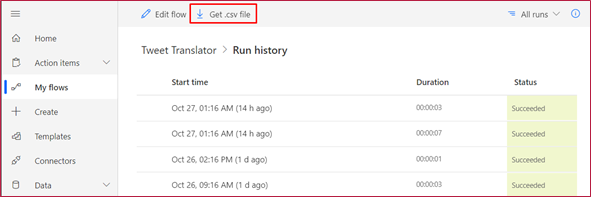
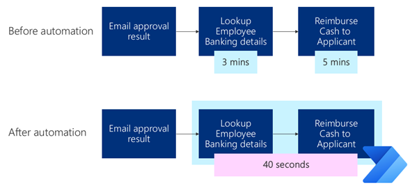

# Assessing the business impact

Once you have successfully deployed your automation, you can assess the impact
by comparing your original business process against your new process, using the
success metrics you defined. Your automation results are stored for 30 days,
during which you can view them to analyze the total number of actions and runs
in a day.

To view the analytics:

1.  Go to **My flows.**

2.  Select particular flow you’re analyzing. \\

3.  Select **Analytics**.

4.  Select the **Usage** tab.

## Number of runs of your flow

The Usage tab shows you how many times that flow has been used to automate that
particular business process in a day.

To export the data to an Excel spreadsheet:

1.  Hover over the graph that shows the data data you want to export.

2.  Select **More Options.**

3.  Select **Export data.**

4.  Choose the file format you want (Excel or CSV).

5.  Select **Export**.

## Flow run duration

To see the duration oef ach flow run.

1.  Go to **My flows**.

2.  Select particular flow you want to analyze.

3.  Select **All runs** in the 28-day run history

4.  If you want to export the information, select **Get .csv file.**

The CSV file include start time and end time of each run. You can use Excel to
re-calculate the duration and do additional analysis (such as average duration).
To get the duration in seconds:

**(Run end time cell – Run start time cell) \* 24 \* 60 \* 60**

Now that you have the number of runs, and duration of the run, you will be able
to find out how much your automation has contributed by comparing it with the
previous manual process.

## Example scenario

Let’s take the scenario from cash reimbursement as an example.

In this scenario, Abhay’s accounting team had to previously key-in accounting
codes and enter & post transactions on his accounting system based on the
information from the attached approval request sent via email. Lets say that he
had measured how long this takes in the planning phase and had recorded that it
takes 3 mins to lookup the employee banking details, and another 5 minutes to
reimburse cash to the applicant from the online banking website.

Based the flow runs, Abhay could see that his automation was run between 91 to
110 times a day, on average of 107 runs.

Duration of his automation was 40 seconds on average based on the information he
retrieved from run history. His time reduced per run would be:

Time before (3 mins + 5 mins) – Time after (40 seconds) = 440 seconds

As his automation ran 3,226 times in 30 days, his total reduction would be:

Reduced time (440 seconds) \* No. of runs (3,226 times) = 1,419,440 seconds =
394.28 hours
