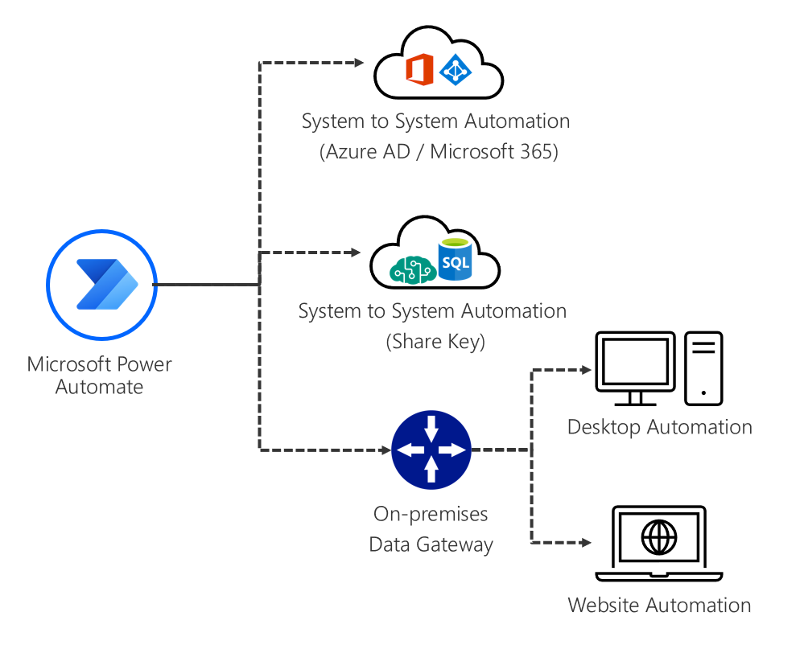
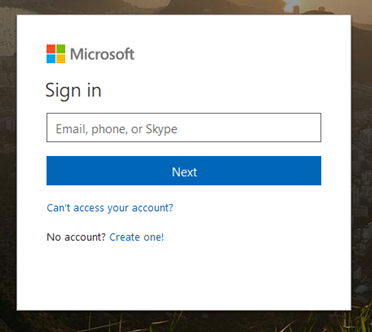
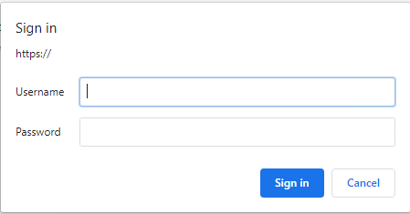
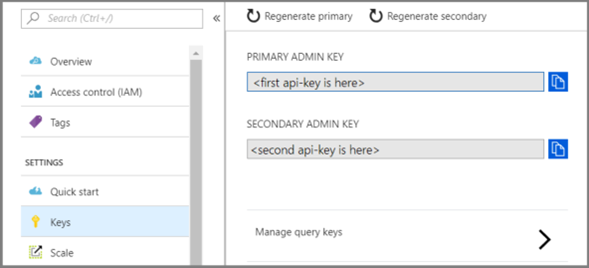

### Authentication and security

Your automation will probably be accessing data and systems that are protected
by requiring users to sign in. Different automation scenarios require Power
Automate to use different authentication methods.

Before you set up your automations, you should ask yourself how you currently
log in to the systems / machines to do the tasks manually. Below are some
examples of different types of authentication (logins) that could be used when
automating with Power Automate.

#### On-premise Data gateway

For desktop and website automations, On-premise data gateway is used to connect
Power Automate and the on-premise data gateway capabilities. This is required so
that programs that are installed in the on-premise machines (eg. Browser
extensions and Power Automate Desktop) can be accessed from Power Automate
remotely. More information on [setting up on-premise data
gateway](https://docs.microsoft.com/data-integration/gateway/service-gateway-install).

#### Authentications using Microsoft 365 / Azure AD

This is the authentication for any automation that you use with Microsoft
services. When the automations are run, they will be run on behalf of the user
who runs the automation and not the user who has set up the automation.

#### Authentications using a username and password

This type of authentication is used for systems and services that have an
independent system other than what is used with Office 365 / Azure AD, with a
separate username and password. Logins for systems such as Google, Facebook,
Twitter etc. all have their own login methods. Some enterprise systems provide
[Single Sign On
(SSO).](https://docs.microsoft.com/azure/active-directory/manage-apps/what-is-single-sign-on)

With the expense reporting example, the online banking system would have its own
login ID and password.

#### Authentications using On-premise system / Windows login

This type of authentication will be required if you are planning to automate
with the Power Automate Desktop application or UI flows. It is separate from
Office 365 / Azure AD. If it is a computer that is connected to a corporate
network, it is highly likely that it uses an Active Directory.

#### Authentications using a shared key

This authentication is usually used for online services, which is to be used for
system to system (API) automations where the services are shared across the
company. This is typically provided/setup by your IT department where the
connector is shared to you.

To set up the automations, make sure you have the authentication (login)
information above ready. You will need these information when you are [making a
new
connection](https://docs.microsoft.com/power-automate/add-manage-connections) to
setup your automation, setting up to [access data via on-premise data
gateway](https://docs.microsoft.com/power-automate/add-manage-connections#connect-to-your-data-through-an-on-premises-data-gateway),
or when using [UI
flows](https://docs.microsoft.com/power-automate/ui-flows/overview).
