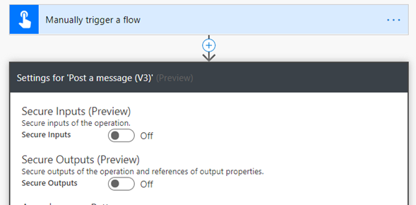
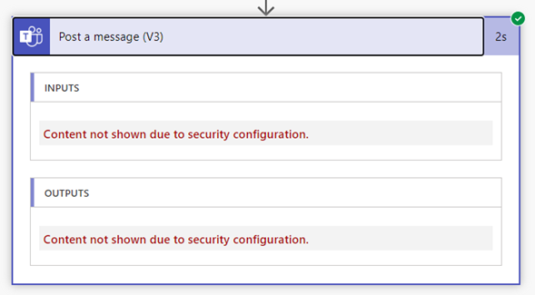

# Defining inputs and outputs

In any automation, there is an input and an output. Before you start creating
automations with Power Automate, you need to define what they are.

Here is an example of how you can define the inputs and outputs.

In the expense approval scenario, Abhay has the following steps to reimburse
cash to the applicant who submitted an expense form.

1.  Abhay receives an approval request for an expense report.

2.  Abhay decides to approve or decline the request.

3.  If approved, Abhay sends an email to the employee to let them know the
    request was approved.

In the example, we can identify that the following pieces of information are
required.

| **Information required**   | **Input or Output** | **Purpose**                                                 |
|----------------------------|---------------------|-------------------------------------------------------------|
| Employee’s name            | Input               | To send an email if expense is approved                     |
| Employee’s email           | Input               | To send an email if expense is approved                     |
| Employee’s employee number | Input               | To search in employee management system for banking number. |
| Approval result            | Output              | To send an email if expense is approved                     |
| Approver’s name            | Output              | To send an email if expense is approved                     |
| Approver’s email           | Output              | To send an email if expense is approved                     |
| Approval date & time       | Output              | To send an email if expense is approved                     |

It may look overwhelming, but the majority of the inputs can be retrieved
automatically. For example, the employee’s name and email can be retrieved if
the automation is triggered manually by the employee.

## Securing inputs and outputs

If you are handling sensitive data such as login IDs, passwords, banking
information etc, you can use the Secure Inputs and Secure Outputs feature in
Power Automate.

By default, you can see the history of runs in Power Automate and look inside
what was input or output. Enabling Secure inputs and outputs allow you to
protect this data and will instead show “Content not shown due to security
configuration” if anyone attempts to look inside the input/output.

