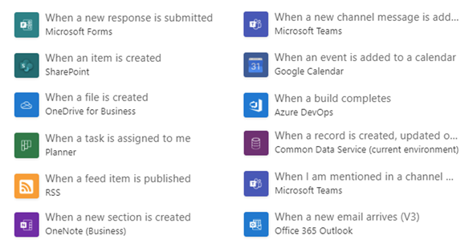

# Determining which automation methods to use

Once the process design is complete, the next step is the architectural design
to focus on how you will automate that process.

Ideally, all the systems you want to automate have Power Automate connectors.
Check the [list of
connectors](https://docs.microsoft.com/connectors/custom-connectors/) to see if
there are connectors available for the system you plan to automate. Once you
find the connector, make sure that the actions you need are available for that
connector. (For example, a connector for an email system might have actions for
“send,” “reply,” and “delete.”)

If there are no connectors available, you have the following options to choose
from:

-   Create a custom connector

-   Use the HTTP connector

-   Web browser automation

-   Desktop application automation

#### Creating a custom connector 

If you are a developer or your organization has a developer who can create
[custom connectors](https://docs.microsoft.com/connectors/custom-connectors/),
this will be the preferred method of automation.

More information on [setting up custom
connectors](https://docs.microsoft.com/connectors/custom-connectors/define-blank).

#### Use the HTTP connector

If you are a developer and have one-off scenarios where you need to connect to
systems with no connectors available, but do not want to setup custom
connectors, HTTP connector is the next preferred method.

More information on [HTTP
connector](https://docs.microsoft.com/azure/connectors/connectors-native-http#add-an-http-trigger)
(directs to Azure Logic Apps as it is a common connector).

#### Web browser automation

If you couldn’t find a connector, and if the system is a web/browser based
application or a website, web browser automation is what you should consider.
Web browser automation automates steps / processes as if a human were using the
browser by mimicking keyboard and mouse movements.

Web browser automation can be achieved either by [Web UI
flows](https://docs.microsoft.com/power-automate/ui-flows/create-web) or by
[Building a
WebAutomation](https://docs.microsoft.com/power-automate/ui-flows/desktop/actions-reference/webautomation)
Process using Power Automate Desktop.

#### Desktop application automation

If you couldn’t find a connector, and if the system is a desktop application on
a PC, this is the automation method to use. Power Automate has capabilities that
mimicking human keyboard and mouse movements.

Desktop application automation can be achieved by [creating a new
Process](https://docs.microsoft.com/power-automate/ui-flows/desktop/create-flow)
using Power Automate Desktop.

More information on [automating desktop
flows](https://docs.microsoft.com/power-automate/ui-flows/desktop/desktop-automation).

The chart below shows the comparison of the different methods.

| Method                         | Ease of use | Requires development background                   | Easily affected by system changes | Requires setup / development time |
|--------------------------------|-------------|---------------------------------------------------|-----------------------------------|-----------------------------------|
| Connector                      | Easiest     | No                                                | No                                | None                              |
| Custom Connector               | Easy        | Yes                                               | No                                | Yes                               |
| HTTP Connector                 | Easy        | Yes                                               | No                                | No                                |
| Web browser automation         | Easy        | Preferably with a basic knowledge of CSS and HTML | Yes                               | Yes                               |
| Desktop application automation | Easy        | No                                                | Yes                               | Yes                               |
              |

In complex automation scenarios, you can combine all these types of automations
mentioned above.

## Triggering the automation to start

With any of the automation methods above, you need to consider how to trigger
(start) these automations. The ways you can trigger an automation are as
follows:

-   Automated triggers

-   Instant / Manual triggers

-   Scheduled Triggers

## Automated triggers

With an **automated trigger**, a system automatically starts the automation when
a condition is met. (Note: Not all connectors include automated triggers.)

Example triggers:

-   When an email is received in Outlook

-   When a new file is placed inside OneDrive

-   When a new record is created inside Microsoft Dataverse

-   When an item was modified in Sharepoint custom list

An example use case for the expense report would be to set an automated trigger
to start an approval flow when a new record is created in the Expense Approvals
entity in Microsoft Dataverse. This is so that Power Apps can be used to create
a form, which then creates a new record in Microsoft Dataverse.
[//]: # (Edit still remaining)

## Instant / Manual triggers 

**Instant / Manual** trigger is a type of trigger where a user needs to manually
start that automation or the trigger is instantaneously started. This can be
triggered directly from a [Flow button](https://docs.microsoft.com/en-us/power-automate/introduction-to-button-flows)
or some of Microsoft services.

## Scheduled triggers 

**Scheduled** triggers are set with a specific date and time to trigger and to
repeat on a periodic basis. It is useful for situations where you need to
automate a specific task daily, weekly, monthly etc.

In the expense report example, a good case to use scheduled triggers would be
that the accounting team wants to send an automated email when the weekly BI
report is ready on a Friday.

