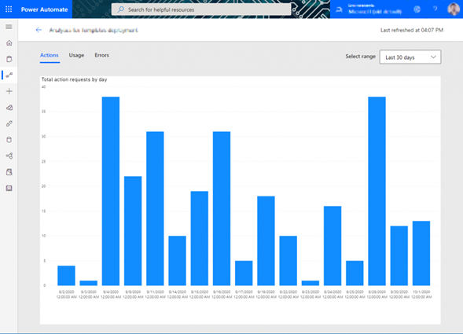
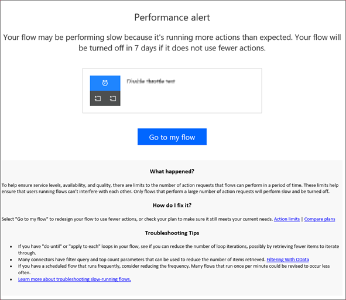

# Discovering performance issues

If you’re experiencing delays or slowdowns during your flow execution, it may be
that you have hit your Power Automate limits for the day. More information:
[Request limits and
allocations](https://docs.microsoft.com/power-platform/admin/api-request-limits-allocations)

## Action analytics
To review whether your automation has reached the limitations, you can use action analytics to have better insight to how much
you are using your actions.

To see the action analytics:

1.  Go to **My flows**.

2.  Select particular flow you want to have a look at the telemetry on.

3.  Select **Analytics.**

4.  Select on **Actions** tab.

When your automation has slowed down, it’s a good idea to revisit your flow
design and check for any efficiency that can help reduce the number of actions
being executed.

For flows that are consistently getting delayed due to overages, flow owners
also receive a notification informing them about these overages with tips and
tricks on how to prevent delayed execution of flow runs.

Here is an example of an email that was sent for a flow that was consistently
running up against action limits:

## **Limits from connected services**

Similar to Power Automate, most web services and apps also tend to implement
similar service protection limits and abuse-detection algorithms.

A misconfigured flow can sometimes reach these limits, which usually manifest as
errors [429] or timeouts [5xx] in your flow runs. It’s important to note that
these limits vary based on the connector / service you’re using within your
flow.
