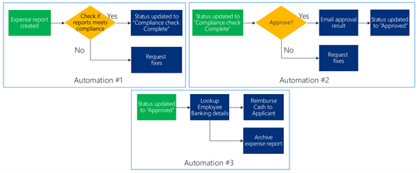

# Separate flows into smaller automated processes

When you're setting up an automation, try to architect your flows so that you
don't have a single automation that covers the entire process. There are several reasons why you should make multiple, smaller flows:

- Maintenance is easier.

- Error handling doesn't need to be as sophisticated.

- Multiple people can work on the automation.

- There's no need to restart the automation from the beginning if a step fails.

In the example below, one automation has been set up for an approval process, covering multiple
processes with a single automation.<!--note from editor: Needs more descriptive alt text. -->

If, for example, the cash reimbursement process fails, the whole automation will
be considered a failure. If a requirement or specification for looking up employee
banking details changes, the whole process will have to be suspended until the updates are in place.

Instead, you can separate the automation into modules, as shown in the following image.<!--note from editor: Needs more descriptive alt text. -->

In this example, Automation \#2 depends on the previous automation to
set the status of the expense report to "Compliance
check complete." However, if there's a problem with the mail system and
Automation \#2 fails, the tasks in Automation \#1 will still be completed. Only tasks in Automation \#2 will need to be restarted.
