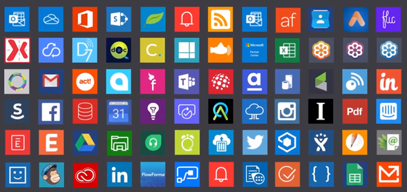

# Various types of process automation

This video provides a quick overview or process automation using Power Automate:
> [!VIDEO https://www.youtube.com/embed/CdXBL7CfwVE]

There are two main types of automation available in Power Automate:

-   API-based digital process automation (DPA)

-   UI-based robotic process automation (RPA)

## API -based digital process automation (DPA)

Power Automate enables you to automate over 380 applications using API-based
“connectors” provided “out of the box.” Additionally, it offers the ability for
software engineers to create new “custom connectors” to any application that has
an API available. (Modern applications (including Cloud-based services) use APIs
to provide programmatic access to data and functionality. The API declares a set
of rules for requests. Programmers use the API to interact with the
application.)

Without writing any code yourself, you can use connectors to access data and use
a wide variety of application functionality in your automation. For example, you
can automate adding a new item to a SharePoint list when you receive an email
with a specific subject line, using the connectors for SharePoint and your email
program.

## UI-based robotic process automation (RPA)

The next question you would have is: what if you have an application for which
there is no connector in Power Automate and you can’t create a custom connector
because it doesn’t have an API? This is where RPA comes in. RPA lets you create
automation even for older systems that do not have an API. With RPA, you
automate applications by teaching Power Automate to mimic the mouse movements
and keyboard entry of a human user (as if a robot were using the computer). In
other words, while DPA provides API connectors so you can *tell* the application
what to do, RPA enables you to *show* it what to do.

## DPA or RPA? Or both?

When automating with Power Automate, we recommend using DPA for applications for
which an API-based connector is available, because APIs are intended to be
stable even when the application changes over time. Software vendors work hard
to avoid making changes that break the way old API rules work.

Conversely, RPA in general is susceptible to break if there are changes in the
local computer’s environment, updates to the application’s screen layouts, and
so forth. Additionally, you must use great care to ensure that you have been
clear in your instructions to the robot. For example, if you selected cell B3 of
the spreadsheet, do you want the robot to select cell B3 every time? Do you want
it to select the first empty cell in column B? Do you want it to select the cell
in column B for the row where column A is set to a specific value? It’s easy
when using RPA to have some instructions or decisions that aren’t obvious just
from recording your mouse clicks and keyboard entry; it may take some iteration
to ensure you have provided all the necessary instructions, including what to do
in case of errors.

Power Automate provides both DPA and RPA, allowing you to bridge what you can
automate between modern API-based services and the websites and desktop
applications for which you don’t have an API-based connector.
