# Use no-code RPA with SAP GUI in Power Automate Desktop

You can use the [Power Automate Desktop recorder](../../desktop-flows/recording-flow.md) to record SAP GUI interactions. The desktop recorder translates each mouse click and keystroke into Power Automate Desktop actions, and then adds these actions to your desktop flow.

If you want to see the new desktop recording experience in action, follow these steps to reconfigure the action-based automation you built in the [Low-code RPA with SAP GUI in Power Automate Desktop](action-based-SAP-GUI-automation-manually-overview.md) section of this playbook.

You can also follow along in the no-code approach in episode 6 of the video series:

> [!VIDEO https://www.microsoft.com/videoplayer/embed/RWJEiJ ]

1. Select the **ProcessHRMasterForm** subflow tab, and then select **Desktop recorder**.

   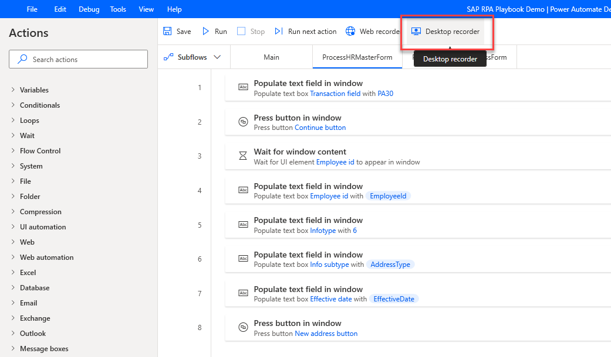

2. Open SAP, bring the SAP **Easy Access** window to the foreground, and then in the Desktop recorder window, select **Start recording**.

   

3. Enter **PA30** into the **Transaction** field, and then select **Enter**.

  

4. Enter a **Personnel number**, and then select **Enter**.

   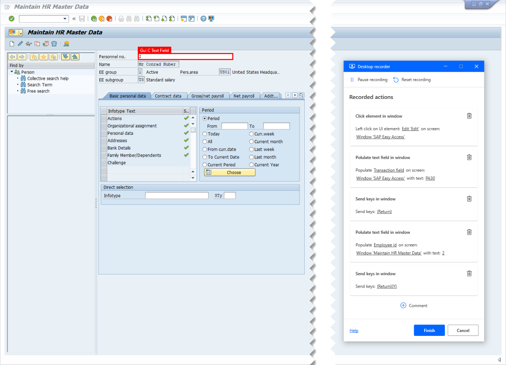

5. Select **Addresses** as the **Infotype Text**, and then enter a value in **STy** (such as **2** or any other value suitable for your use case).

   

6. Enter a date in the **From** field, and then select the **New** icon.

   

7. Enter a street name along with a house number in **Address line 1**.

   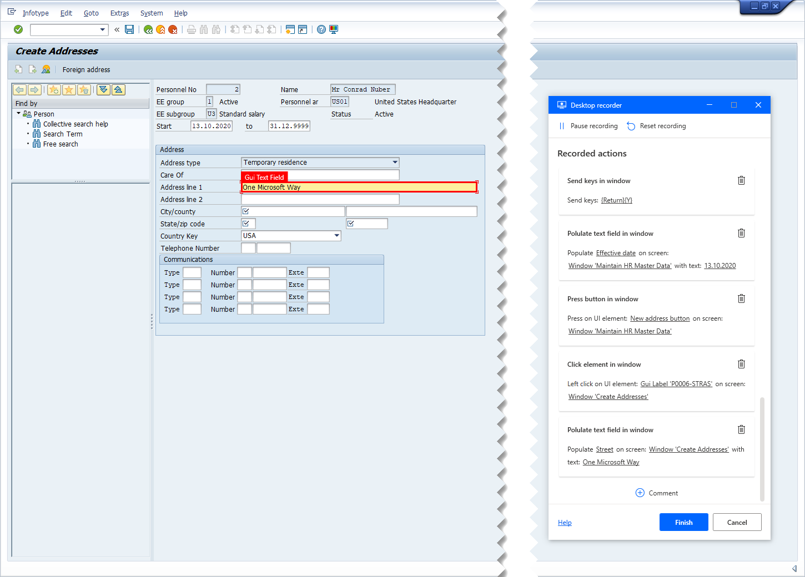

8. Enter values for **City, State/zip code** and **Country key**, and then select **Save.**

   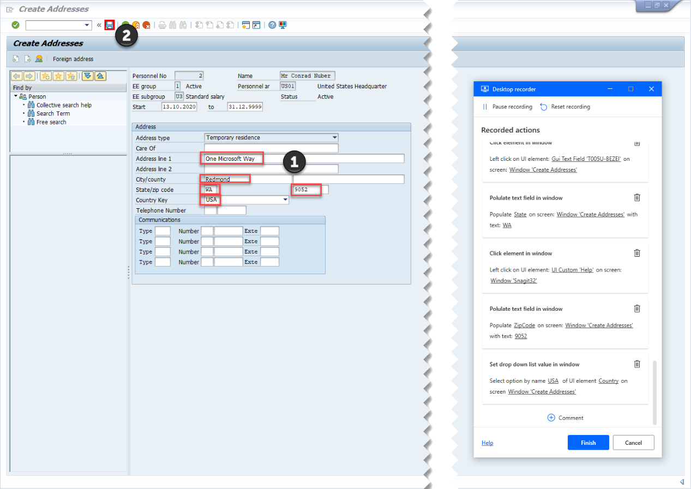

9. Select the **Back** (**F3**) icon.

   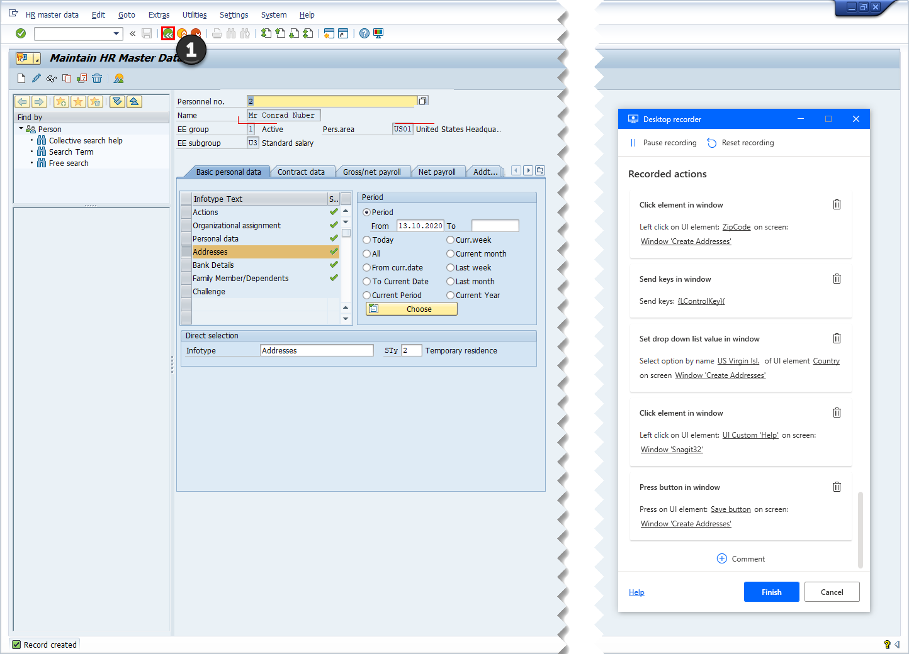

10. This completes the address creation process, so select **Finish** in the desktop recorder window.

    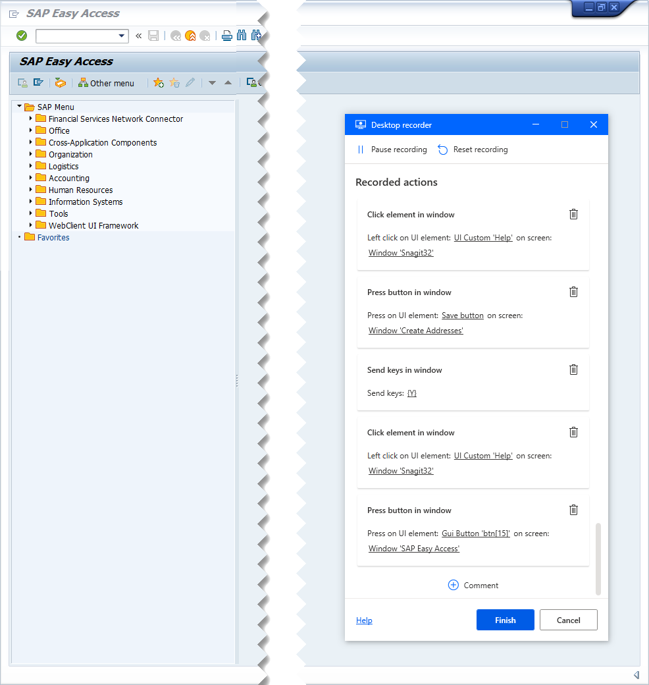

11. Your desktop flow script should look similar to the following image.

    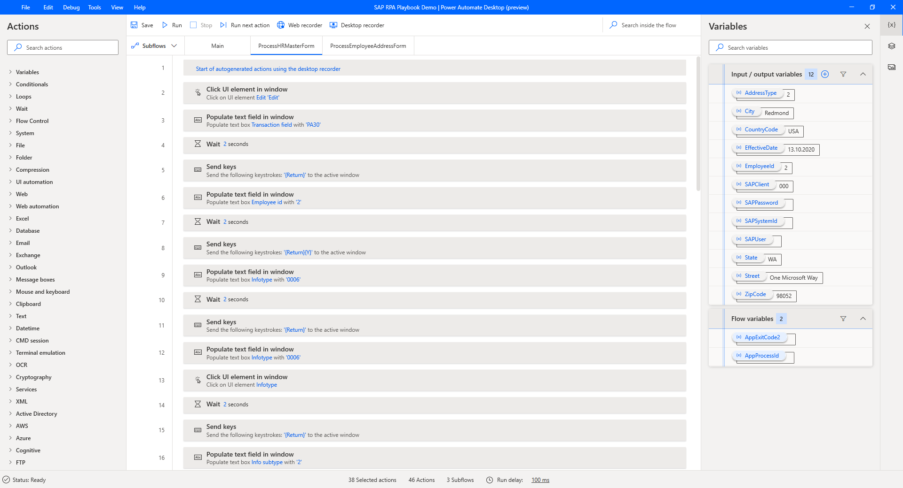

12. During recording, you might have accidentally selected windows or other UI elements that aren't relevant to your flow. If this happens, you can remove duplicate or unnecessary action steps from the script.

    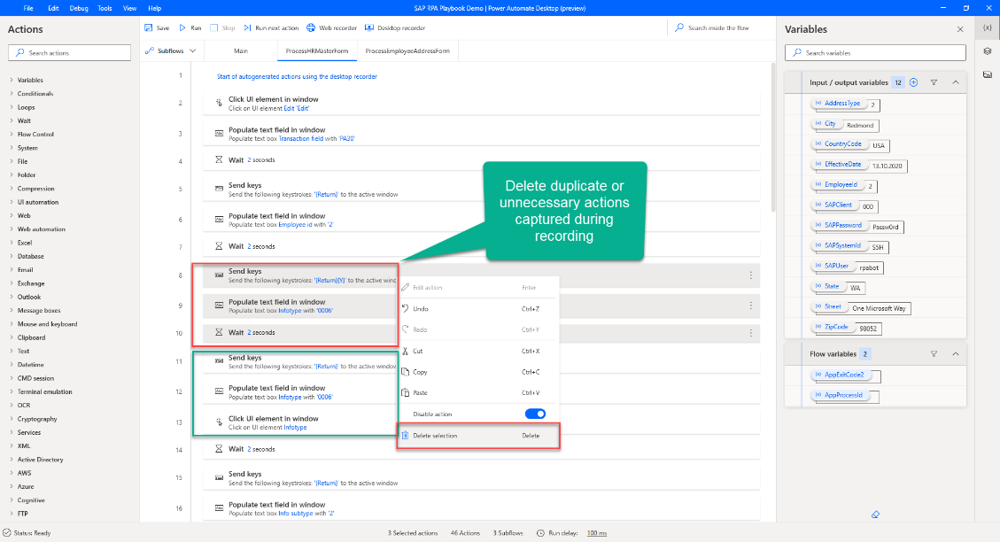

    

13. Highlight all actions that were manually defined in [Low-code RPA with SAP GUI in Power Automate Desktop](action-based-sap-gui-automation-manually-overview.md), right-click, and then select **Delete selection** to remove them from the subflow.

    

14. Edit the **Populate text field in window** action for **Employee Id**, and replace the **Text to fill-in** value with the previously defined **EmployeeId** variable.

    

    

15. Edit the **Populate text field in window** action for **Info subtype**, and replace the **Text to fill-in** value with the previously defined **AddressType** variable.

    

     

16. Edit and replace the hard-coded text with variables in the **Populate text field in window** actions for **Effective Date**, **Street**, **City**, **State**, **ZipCode**, and **Country**.

    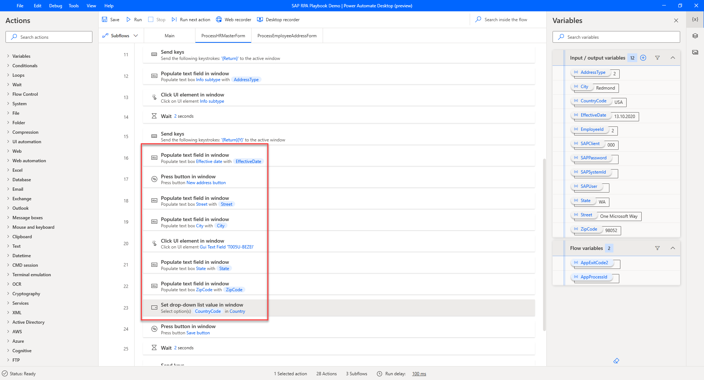

17. Highlight the actions that you'll need for the employee address creation subflow, right-click the actions you selected, and then select **Cut**.

    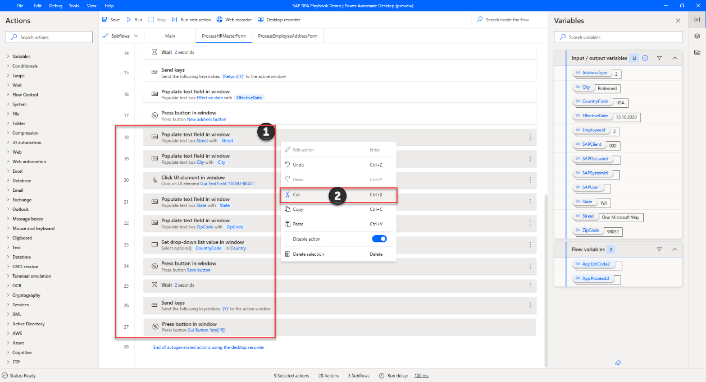

18. Open the **ProcessEmployeeAddressForm** subflow, select all actions, right-click, and then select **Delete**.

    

19. In **ProcessEmployeeAddressForm** subflow, right-click, and then select **Paste**.

    

20. Under the **Variables** pane, edit all variables and then provide **Default values**. These default values will be used to test the updated desktop flow.

    

    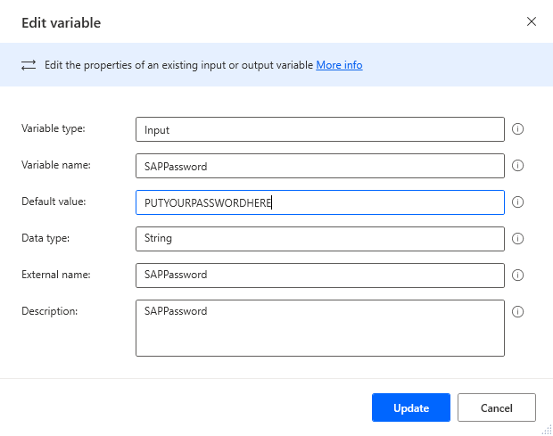

21. Select **Save**, and then close the confirmation message.

22. Select **Run**.

    

Awesome! With this new desktop recording option, some minor action tweaks, and a bit of refactoring, you've reduced development time and simplified the overall desktop flow action definition process.

>[!IMPORTANT]
>Delete all previously defined default values before you leave the desktop flow authoring experience.

> [!div class="nextstepaction"]
> [Next step: Extract data from the SAP GUI UI with Power Automate](extracting-information-from-sap-gui-ui.md)
