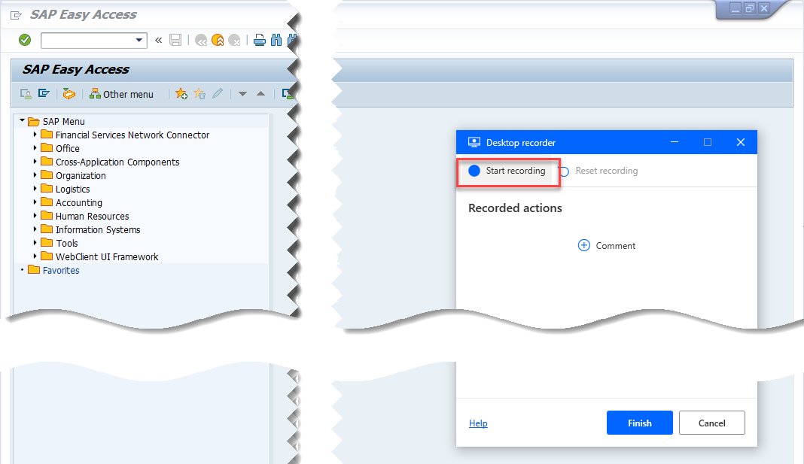
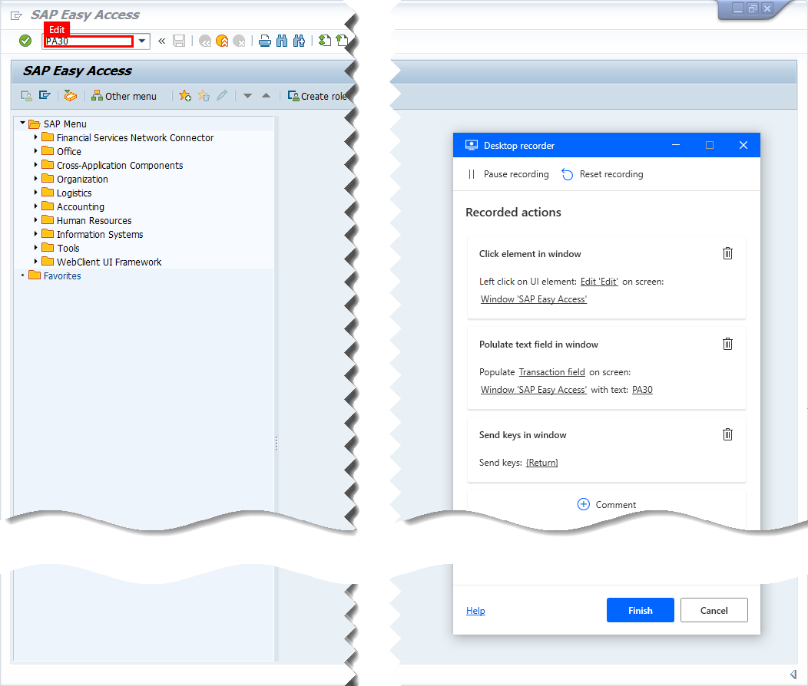
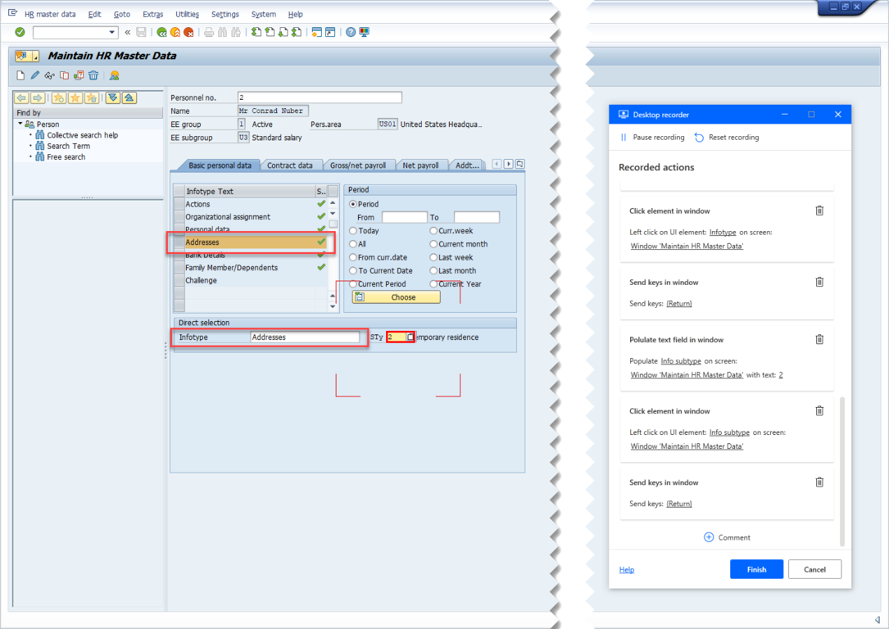
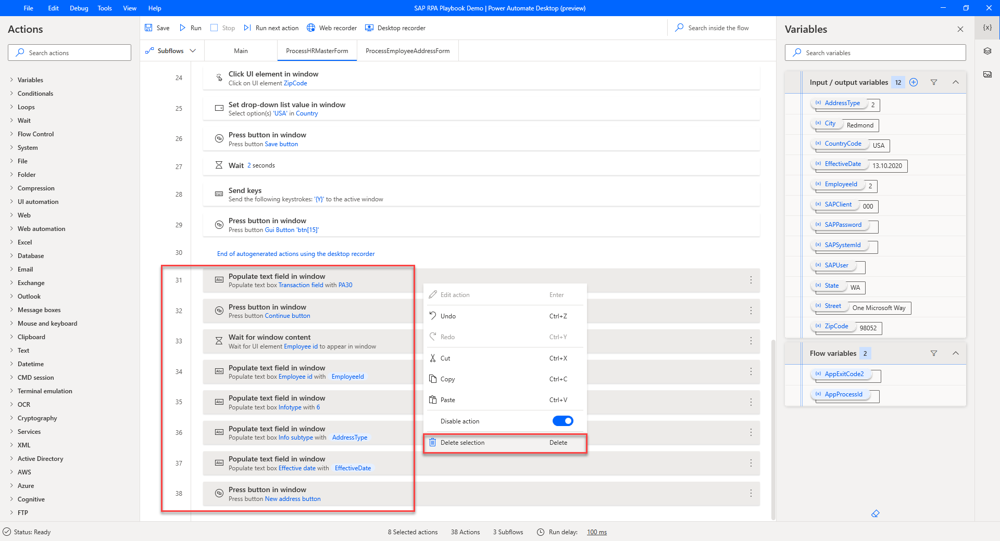
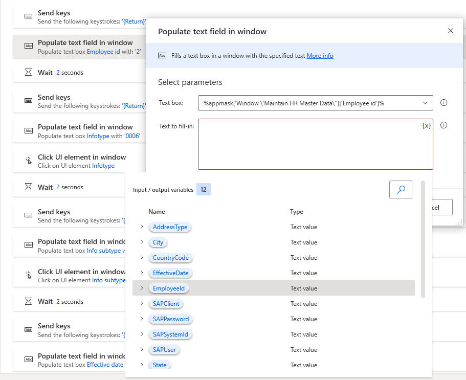
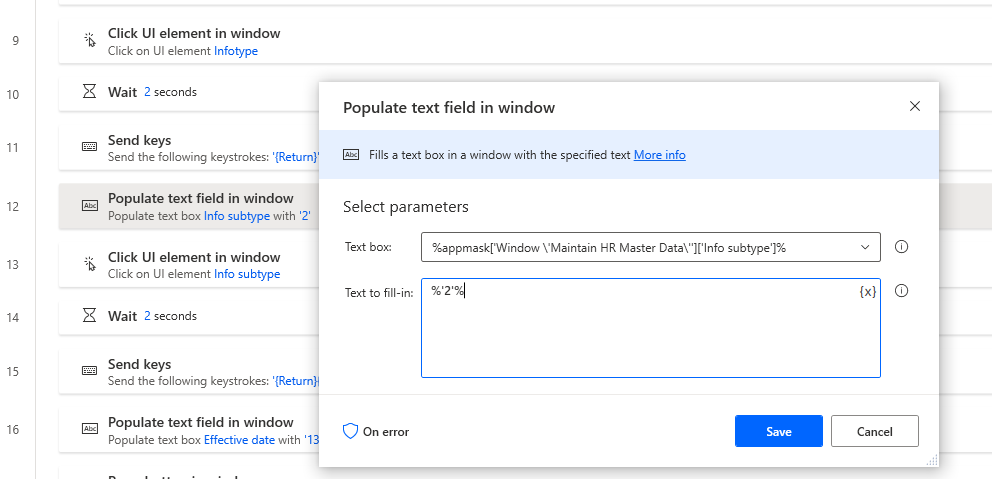
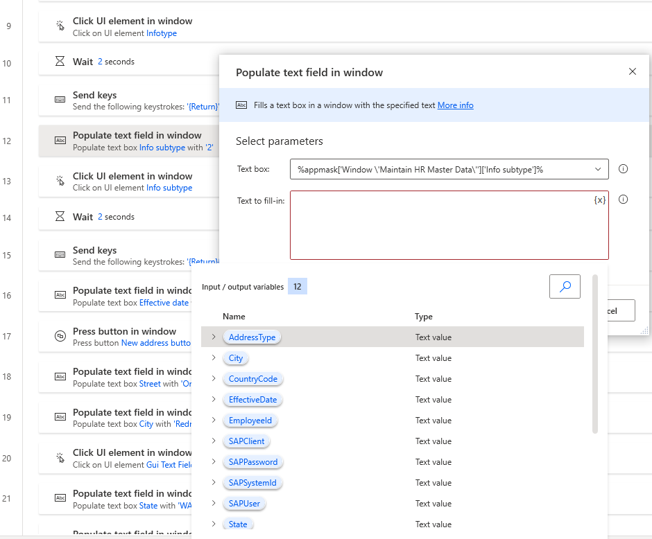
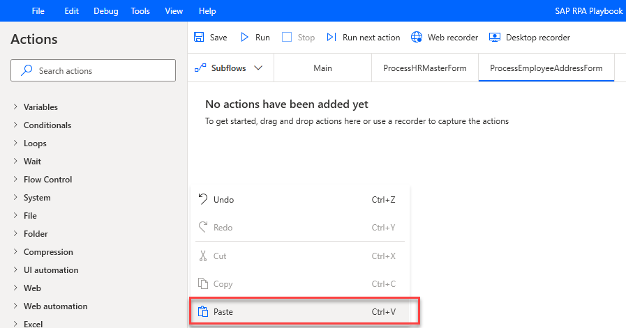
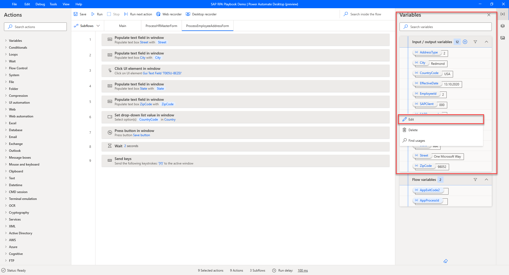

# Action-based SAP GUI automation – using the built-in desktop recorder 

With the [Power Automate Desktop October update](https://flow.microsoft.com/blog/power-automate-desktop-october-2020-update/) we introduced support for SAP GUI-based desktop recording in Power Automate Desktop. Now, in addition to manual action design, you can use Power Automate Desktop's built-in [Desktop recorder](../ui-flows/desktop/recording-flow) to record SAP GUI interactions. The Desktop recorder translates each mouse click and key stroke into Power Automate Desktop actions and adds them to your Desktop flow.

If you want to see the new desktop recording experience in action, please follow these steps to re-configure the action-based automation you built in steps 6.1-6.3.

1.  Select the **ProcessHRMasterForm** subflow tab and then select **Desktop recorder**.

2.  Open SAP, bring the SAP Easy Access window to the foreground, and then in the Desktop recorder window, select **Start recording**. 

3.  Type **PA30** in the Transaction field, then press the **Enter** key.

4.  Enter a **Personnel no** and press **Enter**.

5.  Select **Addresses** as the **Infotype Text** and enter a value in **STy** (such as "2" or any other value suitable for your use case).

6.  Enter a date in the **From** field and click the **New** icon.

7.  Enter a street with house number in **Address line 1**.

8.  Enter values for **City, State/zip code** and **Country key** and select **Save.**

9.  Select the **Back (F3)** icon.

10. This completes the address creation process, so select **Finish** in the Desktop recorder window.

11. Your Desktop flow script should look like this.

12. During recording you might have accidently clicked on different Windows and UI elements; so if necessary, do some cleanup to remove duplicate or unnecessary action steps.

13. Highlight all actions that were manually defined in section 6, then right-click and select **Delete selection** to remove them from the subflow.

14. Edit the **Populate text field in window** action for **Employee Id** and replace the **Text to fill-in** value with our previously defined **EmployeeId** variable.

15. Edit the **Populate text field in window** action for **Info subtype** and replace the **Text to fill-in** value with our previously defined **AddressType** variable.

16. Edit and replace the hard-coded text with variables in the **Populate text field in window** actions for **Effective Date, Street, City, State, ZipCode, Country** as well.

17. Highlight the actions that will be needed for the employee address creation subflow, right-click and select **Cut**.

18. Open the **ProcessEmployeeAddressForm** subflow, select all actions then right-click and select **Delete** (not **Cut**!).

19. In **ProcessEmployeeAddressForm** subflow, right-click and select **Paste**.

20. Under the **Variables** pane, edit all variables and provide **Default values** which will be used to test the updated Desktop flow.

21. Select **Save** and close the confirmation message.

22. Select **Run**.

Awesome! With this new desktop recording option, some minor action tweaks, and a bit of re-factoring you've managed to further reduce development time and simplified the overall Desktop flow action definition process.

**IMPORTANT:** Delete all previously defined default values before you leave the Desktop flow authoring experience in Power Automate Desktop!
