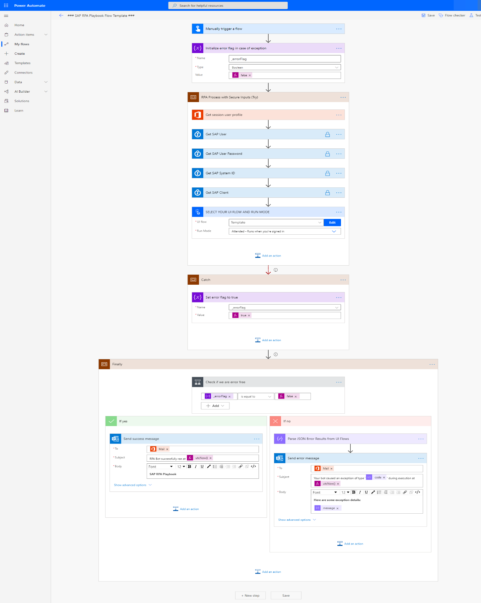

# Core Components for Power Automate RPA SAP GUI automation

## Power Automate

Let's start with the core platform service called Microsoft Power Automate. Power Automate is an enterprise service that helps you create automated workflows by using your favorite apps and services to synchronize files, get notifications, collect data, and more. Learn more on [docs.microsoft.com](../../getting-started) and [Microsoft Learn](../../../learn/paths/automate-process-power-automate/).

Power Automate flow authoring canvas:

## Desktop flows

Desktop flows bring robotic process automation (RPA) capabilities to Power Automate. You can use Desktop flows to automate repetitive tasks in Windows and web applications. A Desktop flow can record and play back UI actions (such as clicks and keyboard input) for applications that don't have easy-to-use or complete APIs available.

List of Desktop flows individuals have access to:

## Power Automate Desktop

It's quicker and easier than ever to automate with the new, intuitive Power Automate Desktop.

Power Automate Desktop allows you to automate legacy applications such as terminal emulators and interact with modern web and desktop applications, Excel files, folders and many more.

Power Automate Desktop broadens the existing RPA capabilities in Power Automate. In conjunction with Desktop flows, all repetitive desktop processes can be automated. Use prebuilt drag-and-drop actions or record your own cloud flows to run later. Interact with the machine using images or coordinates.

Power Automate Desktop console showing Desktop flows that individuals have access to:

Power Automate Desktop authoring canvas:

## On-premises data gateway

The on-premises data gateway acts as a bridge. It provides quick and secure data transfer between on-premises data (data that isn't in the cloud) and several Microsoft cloud services. These services include Power BI, Power Apps, Power Automate, Azure Analysis Services, and Azure Logic Apps.

By using a gateway, organizations can keep databases and other data sources on their on-premises networks while securely using that on-premises data in cloud services.
