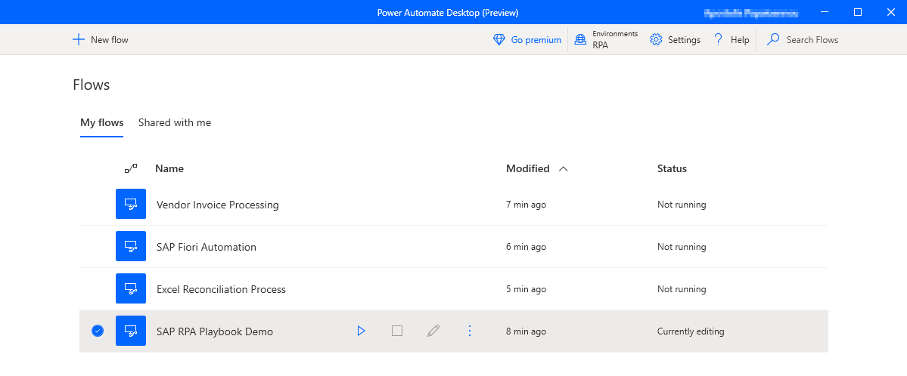
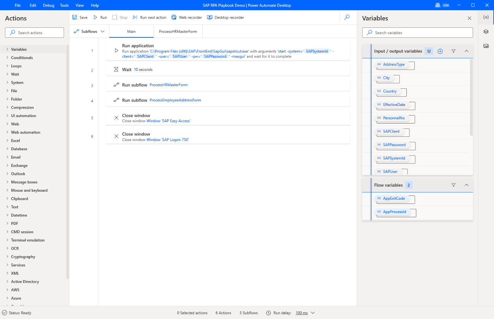

# Core components for Power Automate RPA SAP GUI automation

Here are the four components needed to automate SAP GUI with Power Automate:

- [Power Automate](#power-automate)
- [Desktop flows](#desktop-flows)
- [Power Automate Desktop](#power-automate-desktop)
- [On-premises data gateway](#on-premises-data-gateway)

## Power Automate

Let's start with the core platform service called Power Automate. Power Automate is an enterprise service that helps you create automated workflows by using your favorite apps and services to synchronize files, get notifications, collect data, and more. Learn more on [docs.microsoft.com](../../getting-started.md) and [Microsoft Learn](../../learning-catalog/learning-catalog.md).

The Power Automate designer is shown in the following image.

## Desktop flows

Desktop flows bring robotic process automation (RPA) capabilities to Power Automate. You can use desktop flows to automate repetitive tasks in Windows and web applications. A desktop flow can record and play back UI actions (such as clicks and keyboard input) for applications that don't have easy-to-use or complete APIs available.

A list of desktop flows is shown in the following image.

## Power Automate Desktop

It's quicker and easier than ever to automate with new, intuitive Power Automate Desktop. You can use Power Automate Desktop to automate legacy applications, such as terminal emulators, and interact with modern web and desktop applications, files, folders and many more.

Power Automate Desktop broadens the existing RPA capabilities in Power Automate. In conjunction with desktop flows, all repetitive desktop processes can be automated.

You can use prebuilt drag-and-drop actions or record your own cloud flows to run later.

The following image shows an example of the Power Automate Desktop console, showing desktop flows to which an individual has access.

The following image shows an example of the Power Automate Desktop designer, from which you can create desktop flows.

## On-premises data gateway

The on-premises data gateway acts as a bridge. It provides quick and secure data transfer between on-premises data (data that isn't in the cloud) and several Microsoft cloud services. These cloud services include Power BI, Power Apps, Power Automate, Azure Analysis Services, and Azure Logic Apps.

By using a gateway, organizations can keep databases and other data sources on-premises, while securely using that on-premises data in cloud services.

## Direct machine connectivity

In addition to the on-premises data gateway, there is a new connectivity option that allows physical or virtual machines to directly connect to Power Automate. When you connect your machine to Power Automate, you can instantly start your desktop automation with any of the wide array of available triggers.

Learn more about [direct machine connectivity](../../desktop-flows/manage-machines.md).

> [!div class="nextstepaction"]
> [Next step: Sample SAP GUI automation for this tutorial](sample-sap-scenario.md)
