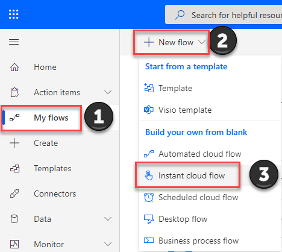
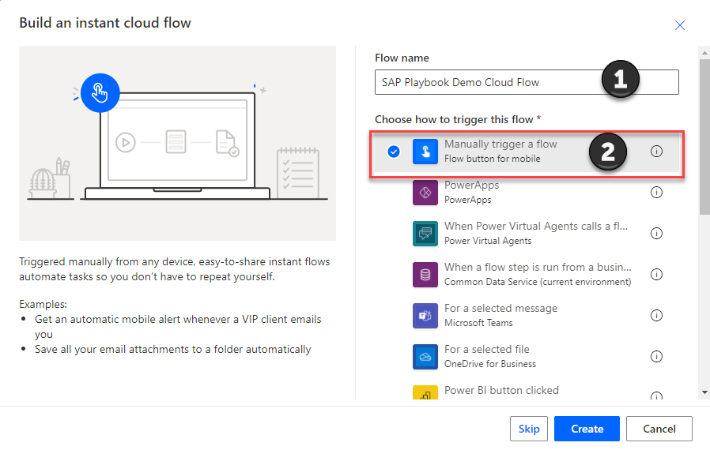
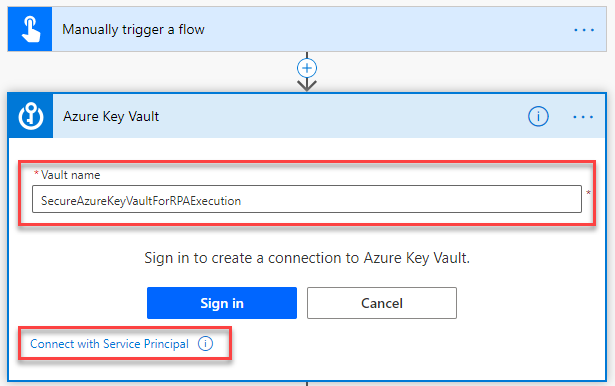
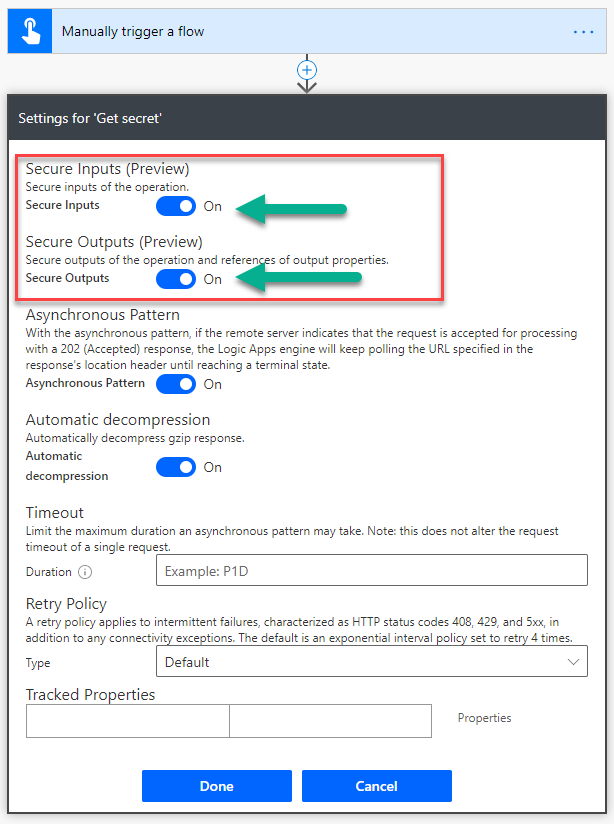
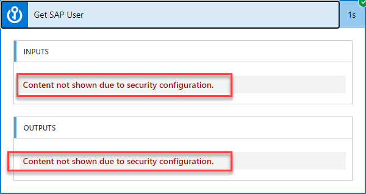
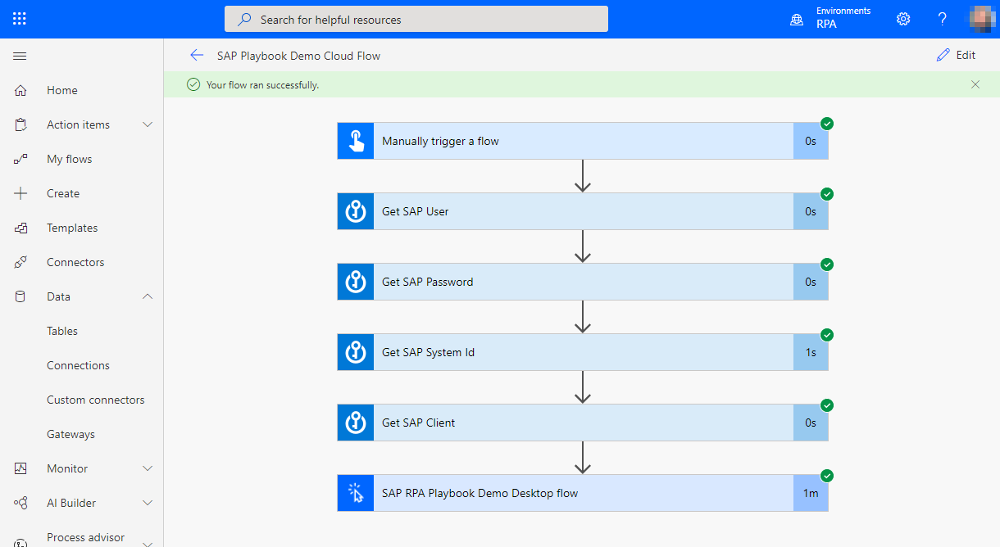

# Create the cloud flow with the Power Automate

You can close both Power Automate Desktop windows and then go to the [Power Automate designer](https://flow.microsoft.com/). Here, we'll create a Power Automate cloud flow that calls our desktop flow by using secure input parameters from the cloud.

>[!NOTE]
>This cloud flow is designed as a "happy path," which means it has no exception handling, scoping, or try-catch-finally patterns. You can find a more resilient design approach in the [Low-code RPA with SAP GUI in Power Automate Desktop](action-based-sap-gui-automation-manually-overview.md) section.<!--note from editor: Please double-check this link. I think it should go to the "head" of the relevant section, just to set the stage for the reader.-->

1. [Open Power Automate](https://flow.microsoft.com/), sign in, and confirm that you're in the same Microsoft Dataverse environment as the one you were in when you created the previous flow in Power Automate Desktop.

   

   

1. On the left pane, select **My flows**, select **New flow**, and then select **Instant cloud flow**.

   

1. In the **Build an instant flow** dialog, enter a flow name, select the **Manually trigger a flow** trigger from the list, and then select **Create**.

   

1. This opens the designer, and it should look similar to the following image.

   

   >[!IMPORTANT]
   >The next steps will involve configuring action components. To securely pass parameters into our desktop flow, we'll be following the optional, but recommended, approach of using Azure Key Vault secrets. 

   >[!NOTE]
   >If you don't have access to Key Vault, you can skip the following steps that show you how to configure Key Vault and provide your credentials and other parameters later as clear text. Microsoft does not recommend that you use clear text credentials in production environments.

1. Select **New step**.

1. Search for **Azure Key Vault Get secret**, and then select **Get secret action**.

   

1. If this is the first time you've configured Key Vault in a flow, you'll get a prompt to set up a connection. You can choose to connect either through user credentials or a service principal account (which we recommend for production scenarios).

   **Establishing a connection with user credentials**

   

   **Establishing a connection with service principal**

   

   

1. After you configure the connection, select the appropriate **Name of the secret** from the list.

   

1. Select **More** (**...**), and then select **Settings**.

   

1. Turn on **Secure Inputs** and **Secure Outputs**, and then select **Done**.

   

   >[!NOTE]
   >These settings will hide sensitive text from the run flow history.

   

1. Select **...**, and then select **Rename** to enter a more specific action name—for example, **Get SAP User**.

1. Select **...**, and then select **Copy to my clipboard**.

1. Select **New step**.

1. Select **My Clipboard**, and then select the name of the previously copied action—in our example, **Get SAP User**.

   

1. Select **...**, and then select **Rename**. Enter a more specific action name—for example, **Get SAP Password**.

   <!--todo double check if it is really step 14-->

1. Repeat steps 14 through 18 for all other Key Vault–based secrets.<!--note from editor: I wish I could tell you which steps this should be, but I'm a bit lost here.-->

   

1. Select **New step**.

1. Search for **Desktop flows**, and then select **Run a flow built with Power Automate Desktop**.

   

1. If this is the first time you've used the desktop flow action, you'll be prompted to create a connection. Provide your **Gateway name**, **Domain and username** (DOMAIN\\User), and **Password**.

1. After the connection is established, select the previously created desktop flow.

   

1. Select **Attended – Runs when you're signed in** as **Run Mode**.

1. Enter each parameter field and either select the appropriate data from the **Dynamic content** pop-up window (such as **SAP System Id**, **SAP Client**, **SAP User**, and **SAP Password**) or manually enter placeholder data (for all the other parameters in the list). If you aren't using the Key Vault option for your SAP credentials, enter them manually and in free text instead.

   

1. After you've renamed the action to something meaningful and supplied all parameters, the action should look like this.

   

## Test the flow

1. Close all SAP windows.

1. Select **Save**, and then wait until the flow is saved.

1. Select **Test**, and then under **Test Flow**, select **Test** again.

   

1. Authorize any connections, if needed, and then select **Continue**.

   

1. Select **Run flow**.

   

1. Select **Done**.

   >[!IMPORTANT]
   >Don't interact with your mouse or keyboard until the process completes.

1. Watch the desktop flow execution.

   

Congratulations, you've just created and launched a secure desktop flow from the cloud and connected to your desktop flow to add an employee address to SAP.

> [!div class="nextstepaction"]
> [Next step: Validate data with the SAP ERP connector](data-pre-validation-sap-erp.md)
