# Create the cloud flow to update an address with Power Automate 
<!--note from editor: Suggest making the title more specific, otherwise they begin to run together I think.-->
Now, we'll create the cloud flow that employees use to request an updated address. This cloud flow passes the input variables to the desktop flow you created in the previous section.<!--note from editor: Not sure if this reference is good enough or should it be a link.-->

We highly recommended that you create cloud flows, desktop flows and other Microsoft Power Platform artifacts within solutions to allow for better portability, application lifecycle management (ALM), and encapsulation.

1. Navigate to <https://powerautomate.com> and sign in with your Azure Active Directory (Azure AD) credentials.

2. Confirm that you're in the same environment as the one in which you built the desktop flow with Power Automate Desktop, and then select **Solutions** > **+ New solution**.

   

3. Enter a **Display name**, select a **Publisher**, and then select **Create**.

   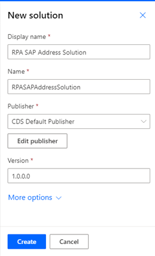

4. Open the solution by selecting its name.

   

5. Select **+ Add existing**, select **Desktop flow**, select the flow you created in Power Automate Desktop, and then select **Add**.

   

   

6. Select **+ New** > **Cloud flow**.

   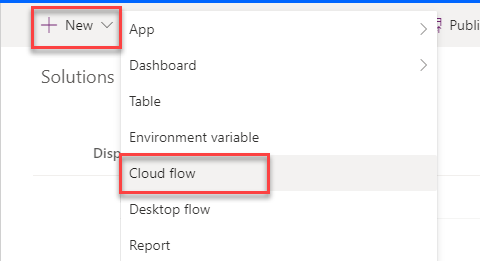

7. Give your flow a name, and select **Manually trigger a flow** as the trigger.

   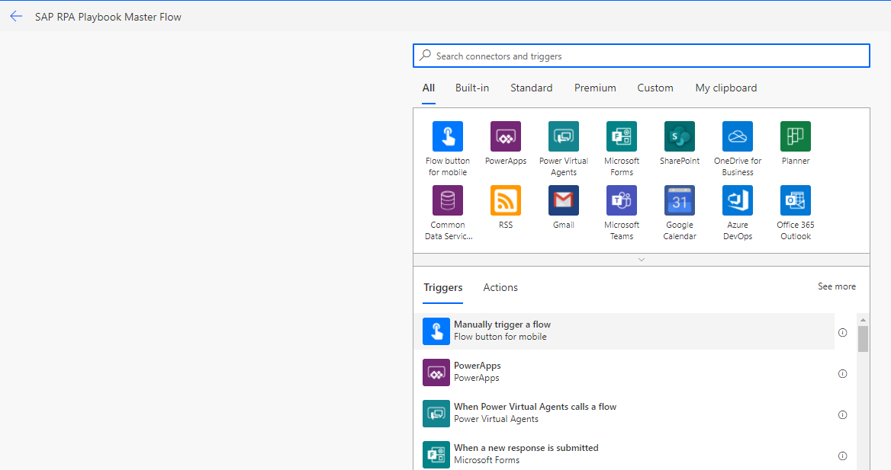

8. Select **+ Add an input**, and then select the appropriate data type to create the eight inputs listed in step 9.

   

   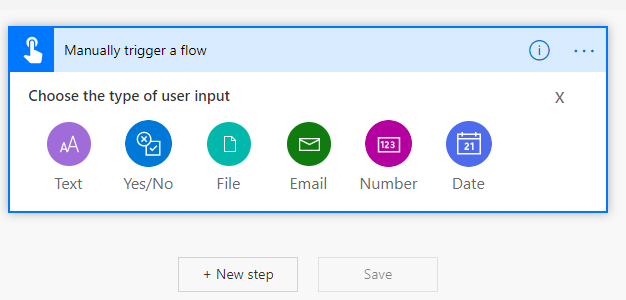

   

9. Add the following inputs to the flow trigger.

   :::image type="complex" source="media/manually-trigger-a-flow-with-multiple-inputs.png" alt-text="Add inputs to the trigger flow.":::
   Screenshot of the Manually trigger a flow dialog with Address Type as Text, Effective Date as Date, and the following six inputs all of Text type: Employee ID, New Street, New City, New ZipCode, New State, and New Country.
   :::image-end:::
<!---->

10. Select **New step**.

    

   >[!NOTE]
   >The following Azure Key Vault action configurations are optional, so if you aren't using Key Vault today, or you just want to test your desktop flow without it, feel free to skip them.<!--note from editor: I assume the reader wouldn't just stop here if they didn't want to configure Key Vault - which step should they skip to? It would be much clearer to have the first 10 steps end  the next set of steps their own heading, something like **To configure Azure Key Vault actions (optional)**. I'm not sure where the main procedure resumes, so I can't suggest where that would go.-->

11. Enter **azure key vault** into the search box.

    

12. If you don't have an existing Key Vault connection, you'll be prompted to create one. You can sign in either with an Azure AD user account or a Service Principal (recommended).

    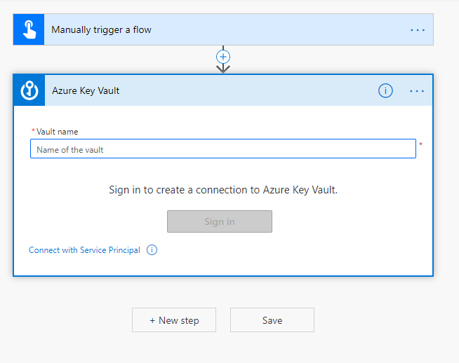

13. Let's assume you select **Connect with Service Principal**.

    

14. After you establish the connection, add four **Get secret** Key Vault actions to the canvas, select the secret, and then rename the actions as shown in the following image.

    :::image type="complex" source="media/add-4-get-secret-Azure-Key-Vault-actions.png" alt-text="Add Get secret actions to the canvas.":::
    Screenshot showing four actions: Get SAP System Id, renamed SAP-HCM-SystemId; Get SAP Client, renamed SAP-HCM-Client; Get SAP User, renamed SAPUser; and Get SAP Password, renamed SAPPassword.
    :::image-end:::

15. Select **More** (**…**) next to the action name, select **Settings**, turn on **Secure Inputs** and **Secure Outputs**, and then select **Done**. Repeat this step for the other three **Get secret** actions.

    

16. Select the plus sign **(+)**, and then select **Add an action**.

    

17. Enter **scope** into the search box, and then select the **Scope** action.

    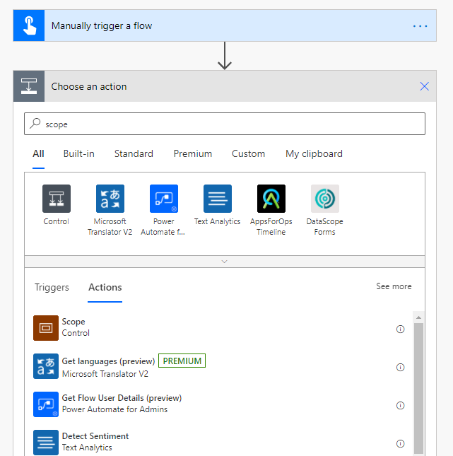

18. Drag all your Key Vault actions onto the **Scope** container, and then rename it to **Try**.<!--note from editor: In the second screenshot, I think the name should be **Try** just to show that this step has been completed. -->

    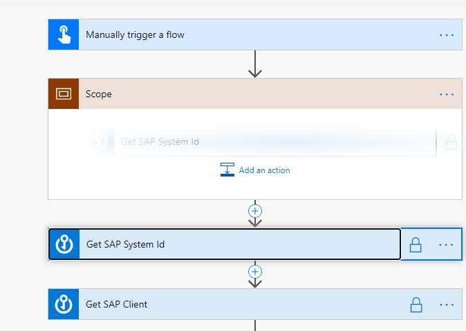

    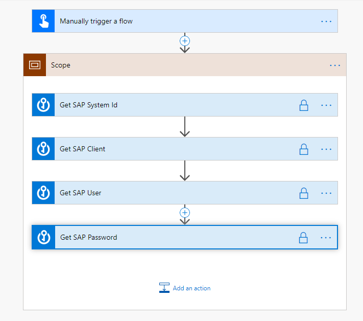

19. Search for, and then select, the **initialize variable** action to add it under the trigger.

    

20. In the **Initialize variable** dialog, make the following settings, and then select **OK** in the **Expression** dialog:

    - For **Name**, enter **Bot failed**.
    - For **Type**, select **Boolean**.
    - For **Value**, enter **false**.

    

21. Add two scope actions. Name them **Catch** and **Finally**.

    

22. In the upper-right corner of the **Catch** scope, select **…**, and then select **Configure run after**.

    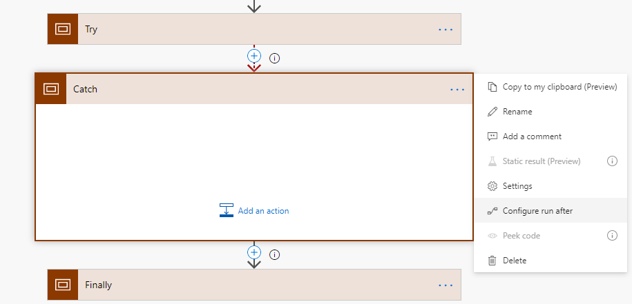

23. Select **has failed**, **is skipped**, and **has timed out**, and then select **Done**.

    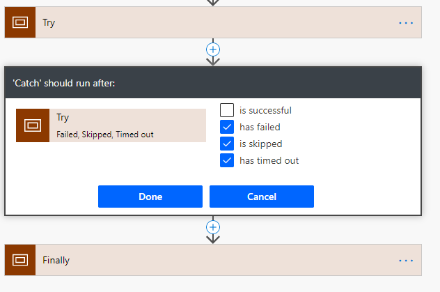

24. In the upper-right corner of the **Finally** scope, select **…**, select **Configure run after**, and then select the **is successful**, **has failed**, **is skipped**, and **has timed out** checkboxes. Select **Done**.

    

    

25. Search for, and then add, the **set variable** action to the **Catch** scope container.<!--note from editor: Edit okay? -->

    

26. Select the **Bot failed** variable, enter **true** in the **Expression** dialog, and then select **OK**.

    

    

27. Search for the **condition** action, and then add it to the **Finally** block.

    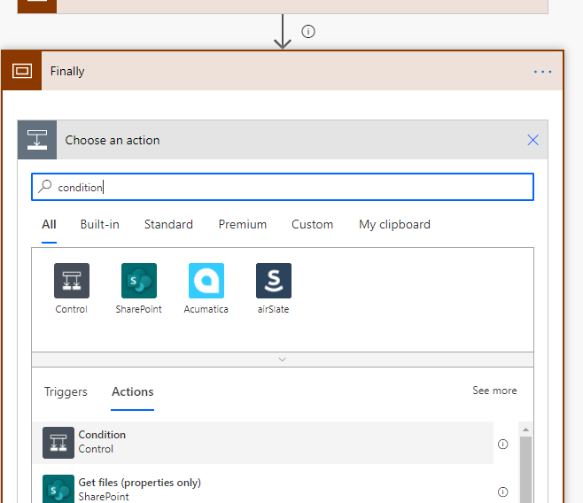

28. Select the **Bot failed** variable from the **Dynamic content** list and then assign it to the **Choose a value** field.

    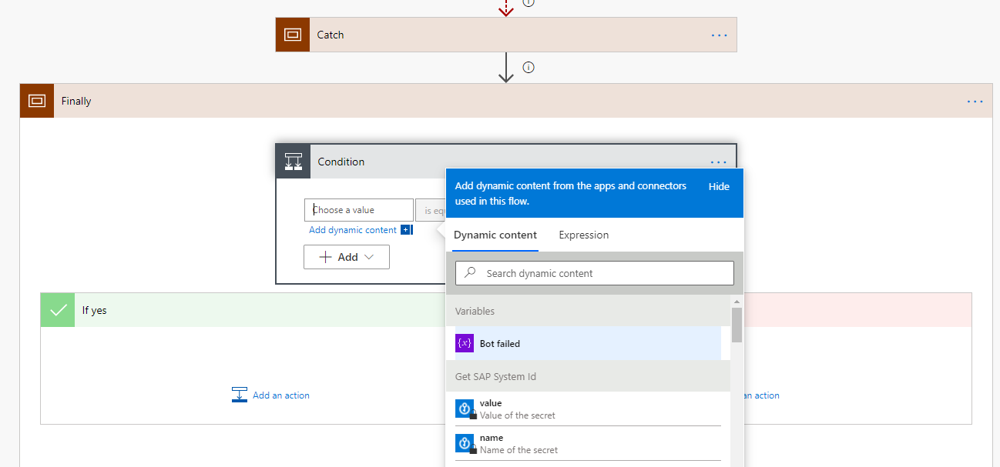

29. Set the expression to **false**, and then assign it to the **value** field.

    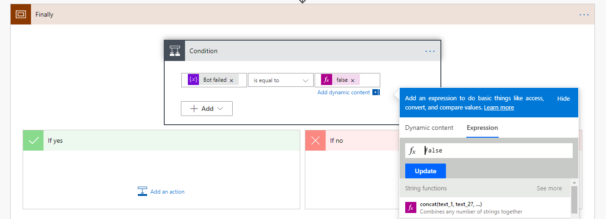

30. In the **If yes** section, add a **Send an email (V2)** action.

    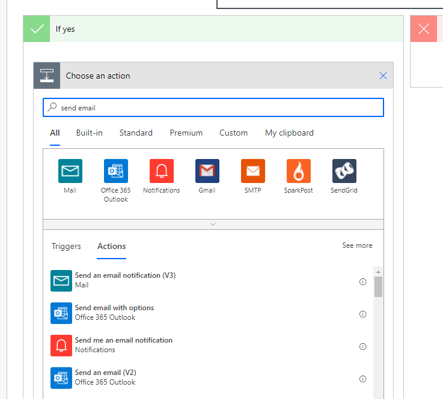

    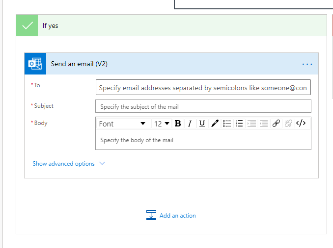

31. Select **User email** from the **Dynamic content** list and add it to the **To** field, and then enter a **subject** and an email **body**.

    

32. In the **Try** container, select **New step**. Search for **Desktop flows**, and then select the **Run a flow built by Power Automate Desktop** action to add it to the flow.
   
    

33. Select your data gateway and then enter a domain, username, and password for an account that has sufficient privileges to run your desktop flows. 

    >[!IMPORTANT]
    >Your on-premises data gateway must be deployed into the same region as your environment; otherwise, it won't appear in the dropdown list.

    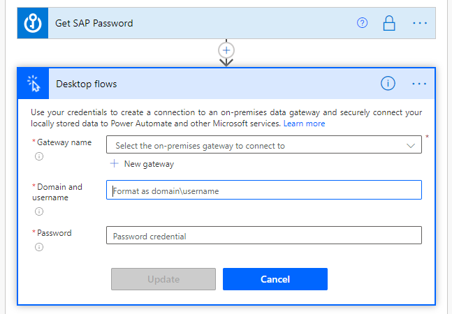

34. For **Desktop flow**, select **SAP RPA Playbook Demo**. For **Run mode**, select **Attended – Runs when you're signed in**.

    

    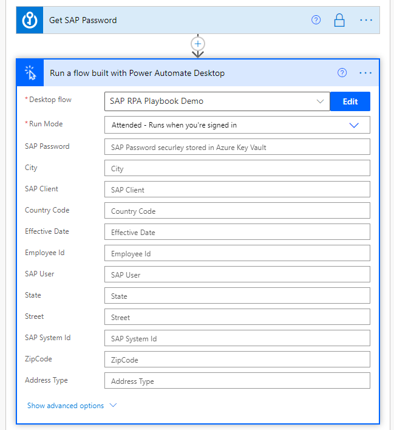

35. Select the **System Id** field, and then select **value** from the **Get SAP System Id** action output in the **Dynamic content** list.

    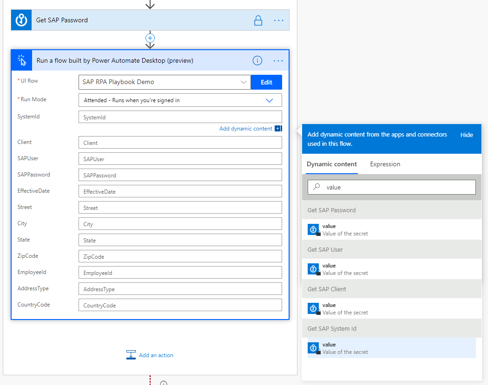

36. Check the expected date time format in SAP and make adjustments if needed by using the formatDateTime function. For example, use **formatDateTime(triggerBody()\['date'\],'dd.MM.yyyy')** to get a date formatted day-month-year, as in the German-formatted date of 13.10.2020.

    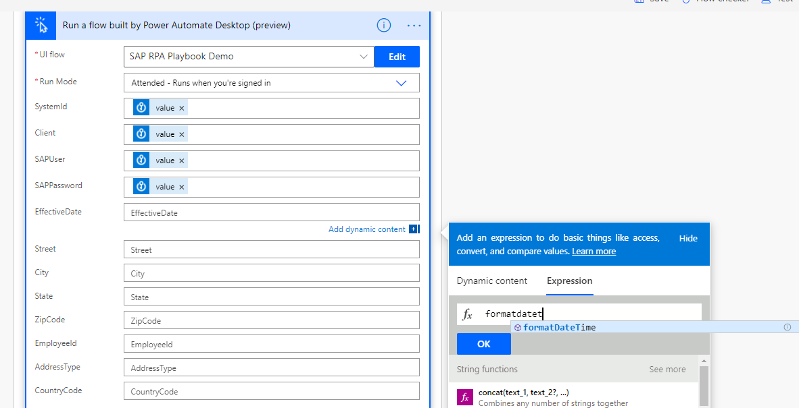

    

37. Supply the data for all other fields by selecting the appropriate property from the trigger **Dynamic content** list for the cloud flow.

    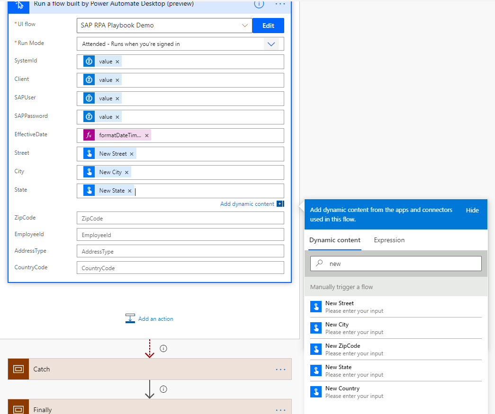

    :::image type="complex" source="media/run-a-UI-flow-built-by-PAD-with-variables-set.png" alt-text="Screenshot of the Run a flow built by Power Automate Desktop dialog after all variables are set.":::
    Screenshot of the Run a flow built by Power Automate Desktop dialog with the following variables and their settings: SystemId, Client, SAPUser, SAPPassword all set as secret values; EffectiveDate as formatDateTime, Street as New Street, City as New City, State as New State, ZipCode as New ZIP Code, EmployeeId as Employee ID, AddressType as Address Type, and CountryCode as New Country.
    :::image-end:::

38. Select **Save** to save the flow.

    

39. Select **Test**.

    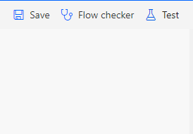

40. Select **I'll perform the trigger action**, and then select **Save & Test**.

    

41. Authenticate if needed, and then select **Continue**.

    

42. Supply values for all variables, and then select **Run flow**.

    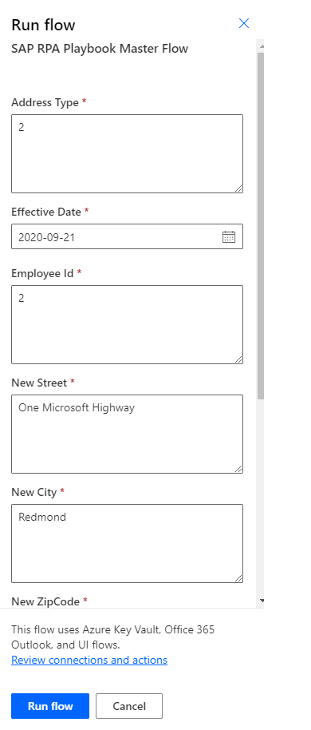

43. Select **Done**.

    >[!NOTE]
    >Don't interact with your mouse or keyboard until the process is completed.

    

The cloud flow starts and calls the desktop flow, which enters data into SAP.

Congratulations! You've successfully implemented two SAP GUI automation techniques. We're excited to see what you build next with SAP and Power Automate.

> [!div class="nextstepaction"]
> [Next step: No-code RPA with SAP GUI in Power Automate Desktop](action-based-sap-gui-automation-recorder-overview.md)
