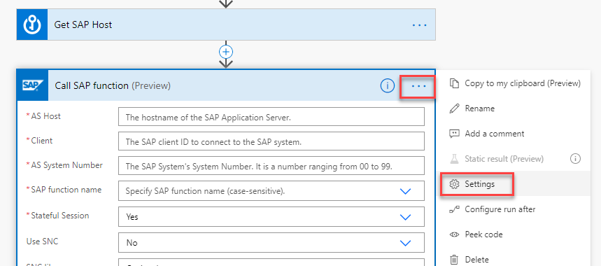
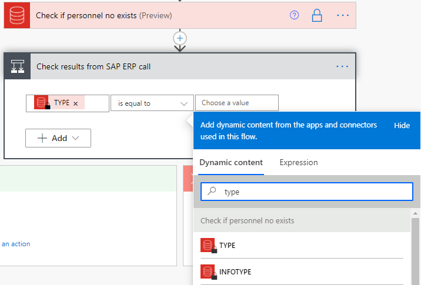
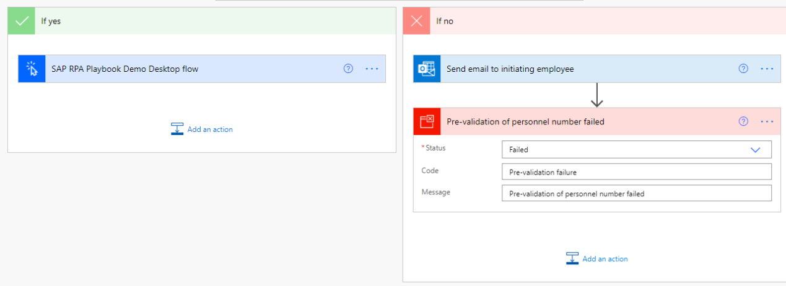

# Optional – Data pre-validation using the Power Automate SAP ERP (Preview) connector

This is an optional chapter covering the [certified](https://www.sap.com/dmc/exp/2013_09_adpd/enEN/#/solutions?id=s:d0dcda07-de96-4870-bcad-dac797207da5) [SAP ERP (Preview) connector](https://docs.microsoft.com/en-us/power-platform-release-plan/2020wave1/cdm-data-integration/sap-erp-connector-power-apps-power-automate) which allows automation developers to connect to SAP through BAPI's and RFC's. There are [several pre-requisites that need to be met](https://powerapps.microsoft.com/blog/introducing-the-sap-erp-connector/).

Let's extend our current scenario to include a pre-validation check that uses the SAP ERP connector to check whether the **Personnel no** supplied to the flow is valid and that the employee is in an active employment state. Depending on the results of this check, we'll decide whether to continue or terminate the flow.

Here's how the adjusted process flow looks.

There are several benefits to employing this approach:

-   Avoiding unnecessary RPA processing and more complex UI based exception handling

-   Better user experience through near real-time data validation feedback

-   Freeing up VM and bot capacity to run only on pre-validated data

-   Data Loss Prevention policies can be employed, allowing / disallowing this connector to be used in conjunction with others

Please follow the steps below to adjust our existing flow to incorporate the pre-validation check:

1.  Edit the **SAP RPA Playbook Demo Flow** you've created in section [**5.1**](#creating-the-api-flow-with-the-power-automate-portal).

2.  Under the Get SAP Client action select **+ New step**.

3.  Search for SAP and select **Call SAP function (preview).**

4.  Select **SAP Authentication** in the **Authentication Type**, and set the **Data Gateway**, **SAP Username** and **SAP Password**.

**Note:** The credentials will have to be supplied manually; you can't use Key Vault secrets here because the connection is being validated at design time.

5.  Select the three dots and then **Settings**.

6.  Turn on the **Secure Input** and **Secure Output** options and select **Done**.

**Note:** These settings will hide sensitive text from the run flow history.

5.  Rename the action to **Check if personnel no exists**.

6.  Enter **AS host**, **Client**, **AS System Number**, **BAPI\_EMPLOYEE\_GETDATA** as **SAP function name**, **No** in the **Stateful Session** field, and enter a valid **Personnel no** as **EMPLOYEE\_ID**.

7.  Under the **Check if personnel no exists** select **+ New step**.

8.  Search for **Condition** and select **Condition** and rename it to something meaningful and select the dynamic content **TYPE** for the **Choose value** field.

9.  Drag the Desktop flow action **SAP RPA Playbook** onto the **If yes** box.

10. In the **If no** box, select **Add an action,** search for **Send an email** and configure the action as shown in the screenshot.

11. In the **If no** box and below the email action, select **Add an action,** search for **Terminate** and configure the action as follows.

12. Go back up to action **SAP RPA Playbook Demo Desktop flow** and enter a non-existing **Personnel No** into the EMPLOYEE ID field.

12. **Save** and **Test** your flow with the **non-existing** **Personnel no**.

13. The resulting flow run should look like this.

14. Run another **Test**, this time with a **valid** **Personnel no** and confirm that the results look like this now.

That's it. By incorporating the SAP ERP API connector we've made our automation more efficient, intelligent and end-user friendly.
