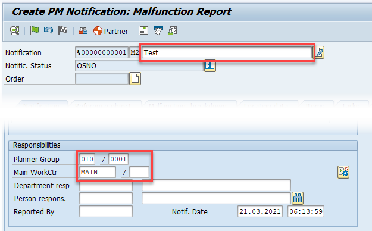
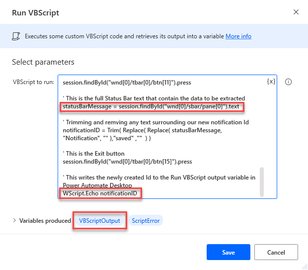
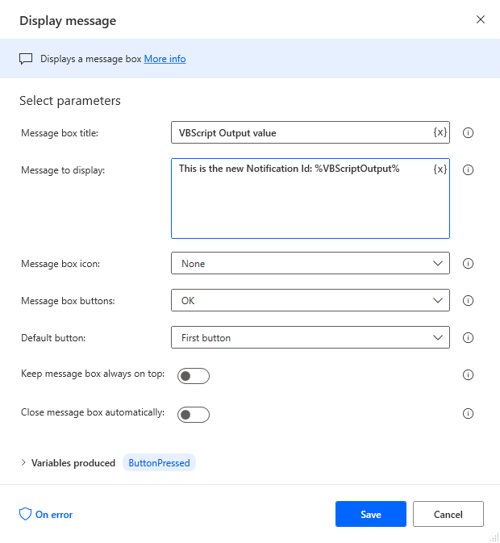
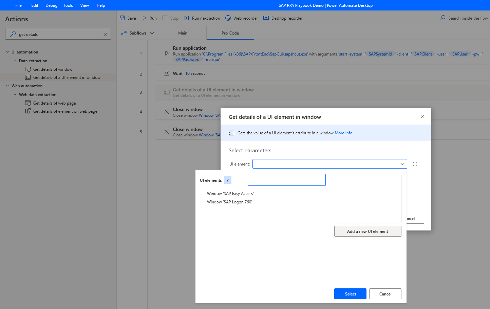
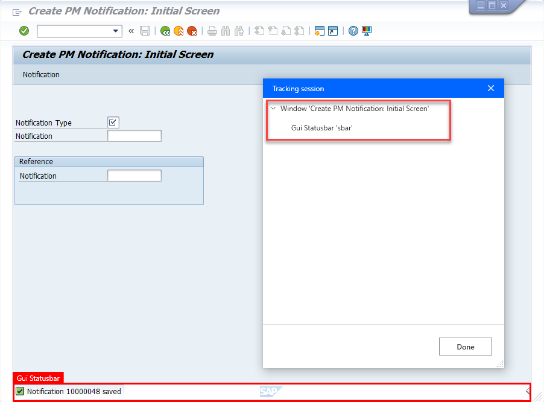
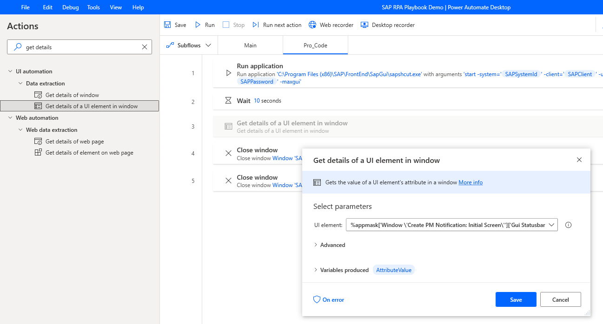
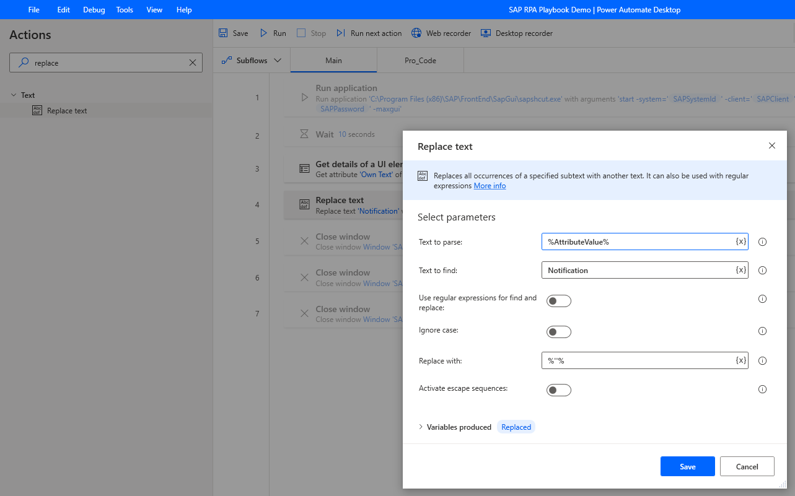
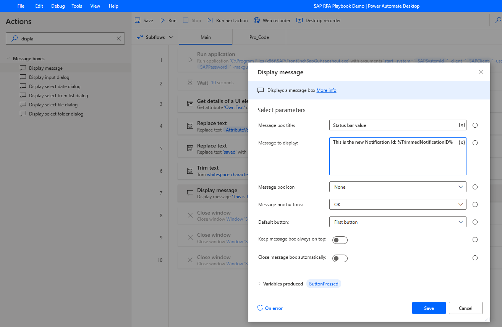
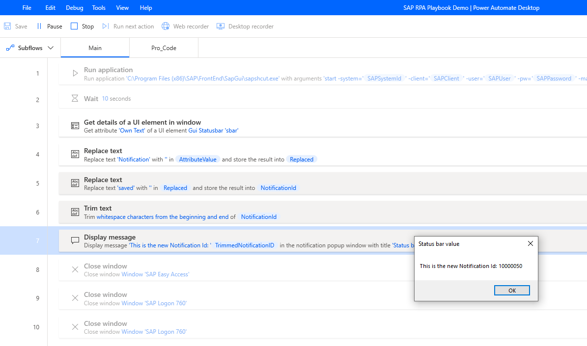

# Extracting information from SAP GUI UI

Creating or updating records in SAP will typically generate some sort of record status that includes newly generated record IDs and then display them in the lower part of the SAP UI.

Here's a status message after the creation of a new SAP PM Notification:

This information might be useful for subsequent automation process steps, and therefore needs to be extracted and assigned to variables for downstream data processing.

We have multiple ways to achieve this and depending on your development approach would include low-code or pro-code techniques.

## Pro-code approach

The pro-code approach uses VBScript commands to extract information from SAP UI elements.

Extracting status data, such as a newly created Purchase requisition or Plant Maintenance Notification number for example, requires access to the status bar UI element that can be accessed like this:

session.findById("wnd\[0\]/sbar/pane\[0\]").Text

To walk you through the end-to-end experience, we'll record the creation of a new SAP PM Notification and adjust the generated code to return the newly created Id to Power Automate Desktop. In case you've never heard of SAP's PM Notification or you don't have access to it, don't worry you will still be able understand the steps needed to extract such data for your own scenario.

Please follow these steps:

1.  Confirm that all [SAP GUI scripting configurations](#sap-gui-scripting-configurations) have been done.

2.  Open SAP Logon and select the desired SAP system to sign in to.

3.  Select **Customize Local Layout** (Alt F12) and then **Script Recording and Playback...**.

4.  Select **More.**

5.  Under **Save To**, specify or select the file path and filename where the captured user interactions should be stored.

6.  Select the **Record Script** button to start the screen capturing process. Every interaction you do now in SAP will be captured as repeatable VBS commands. If you had previously recorded steps and saved to this file, a dialog box will pop up asking you to overwrite the file or not.

7.  Enter transaction code **IW21** and press **Enter**.

8.  Select or enter the **Notification type** and press **Enter**.

9.  Enter a **Short Text**, **Planner Group**, **Main WorkCtr**, and any other desired field.

10. Select **Save (Ctrl+S)** in the upper toolbar.

11. Back in the **Create PM Notification** **initial** form, you'll notice a new status message in the status bar on the lower left part of the UI.

12. Select **Exit (Shift+F3)** in the upper toolbar and **stop the recording**.

13. Optionally, log off from SAP and close all SAP windows.

Let's examine the generated VBScript code:![Screenshot of VBScript generated during SAP Notification creation  If Not IsObject application  Then       Set SapGuiAuto    GetObject  quot SAPGUI quot         Set application   SapGuiAuto GetScriptingEngine    End If    If Not IsObject connection  Then       Set connection   application Children 0     End If    If Not IsObject session  Then       Set session      connection Children 0     End If    If IsObject WScript  Then       WScript ConnectObject session       quot on quot        WScript ConnectObject application   quot on quot     End If    session findById  quot wnd 0  quot   maximize    session findById  quot wnd 0  tbar 0  okcd quot   text    quot IW21 quot     session findById  quot wnd 0  quot   sendVKey 0    session findById  quot wnd 0  usr ctxtRIWO00 QMART quot   text    quot M2 quot     session findById  quot wnd 0  usr ctxtRIWO00 QMART quot   caretPosition   2    session findById  quot wnd 0  quot   sendVKey 0    session findById  quot wnd 0  usr subSCREE shortened command     quot   text    quot My Notification Short Text quot     session findById  quot wnd 0  usr tabsTAB_ shortened command     quot   text    quot 010 quot     session findById  quot wnd 0  usr tabsTAB_ shortened command     quot   text    quot 0001 quot     session findById  quot wnd 0  usr tabsTAB_ shortened command     quot   text    quot MAIN quot     session findById  quot wnd 0  usr tabsTAB_ shortened command     quot   setFocus    session findById  quot wnd 0  usr tabsTAB_ shortened command     quot   caretPosition   4    session findById  quot wnd 0  tbar 0  btn 11  quot   press    session findById  quot wnd 0  tbar 0  btn 15  quot   press ](media/VBsceript-code-for-SAP-GUI-UI.png)

Now, let's adjust the generated code to include a step that extracts, trims, and returns the new notification Id to the Run VBScript action.

![Screenshot of adjusted VBScript that returns SAP Notification to Power Automate Desktop via a variable    39  This is the Save button    session findById  quot wnd 0  tbar 0  btn 11  quot   press      39  This is the full Status Bar text that contain the data to be extracted    statusBarMessage   session findById  quot wnd 0  sbar pane 0  quot   text      39  Trimming and removing any text surrounding our new notification Id    notificationID   Trim  Replace  Replace  statusBarMessage   quot Notification quot    quot  quot     quot saved quot    quot  quot            39  This is the Exit button    session findById  quot wnd 0  tbar 0  btn 15  quot   press      39  This writes the newly created Id to the Run VBScript output variable in Power Automate Desktop    WScript Echo notificationID ](media/VBscript-code-for-SAP-GUI-UI-adjusted.png)

This will set the **VBScriptOutput** variable of the **Run VBScript** action to the newly created notification ID.

If you would like to see the contents of the VBScriptOutput, you could use a display message action and show a similar output to this:

 

## Low-code approach

The low-code approach uses actions and custom selectors to extract newly generate record Id's or other status messages that are important for downstream flow processing.

The following steps won't go into detail on how to record or use manual action design to create a new SAP PM Notification record. Please review section 6 or 7 if you need a refresher on how to that.

Please follow these steps:

1.  Use the Desktop Recorder or manual action design to capture tall controls needed for the SAP PM Notification process.

2.  Create a notification record and capture the status text that appears once you've selected **Save** in the upper toolbar of the **Create PM Notification** screen.

3.  Once saved you'll be redirected to the previous screen where you should see a new notification number appearing in the status bar text.

4.  Now, go back to Power Automate Desktop, search for an action called **Get details of a UI element in window** and add it to your authoring canvas.

5.  Select the UI element dropdown and select **Add a new UI element** button.

6.  Select the SAP Easy Access window and hover with your mouse over the status bar until a red border labeled **Gui Statusbar** appears. While the border is active, hold down **Ctrl** while clicking to select the status bar.

7.  Select **Save**.

8.  Next, we'll search for the **Replace text** action in the **Actions** pane and dragging it onto the design canvas.

9.  In **Text to find**, enter **Notification** and under **Replace with**, enter a blank string which is expressed like this: **%''%**

10. Add another **Replace text** action and rename the **Variables produced** to **%NotificationId%** , enter "save" as **Text to find** value, and under **Replace with** enter a blank string, which is expressed like this: **%''%**

11. Search for the **Trim text** action in the **Actions** pane, drag it onto the design canvas, select **%NotificationId%** as **Text to trim** value and rename Variables produced to **%TrimmedNotificationID%**.

12. Search for the **Display message** action in the **Actions** pane, drag it onto the design canvas set **Message box title** and **Message to display** as desired.

13. Run the automation that creates a new SAP PM Notification and extracts its newly generated notification Id that can be displayed as below.

