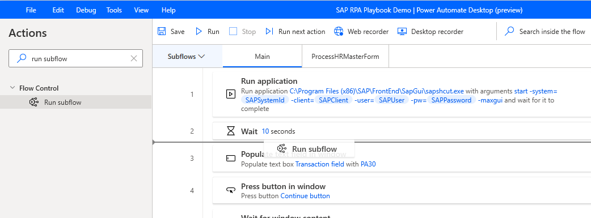
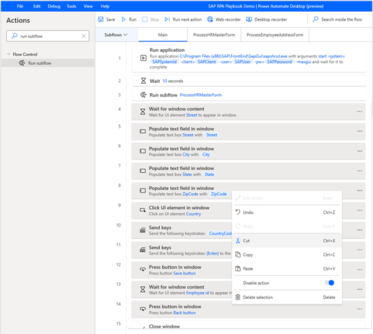
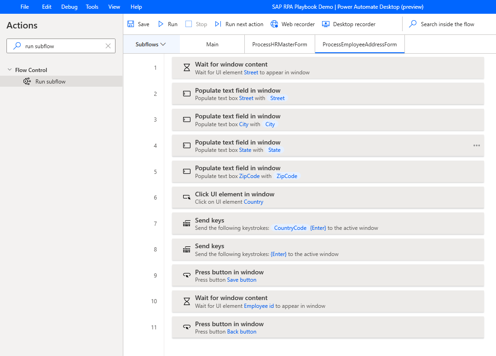

# Create a subflow for SAP GUI automation

Now, let's modularize our current flow by moving actions that carry out specific interdependent tasks (e.g. filling out a form) into a new sub flow.

1. Create a new sub flow, name it **ProcessHRMasterForm**, and then select **Save**.

   

2. Go back to the main flow tab, select all actions below (row 4 – 11), right click, and then select **Cut**.

   

3. Go to the sub flow tab **ProcessHRMasterForm**, right click, and then select **Paste**.

   

4. Go back to the **Main** flow tab.

5. Enter **run sub flow** into the **Action** search box, drag the **Run subflow** action onto the canvas, select **ProcessHRMasterForm** as **Call subflow** value, and then select **Save**.

   

6. Create another sub flow, name it **ProcessEmployeeAddressForm**, and then select **Save**.

   

7. Go back to the **Main** flow tab.

8. On the **Main** flow tab mark all actions below (row 4 – 14), right-click, and then select **Cut**.

   

9. Go to the sub flow tab **ProcessEmployeeAddressForm**, right-click, and then select **Paste**.

   

   

10. Go back to the **Main** flow tab.

11. Enter **run subflow** into the **Action** search box, drag the **Run subflow** action onto the canvas,  select **ProcessEmployeeAddressForm** as **Call subflow** value, and then select **Save**.

    
