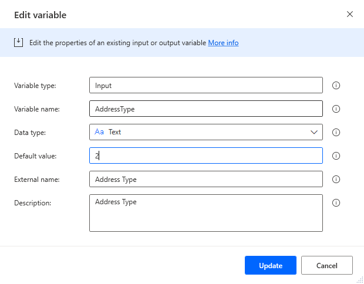
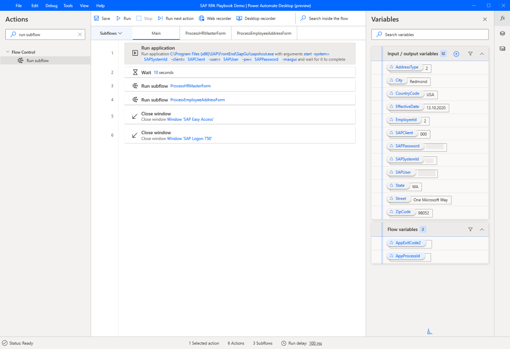

# Getting ready to debug

Before we continue with the primary flow in the Power Automat portal, let's test the flow by temporarily assigning a **default value** to the variables that we defined earlier.

1. In the **Variables** pane, select the **…** next to the **AddressType** variable name, and then **Edit**.

   

1. Enter a **Default value**.

   For example, enter "2" for a temporary address.
   
1. Select **Update**.

   

1. Repeat steps 1 and 2 for the other 11 variables.

   

1. Select **Save**, close the confirmation dialog, and then select **Run**.

   

Your flow runs. If you run into an error during the test run, observe the error status bar in the lower part of the Power Automate Desktop designer and apply the appropriate fix.

>[!IMPORTANT]
>Delete all default values before you leave the desktop flow authoring experience in Power Automate Desktop.