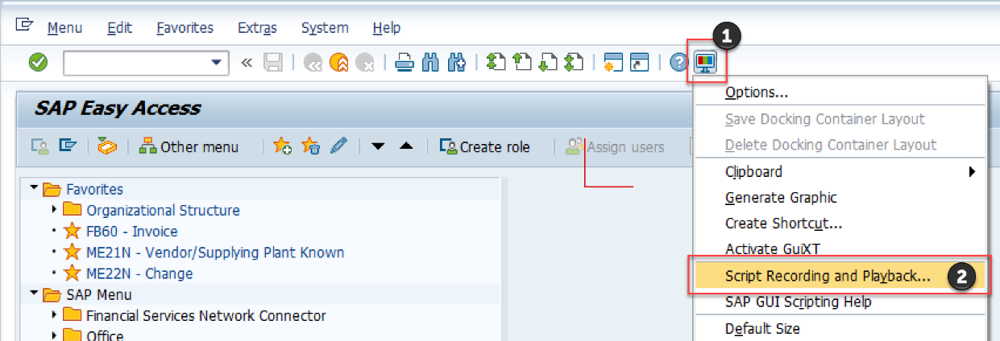
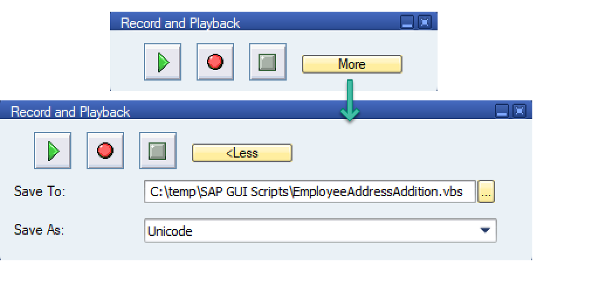

# Recording VB script using the SAP GUI automation engine

1.  Confirm that all [SAP GUI scripting configurations](#sap-gui-scripting-configurations) have been done.

2.  Open SAP Logon and select the desired SAP system to sign in to.

3.  Select **Customize Local Layout** (Alt F12) and then **Script Recording and Playback…**.

4.  Select **More.**

5.  Under **Save To** specify or select the file path and filename where the captured user interactions should be stored.

6.  Select the **Record Script** button to start the screen capturing process. Every interaction you do now in SAP will be captured as repeatable VBS commands. If you had previously recorded steps and saved to this file, a dialog box will pop up asking you to overwrite the file or not.

7.  Next, follow the sample steps outlined in [4 Sample scenario](#_Sample_SAP_scenario) to produce a recording.

8.  Once you're done, select the **Record and Playback** dialog box then **Stop Recording** and close the dialog box.

9.  You can close all SAP windows now if you wish.

SAP's scripting engine has recorded each click as VBScript commands and has saved it to the output file you've provided. Open the file in your code editor of choice to examine its contents.
