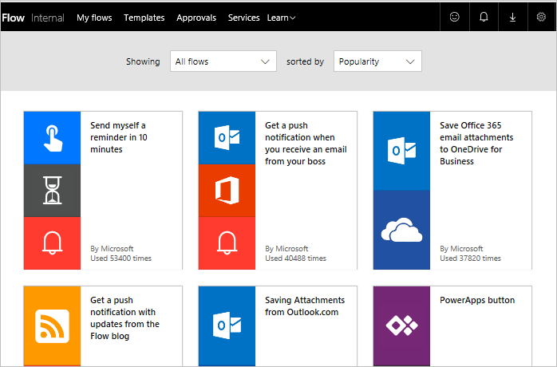
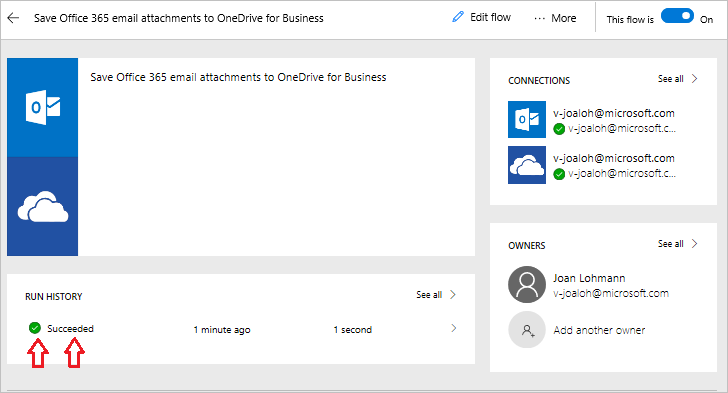

<properties
   pageTitle="Create a Flow from a Template | Microsoft Flow"
   description="Create a flow from a list of templates, manage, and administer the flow."
   services=""
   suite="flow"
   documentationCenter="na"
   authors="v-joaloh"
   manager="anneta"
   editor=""
   tags=""
   featuredVideoId="kZs7lqgp4LU"
   courseDuration="5m"/>

<tags
   ms.service="flow"
   ms.devlang="na"
   ms.topic="get-started-article"
   ms.tgt_pltfrm="na"
   ms.workload="na"
   ms.date="08/15/2017"
   ms.author="v-joaloh"/>

# Create a flow from a template #

Welcome back to Guided Learning for Microsoft Flow. In this lesson, you will see more of the Microsoft Flow environment, and you can **build your first flow**.

Getting started with Microsoft Flow is easy, as there are a huge number of **templates to choose** from, which will help you connect the services you are already using in more meaningful ways.  

## Microsoft Flow templates ##
Take a look at the [ Microsoft Flow website](https://ms.flow.microsoft.com).
 
Open the **Templates** menu.

As you scroll through the list, you see that Microsoft Flow allows you to connect to many services.

 

## Choose a template ##

**Searching for attachments** through email can be time consuming, and this flow saves time by **storing all your email attachments** into a folder in your OneDrive.

Select the **Save Office 365 email attachments to OneDrive for Business** template.

## Create and administer a flow ##

This is one of our **one click** templates, where you only answer relevant questions **necessary to build the flow**.

On the template graphic, there is a **description** of what the template **does and needs** to succeed.

You are asked to **provide credentials** for the **Office 365 Outlook** and **SharePoint** services. 
If you use both services regularly, you will already be signed into them.

1. Select **Create Flow**.

    

    Then you'll see the results. 

    

    Flow has **created a folder** on your OneDrive, where it will now automatically place **every attachment** that gets emailed to your work email.

1. Open **My Flows**.

    

1. Select the **flow you just made** to see how it works.

    

1. You see a **green check mark**, indicating that the **flow succeeded**. Select **Succeeded** to see the run history and the results.

    

    **All parts of the flow** were successful. 

    

## Important concepts in Microsoft Flow ##

Some things to know about when building flows. 
Every flow has two key parts: a **trigger**, and **one or more actions**. 
 
You can think of the **trigger** as the starting action for the flow, which can be things like **On new Email** that you have here or, **when a new item is added**, if you happened to be using SharePoint. It can also be a fixed schedule, if you use a trigger called **Recurrence**, which you'll learn about later.

**Actions are the activities** you want to happen when **a trigger is invoked**. For example, **Create file** will recreate the file in OneDrive.

Other actions could be, send an **email**, post a **Tweet**, start an **approval**, or many others.
These will all come into play later, as you build your own flows from scratch. 

## Next Lesson ##

The next lesson will look at the Microsoft Flow Mobile app and its capabilities. 