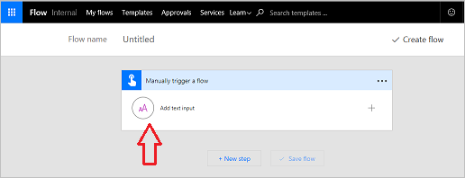
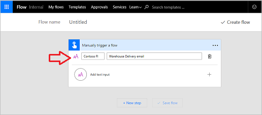
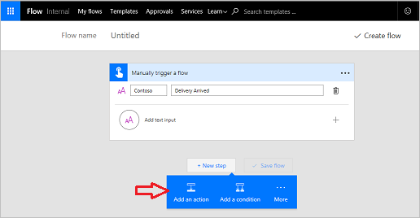
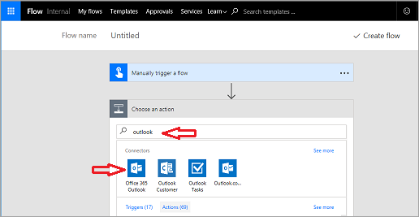
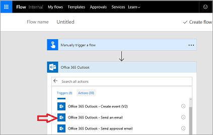
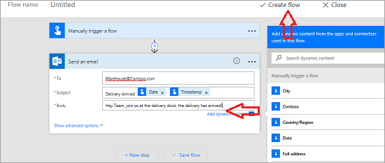
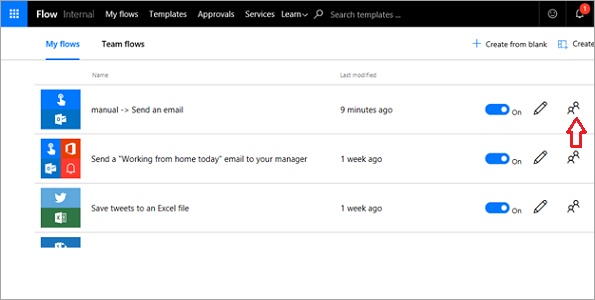
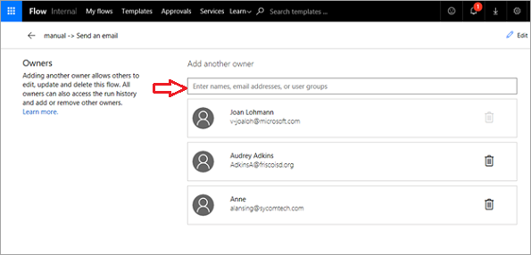
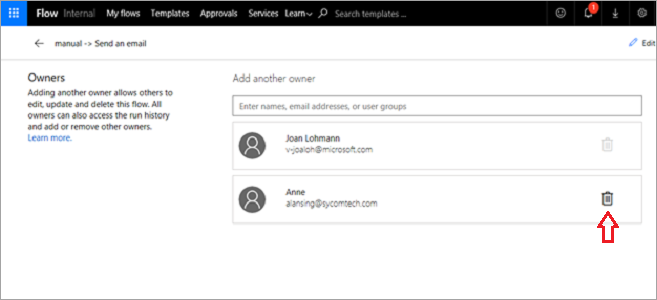

<properties
   pageTitle="Create a button flow | Microsoft Flow"
   description="Create a button flow and team flow for Contoso Flooring."
   services=""
   suite="flow"
   documentationCenter="na"
   authors="v-joaloh"
   manager="anneta"
   editor=""
   tags=""
   featuredVideoId="kZs7lqgp4LU"
   courseDuration="5m"/>

<tags
   ms.service="flow"
   ms.devlang="na"
   ms.topic="get-started-article"
   ms.tgt_pltfrm="na"
   ms.workload="na"
   ms.date="06/08/2017"
   ms.author="v-joaloh"/>

# Create a button flow #

Welcome to the Guided Learning session where you will learn how to **build a flow** for the Contoso Flooring Company. This is the first flow for the company to use in their working environment.

First, go to the flow website and sign into the [ Microsoft Flow website.](https://ms.flow.microsoft.com/en-us/)

Once you are done with the sign-in, click on **My Flows**, and then **Create from blank**.

The first thing  you'll need is a **trigger**. The **button flow** is a convenient one to use. If it's not there in your list, simply search for **button**, in the top field, and it will pop up for you. Select **Flow button for mobile**.

 

The button flow when pressed, will **manually trigger** a flow.
So, press on it...

and you can enter **input text**.

Make the input title say **Delivery Arrived**,

add a **New step**, 

and in the new step, **add an action**. 

If you didn't have it pre-populated, just **search outlook**, and there it is.

The action that you want to use is **send an email**.

When the **button is pressed**, an email is sent to the **whole Contoso Warehouse team**, no matter where they are in the building, letting them know that the delivery has arrived.

Go ahead and expand the fields and customize this to work for Contoso flooring.

In the To field, type the Contoso Warehouse distribution list, **Warehouse@Contoso.com**.

Make the subject of the email say, **Delivery Arrived**. 

To the right, notice a **dynamic content** box popped up. To show, in the Subject line, the exact date and time the **button was pressed**, click **Date** and **Timestamp**. 

Now, type a simple **Body** of the email saying something like, **Warehouse Team, please come to the unload bay as todays delivery has arrived**.

Press **Create flow**, to send the email.

## Create a team flow ##

You can use this button Flow as an example of how to create a team flow. What if the creator of this flow is out sick? What if she leaves the company? You want to make sure that this flow keeps running. To do that -- add co-owners!

Click the **team icon** on your flow to add a co-owner.

 

Enter names, email addresses, or user groups to add co-owners.

To **remove co-owners** click the trash can where  their name is shown.

And verify you want to **Remove this owner**.

## Summary ##

In this lesson, you've seen how to **create a button flow**. 

In minutes, the flow gave a warehouse worker the ability to **alert her team** to a **delivery arrival**, so that the team didn’t have to stand around and wait, wasting valuable time they could spend on other tasks. 

The worker then shared that button out to her team, so others could trigger the same flow if she wasn’t around.

## Next lesson ##

Check out the next lesson to see how to create a flow that uses **push notifications**. 