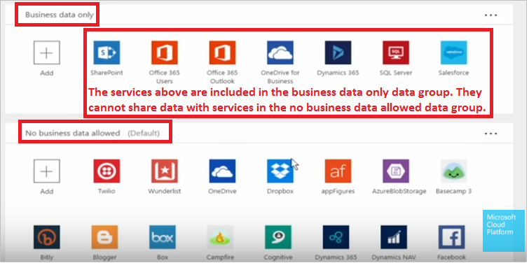
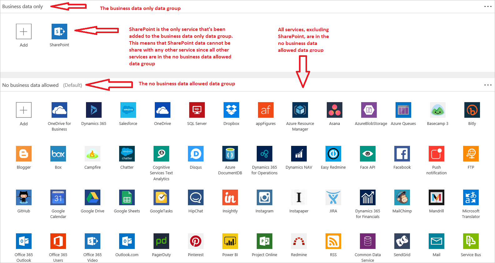

<properties
   pageTitle="Data loss prevention policies | Microsoft Flow"
   description="Learn about data loss prevention polices in Microsoft Flow"
   services=""
   suite="flow"
   documentationCenter="na"
   authors="msftman"
   manager="anneta"
   editor=""
   tags=""
   featuredVideoId="vls4RPVP5xE"
   courseDuration="5m"/>

<tags
   ms.service="flow"
   ms.devlang="na"
   ms.topic="get-started-article"
   ms.tgt_pltfrm="na"
   ms.workload="na"
   ms.date="11/24/2016"
   ms.author="deonhe"/>

# All about Data loss prevention (DLP) policies

With an expanding list of [services](https://flow.microsoft.com/services) available to build workflows with [Microsoft Flow](https://flow.microsoft.com), you may need to safeguard sensitive or critical business data stored in enterprise services such as SharePoint or Salesforce. You may find that your organization needs to create a policy which ensures that sensitive business data isn't published to consumer services like Twitter and Facebook. With Microsoft Flow, you can easily create **data loss prevention** (DLP) policies to tightly control which consumer services your business data can be shared with when your users create flows.  

## Terms you should get familiar with
Term|Description
-----|-----
**DLP** |This is an abbreviation for data loss prevention. You'll create a DLP policy to manage the sharing of data between **services**.|
**Services**|[Services](https://flow.microsoft.com/services) are applications such as Salesforce, SharePoint and Twitter. These services, and lots more, are used to create flows.
**Data group**|A logical grouping of services. You put services that are allowed to share data in the same data group. There are two data groups: **business data only** and the **no business data allowed** data group.
**Environment**|A DLP is applied to an [environment](../environments-overview-admin.md). An environment contains users.
**Users**|Users are members of your organization to whom a DLP policy will apply, based on their membership in an environment. 
**Flow**|A [flow](./learning-introducing-flow.md) is a workflow app that uses any combination of the available services.

## All about how DLP policies work

A DLP policy is simply a named rule that places each service into one of two mutually exclusive data groups. This rule is then applied to an environment. An environment is a logical grouping of users. Users are not allowed to create flows that share data between the services you placed in the different data groups. In other words, your users can only create flows that share data between the services within a **single** data group. No cross-data-group sharing is allowed.  

|**Data group name**|**Description of data group**|
|-----|-----|
|**Business data only**|All services in this group can share data among themselves. They cannot share data with the no business data allowed data group.|
|**No Business data allowed**|All services in this group can share data among themselves. They cannot share data with the business data only data group.|

**Note**: Adding a service to one data group automatically removes it from the other data group. For example, if Twitter is currently located in the **business data only** data group, and you don't want to allow business data to be shared with Twitter, simply add the Twitter service to the **no business data allowed** data group. This will remove Twitter from the business data only data group.
  
## Here's what you need to create a DLP

- Access to the Flow [admin center](https://admin.flow.microsoft.com)  
- An account with the environment admin role  
- An environment with users assigned to it  

## Create a DLP policy
Here's a quick overview of how to create a DLP policy:  

1. Give the policy a name
2. Select the environment to which the policy will apply
3. Add the services to one of the two data groups. Remember, only services located in a specific group can share data so any flow that's created to share data between services located in the two data groups will be automatically blocked when the maker saves it.  

There is also a more [detailed walk-through](../prevent-data-loss.md) on DLP policies available.  

## Examples

- If you were to create a policy that restricts flows to share business data only among SharePoint, Office 365 users, Office 365 Outlook, OneDrive for Business, Dynamics 365, SQL Server and Salesforce, it would look like this:  
  
- Here's what it would look like if you decided to create a policy to not allow any members of a specific environment to create a flow that shares SharePoint data. Notice that SharePoint is the only service in the **business data only** data group:  
  

## Next steps  
- [Learning - Flow parts](./learning-flow-parts.md)
- [Learning - Introduction to Flow](./learning-introducing-flow.md)

