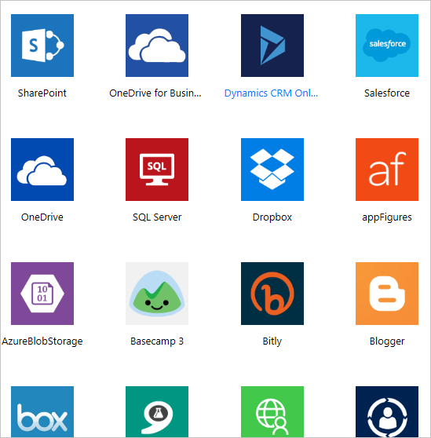
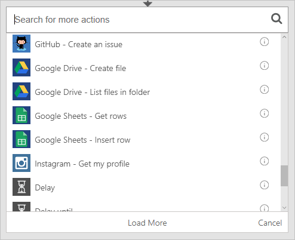

<properties
   pageTitle="Building blocks of Flow | Microsoft Flow"
   description="See the different parts of Microsoft Flow and how they relate"
   services=""
   suite="flow"
   documentationCenter="na"
   authors="camsoper"
   manager="anneta"
   editor=""
   tags=""
   featuredVideoId=""
   courseDuration="5m"/>

<tags
   ms.service="flow"
   ms.devlang="na"
   ms.topic="get-started-article"
   ms.tgt_pltfrm="na"
   ms.workload="na"
   ms.date="10/24/2016"
   ms.author="casoper"/>

# Building blocks of Microsoft Flow

We've seen how to start creating a flow using templates or from a blank flow. Now we're going to provide a little more detail on the building blocks of a flow. Microsoft Flow has several building blocks that work together in certain ways, much like a flowchart.

- **Connectors** are sources and destinations of data in a flow.
- **Triggers** are events that start a flow.
- **Actions** are tasks accomplished by the flow.
- **Conditions** allow for branching if/then logic in a flow.
- **Loops** are for iterating over actions more than once.

We don't expect you to take a ton of time just to learn what Microsoft Flow _is_, but we think it's helpful to flesh things out a bit more.

## Services

Microsoft flow can connect to many different **applications and services**.  Some example services are **Twitter**, **Github**, **Office 365**, and **Google Docs**.  These are the **sources** that provide data to Microsoft Flow as well as providing **destinations** for the work done by Microsoft Flow.  You can view the entire list of services by clicking the **Services** link at the top of **flow.microsoft.com**.

## Triggers

Every flow starts with a **trigger**.  There are many different types of triggers.  Some of them are events in your connected web services, such as **when a certain user sends a tweet** or **a file is saved to your Dropbox account**.  Other triggers are built-in, such as **running a flow on a recurring schedule** or **running a flow in response to a web request**.  Finally, there are manual triggers, such as launching a flow by clicking a **button in Microsoft Flow or Microsoft PowerApps**.  Triggers often **pass information about the event that happened** to actions in your flow.

  

## Actions

An **action** represents what you want to actually **happen** after the flow is triggered.  This might be a **notification**, **copying data or files** from a source to a destination, or some other action, like **posting to social media** or **delaying for a period of time**.  You can also use actions to **retrieve data from a service** to use with other actions.

 

## Conditions

**Conditions** allow you to add decision making to your flow.  When a condition is evaluated, the flow branches into a **yes** path and a **no** path.   For example, If you wanted to copy your vacation photos posted to **Dropbox** to **OneDrive**, you might create a condition after a **Dropbox new file** trigger that checks to see if the file name contains the word *vacation*, and if it does, copy the file to **OneDrive**, but otherwise chooses to do nothing.

 

## Loops

**Loops** allow you to execute an action more than once, like if an action needs to occur repeatedly, or once per item in a collection of items.

## Next Steps

In this topic, we took a look at the components that make a flow.  We build flows by connecting to apps and services, **triggers** to launch the flow, **actions** to make something happen in the flow, **conditions** to make decisions, and **loops** to iterate in a flow.  Next, we'll review what we've learned so far in this Guided Learning course.

