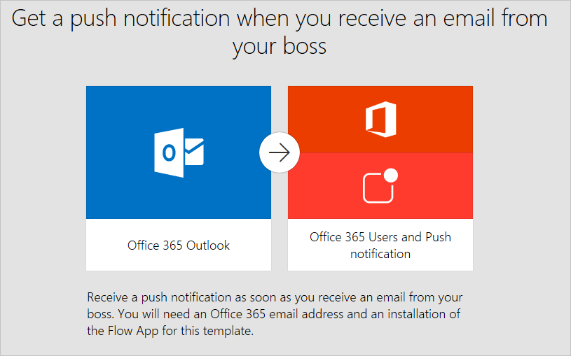

<properties
   pageTitle="Getting Notifications with Microsoft Flow | Microsoft Flow"
   description="Learn how to get notifications on your mobile device with Microsoft Flow."
   services=""
   suite="flow"
   documentationCenter="na"
   authors="camsoper"
   manager="anneta"
   editor=""
   tags=""
   featuredVideoId=""
   courseDuration="5m"/>

<tags
   ms.service="flow"
   ms.devlang="na"
   ms.topic="get-started-article"
   ms.tgt_pltfrm="na"
   ms.workload="na"
   ms.date="11/15/2016"
   ms.author="casoper"/>

# Getting notifications

A common use of **Microsoft Flow** is to get a **notification** when something happens.  Notifications can be **emails**, **text messages**, or **push notifications on your phone**.

## Push notifications

It's easy to create a flow that sends push notifications to your **mobile device**.  You can **use a template**, like in the video above, or you can use the *Send a push notification* **action** when creating a flow **from scratch**.  You can include **dynamic content** from other actions or triggers.

## Next steps

Next we'll look at using Microsoft Flow to **copy files**.