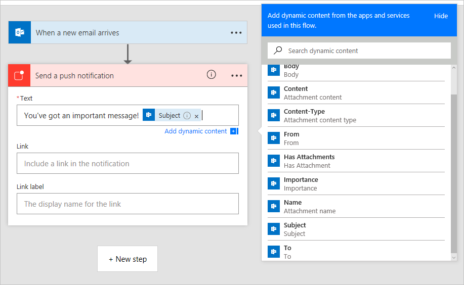

<properties
   pageTitle="Getting Notifications with Microsoft Flow | Microsoft Flow"
   description="Learn how to get notifications on your mobile device with Microsoft Flow."
   services=""
   suite="flow"
   documentationCenter="na"
   authors="msftman"
   manager="anneta"
   editor=""
   tags=""
   featuredVideoId="VEHKGLY0hq4"
   courseDuration="6m"/>

<tags
   ms.service="flow"
   ms.devlang="na"
   ms.topic="get-started-article"
   ms.tgt_pltfrm="na"
   ms.workload="na"
   ms.date="11/22/2016"
   ms.author="deonhe"/>

# Getting notifications

A common use of **Microsoft Flow** is to get a **notification** when something happens.  Notifications can be **emails**, **text messages**, or **push notifications on your phone**.

## Required app

It's easy to create a flow that sends push notifications to your **mobile device**.  You can create the flow in the **mobile app** or on the **flow.microsoft.com** web app, but you'll need the **mobile app** to receive push notifications. The Microsoft Flow mobile app is available for [Android](https://aka.ms/flowmobiledocsandroid), [iOS](https://aka.ms/flowmobiledocsios), or [Windows Phone](https://aka.ms/flowmobilewindows).

If you are using an unsupported mobile device, consider using **SMS messages** (texts) to receive notifications instead of push notifications.

## Creating flows that send notifications

You can **use a template**, like in the video above, or you can use the *Send a push notification* **action** when creating a flow **from scratch**.  You can include **dynamic content** from other actions or triggers.

## Next lesson

Now that you've seen how to **receive notifications**, let's look at using Microsoft Flow to **copy files**.