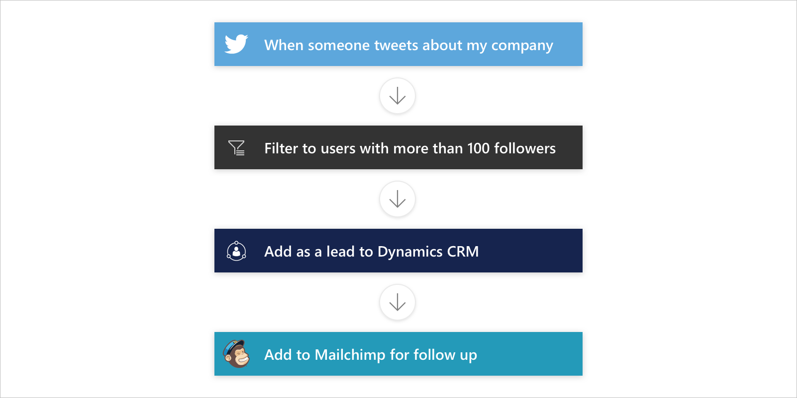
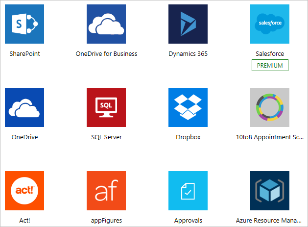
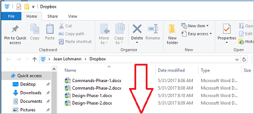
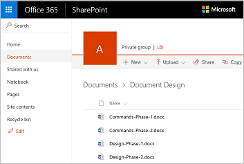
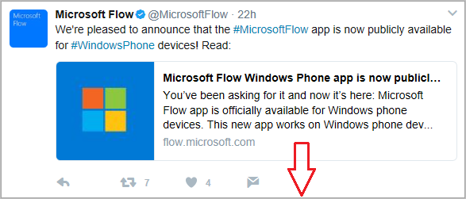
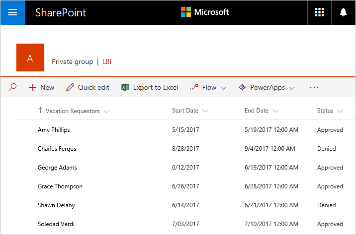
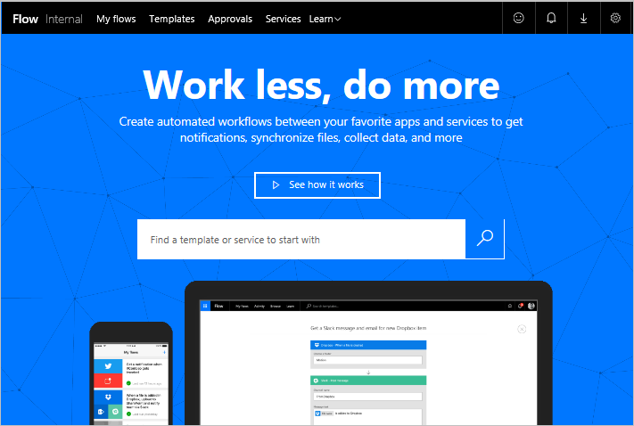
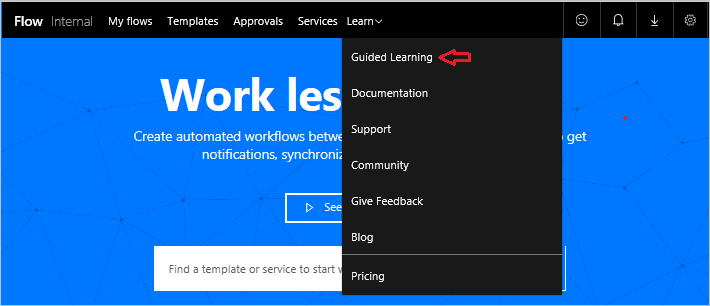
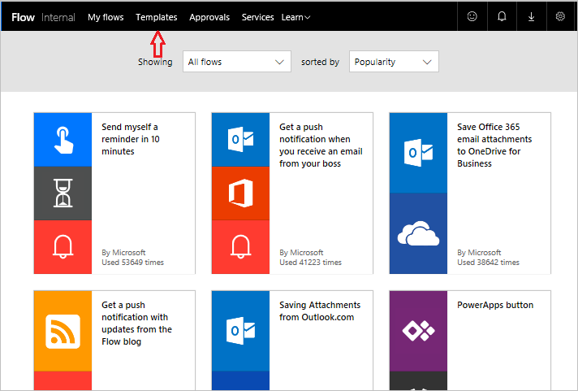

<properties
   pageTitle="Introduction to Microsoft Flow | Microsoft Flow"
   description="Understand what Microsoft Flow is and what you can do with it."
   services=""
   suite="flow"
   documentationCenter="na"
   authors="msftman"
   manager="anneta"
   editor=""
   tags=""
   featuredVideoId="CYR-fZc5Maw"
   courseDuration="14m"/>

<tags
   ms.service="flow"
   ms.devlang="na"
   ms.topic="get-started-article"
   ms.tgt_pltfrm="na"
   ms.workload="na"
   ms.date="08/15/2017"
   ms.author="deonhe"/>

# Introduction to Microsoft Flow #
Welcome to Guided Learning for Microsoft Flow. This **self-paced online course** explains Microsoft Flow in a sequential way so that you can build your knowledge from the ground up. The course is designed to provide **guidance in understandable chunks** with lots of **visuals and examples**, following a logical progression to help you learn principles and details.

In this course, you'll learn about Microsoft Flow and its concepts, see how to **build flows**, **manage them**, and **administer them** in your environment. You'll be presented with information and scenarios for a fictional company called Contoso Flooring, but you'll see how to use the same scenarios in your business or your clients' businesses.

If you're a beginner with Microsoft Flow, this course will get you going. If you already have some experience, this course will tie concepts together and fill in the gaps. This course is a work in progress, so **please let us know how we're doing** and what other topics you want to see in this course.

## What is Microsoft Flow? ##
Microsoft Flow is an online **workflow service** that enables you to work smarter and more efficiently by **automating workflows** across the most common apps and services. For example, you can create a flow that adds a lead to **Dynamics 365** and a record in **MailChimp** whenever someone with more than 100 followers tweets about your company.

When you sign up, you can **connect to more than 100 services** and **manage data in either the cloud or on-premises sources** such as SharePoint and SQL Server. The list of applications and services that you can use with Microsoft Flow grows constantly.

## What can you do with Microsoft Flow? ##
You can use Microsoft Flow to **automate workflows** between your favorite **applications and services**, synchronize files, get notifications, collect data, and more. 

For example, you can **automate** these tasks:

- Instantly respond to high-priority notifications or emails.
- Capture, track, and follow up with new sales leads.
- Copy files from one service to another.
- Collect data about your business, and share that information with your team.
- Automate approval workflows.

A common use of Microsoft Flow is to **receive notifications**. For example, you can instantly receive an email or a push notification on your phone whenever a sales lead is added to Dynamics 365 or Salesforce.

You can also **use Microsoft Flow to copy files**. For example, you can ensure that any file that's added to Dropbox gets **automatically copied** to SharePoint where your team can find it.

 

 

You can **monitor what people are saying** about your business by creating a flow that runs whenever **someone sends a tweet** with a certain hashtag. The flow could put details about that tweet into a SQL Server database, a SharePoint list, or even an Excel file hosted on OneDrive--whichever service works for you. With the data that you collect, you can create actions to connect it to Power BI, spot trends, and ask questions about the data.

And finally, **you can automate approval loops** for, as an example, vacation requests in a SharePoint list.

For more ideas, **browse our list of templates**, which help you build flows in just a few steps. For example, you can easily build flows to **send yourself weather forecasts**, reminders at regular intervals, or phone notifications whenever your manager sends you mail.

Got an idea for a flow that you don't see in the list? Create your own from scratch and, if you want, share it with the community!

## Where can I create and administer a flow? ##

You can create a flow and perform administrative tasks **in a browser** or **on your phone** - if you download the mobile app for Microsoft Flow.

  

You can perform these tasks, among others:
- Turn flows on or off from wherever you are.
- See when a flow has failed.
- Review detailed run-history reports.
- View and filter runs by notification type.

## A brief tour of Microsoft Flow ##
Let's jump into the tool, and we'll show you around. We have tons of information for you to learn about how to use Microsoft Flow.

On the home page, there are menus for:

- **My flows**, where your flows live.
- **Templates**, which is a great place to start.
- **Approvals**, where you can automate and streamline your approval process.
- **Connectors** (formerly **Services**), where you can connect from one service to another.
- **Learn**, where you can gain information that will help you ramp up quickly on Microsoft Flow.

For now, let's focus on **Learn**, which contains:
- **Guided Learning** can walk you through using Microsoft Flow, all the way from beginning techniques to advanced scenarios.
- **Documentation** is where our advanced topics live. If you want to really understand a feature or a function, you can do a deep dive here to figure things out.
- **Support** is a great landing place to find help.
- **Community** is a place to plug into and find out how other people use Microsoft Flow.
- **Give feedback** taps into a community of power users, where you can **send comments and questions** to developers and other users.
- **Blog** keeps you up to date on the most recent developments and releases in the Microsoft Flow ecosystem.
- **Pricing** can help you choose the right plan for you or your business.

On the **Templates** page, you can have a look at some of the most popular templates, which should give you great ideas for flows you want to try.

## Next lesson ##
Now that you've gotten a taste of what Microsoft Flow is and what it can do, let's take a look at what makes a flow.
