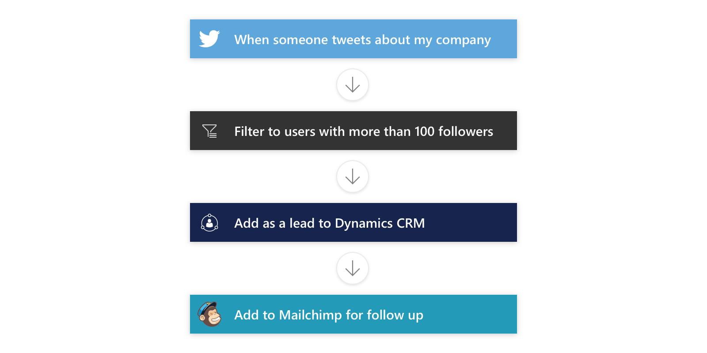

<properties
   pageTitle="Introduction to Microsoft Flow | Microsoft Flow"
   description="Understand what Microsoft Flow is and what you can do with it."
   services=""
   suite="flow"
   documentationCenter="na"
   authors="msftman"
   manager="anneta"
   editor=""
   tags=""
   featuredVideoId="kZs7lqgp4LU"
   courseDuration="5m"/>

<tags
   ms.service="flow"
   ms.devlang="na"
   ms.topic="get-started-article"
   ms.tgt_pltfrm="na"
   ms.workload="na"
   ms.date="11/22/2016"
   ms.author="deonhe"/>

# Guided Learning for Microsoft Flow

Welcome to **Guided Learning** for Microsoft Flow. This self-paced online course explains Microsoft Flow in a sequential way, so you can build your knowledge from the ground up.

This  **Guided Learning**  course currently has a Getting Started section, and we will add content over the next few weeks. The course is designed to provide guidance in understandable chunks, with a logical flow that helps you learn concepts, details, and examples. It includes lots of visuals to help you learn, too.

If you're a **beginner** with Microsoft Flow, this course will get you going, and if you're a Microsoft Flow **veteran** this course will tie concepts together, and fill in the gaps. We hope you enjoy the course, and look forward to including more content in the future.

This Guided Learning course is an ongoing **work in progress**.  Please **let us know** how we're doing, and **other topics you want to see** in this course.

## What is Microsoft Flow?

Microsoft Flow is an online **workflow service** that enables you to work smarter and more efficiently by automating workflows across the most common apps and services.  Microsoft Flow can connect to over one hundred services all ready to use when you sign up. Microsoft Flow also has a mobile application that helps you track your workflows on the go, administration experiences for use in the enterprise, and you can even embed Microsoft Flow into your own applications.

In this course, we'll introduce Microsoft Flow and its concepts, show you how you can build flows, manage them, and, as an administrator, control them in your environment. We'll be presenting information and scenarios for use at a made up company called the Contoso Flooring Company.  We'll do this to show you how the senarios we are building could be useful in your business or in your client's businesses.

Microsoft Flow isn't limited to **applications on the internet**.  You can include **on-premise data** in your flows, too, like from SharePoint and SQL Server.

## What you can do with Microsoft Flow

 You can use Microsoft Flow to create **automated workflows** between your favorite applications and services, to synchronize files, get notifications, collect data, and more.  The [list of applications and services you can use with Microsoft Flow](https://flow.microsoft.com/services/) is constantly expanding.  Some examples of tasks you can automate with Microsoft Flow are:

- Instantaneously receive and respond to critical notifications or emails.
- Capture, track, and follow-up with new sales leads.
- Copy files from one service to another.
- Collect data about your business and inform your team.
- Automate approvals.

A common use of Microsoft Flow is to **receive notifications**. For example, whenever a sales lead is added in Dynamics 365 or Sales Force, you can instantly receive an email about the lead, or receive a push notification to the mobile app on your phone. A great way to follow-up with **new sales leads**.

You can also use Microsoft Flow to copy files. For example, whenever a file is added to a folder in DropBox, you can automatically copy it to a folder in SharePoint to **inform your team** when the file is there.

If you want to see what people are saying about your business, you can **create a flow** that will **trigger** whenever a Tweet with a certain hashtag is posted. The flow will copy those Tweet details, put them into a SQL database, a SharePoint list, or even an Excel file hosted on OneDrive. Whichever works for you. With the data you collected, you can create **actions** to connect it to Power BI, spot trends, and ask questions about the data.

And finally, one of the most popular ways that people use Flow is to **automate approvals**. For example, if you are using a SharePoint list to track approvals in your company, you could trigger an approval work flow.

For more ideas, browse our list of **templates** on the **Template Landing** page (we'll talk more on that in the next section). Got a great idea for a flow you don't see in that list?  No problem!  You can create your own from scratch and, if you want, share it with the community!

## Creating and administering flows
To create and administer flows, you can use the web app, or the Microsoft Flow mobile app for [Android](https://aka.ms/flowmobiledocsandroid), [iOS](https://aka.ms/flowmobiledocsios), or [Windows Phone](https://aka.ms/flowmobilewindows). Whichever platform you choose, it’s easy to diagnose issues, synchronize data, and more:
- Turn flows on or off from wherever you are.
- See when a flow has failed.
- Review detailed run history reports.
- View and filter runs by notification type.

## Next lesson

Now that you've gotten a taste of what Microsoft Flow is and what it can do, let's take a look at what makes a flow.
