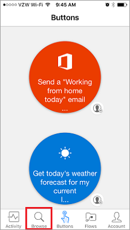
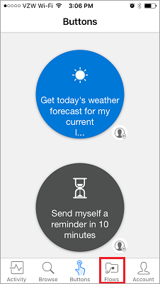
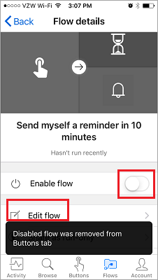

<properties
   pageTitle="Microsoft Flow Mobile App | Microsoft Flow"
   description="How to use the Microsoft Flow mobile app to create and manage flows."
   services=""
   suite="flow"
   documentationCenter="na"
   authors="v-joaloh"
   manager="anneta"
   editor=""
   tags=""
   featuredVideoId="kZs7lqgp4LU"
   courseDuration="5m"/>

<tags
   ms.service="flow"
   ms.devlang="na"
   ms.topic="get-started-article"
   ms.tgt_pltfrm="na"
   ms.workload="na"
   ms.date="06/07/2017"
   ms.author="v-joaloh"/>

# Microsoft Flow Mobile app #

In this lesson, you will be covering the Microsoft Flow Mobile App and its capabilities. From the mobile app, you can access these features: **Activity Feed**, **Browsing**, **Buttons**, and **Managing Flows**.

First, you’ll need to **download** and **install** the Microsoft Flow App from your app store.

Once it's installed, **open it** and **sign in**.

When you open the app, you land on the **Activity Feed**.

The Activity Feed is the spot to see what’s happening with your flows, **while you are on the go** and may not have **access to your computer** for a full experience.

For instance, if you click any of these flows, you can **get a closer look** at that flows **last activity**, whether it succeeded or failed to run, and if it failed, which step it failed on.

As you can see, this flow succeeded in both steps.

From here, go ahead and click the **Buttons** icon.

## How Flows are Kicked Off ##
   
   Buttons are flows that are started with a manual action. One popular button is **Send a "Working from home today" email to your manager**.
   You could use this one if you live far away and on days when the traffic is a mess!

Use the **Browse** button to check out templates for **more button flows** to add to your collection.

To see how that works, choose the **Send myself a reminder in 10 minutes** button flow.
 

On the Create flow screen, tap **Use this template**,

and then tap **Create**.

The flow is **saved**, **created**,

and here it is in **your collection**. 

Here it is in **your buttons**. 

You can go ahead and tap it, and in 10 minutes, you'll **get a reminder**.

It's simple to **add additional buttons** to your collection.

## Modify or delete a flow ##

If you decide that you want to modify or delete one of your flows, it's easy.

Tap the **Flows** button, which is essentially the **mobile management area** for your flows.

Now, tap this flow as you **don’t really want this one anymore**, and you see that there are a few options.

To enable or disable the flow, **tap the Enable flow** toggle switch.

You can always **edit the flow**, in case you want to **make it useful** to yourself again. 

And you can see the **run history** of the flow, to get an idea of its **successful and unsuccessful** runs.

You can also delete it by tapping the **Delete flow** button.

 Here, you see the **flow has been deleted**.

## Next Lesson ##

The next lesson covers **how to create a button flow** for a team. 