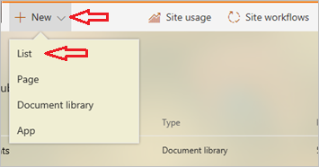
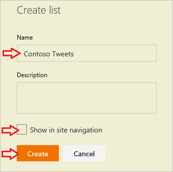
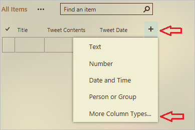
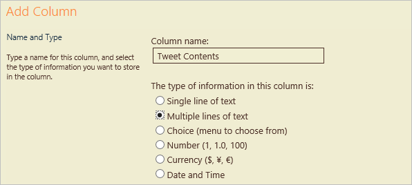
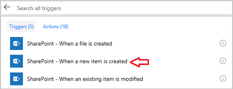
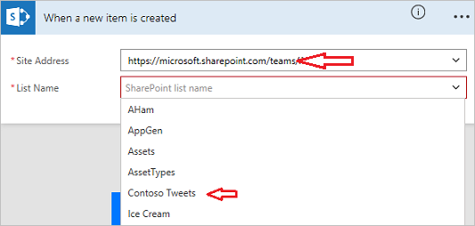
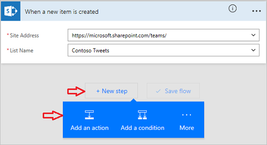
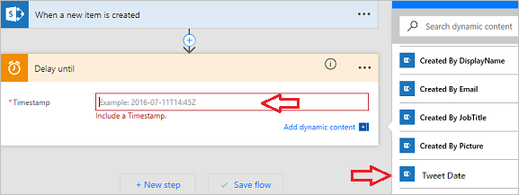
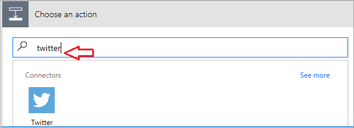
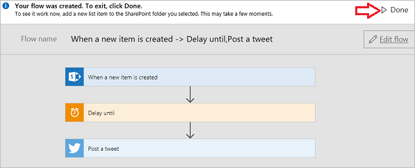

<properties
   pageTitle="Push notifications in Microsoft Flow | Microsoft Flow"
   description="Create push notifications from SharePoint to Twitter using Microsoft Flow."
   services=""
   suite="flow"
   documentationCenter="na"
   authors="v-joaloh"
   manager="anneta"
   editor=""
   tags=""
   featuredVideoId="kZs7lqgp4LU"
   courseDuration="5m"/>

<tags
   ms.service="flow"
   ms.devlang="na"
   ms.topic="get-started-article"
   ms.tgt_pltfrm="na"
   ms.workload="na"
   ms.date="06/20/2016"
   ms.author="v-joaloh"/>

# Create push notifications in Microsoft Flow #

This session of **Guided Learning** for Microsoft Flow will teach you how to create push notifications. For this flow, you'll build a **SharePoint** list where the Marketing team for **Contoso Flooring** will store their **Twitter posts** and posting dates. From there, you will build a flow that will auto-Tweet the content for them. 

Use the [SharePoint service](https://flow.microsoft.com/services/) to build a list for Contoso.

## Build a SharePoint list ##

The first thing you need to do is create a new SharePoint list. 

Select **New** and **List**.

Go ahead and name it **Contoso Tweets**. 

Clear the **Show in site navigation** check box, and press **Create**.
 

When you press Create, SharePoint drops you into your new list.

By default you are given **one column with title**.

Add another column and name it **Tweet Contents**. The things that you’ll say in the tweets will go here. 

Press the plus sign and move down to **More Column Types...**

There, check **Multiple lines of text**. 

Add a column for the tweet **Date and Time**, and name it **Tweet Date**.

Do the same here as with Tweet Contents above...
Press the plus sign and move down to **More Column Types...**

**Important!** Scroll down to Date and Time Format:, you want to select **Date & Time**, so both are included.

And then, when you click **OK**, you see the **Contoso Tweets** list in your SharePoint site. Here you can add new items or edit the list.

## Now build the flow ##

Your list is built, so go ahead and build the flow.

In Microsoft Flow, go to **My Flows**, and press **Create from blank**.

Make the trigger a SharePoint list – click the **SharePoint connector**.

If its not there in your list, type **SharePoint** to bring up the connector.

## Choose a trigger ##
In the list, select **SharePoint - When a new item is created**. 

We want our trigger to be that when a **new row is added**, with Tweet content, the **flow checks for it** automatically.

Pick your SharePoint site -- If it **won’t load**  for you --  **type a part** of the address, and click OK. You can see the list that you set up earlier, Contoso Tweets.

Okay, that’s it – the **trigger is done**.

 ## Choose a new action ##

Now, **add a new step**, and **Add an action**, 

and click, **Delay until**. You'll see, it lives under the Schedule service, and the action itself is called Delay until.

  

When the dynamic content pops up, scroll down to the bottom, and you see that there are the three columns you set up in the list, Title,  Tweet Date, and Tweet Content. Use the dynamic content of **Tweet Date** for the **Delay until** schedule. 

Now, when someone **adds something** to my SharePoint list, it will **delay any action** until the Date and Time you set in the **Tweet Date** column.

 

Add **another action** for the flow to take, **at the date and time** you have it delayed until.

 

Now, you'll add a final step which will use the Twitter service and choose the action, **Twitter - Post a tweet**.

 
Open the dynamic content again, and select **Tweet Content**. 

Now, here's the sequence you have created. 

When a **new item is created** in our SharePoint list, you will **delay it until** the pre-set date, and once that date is met, you'll **post it** with the Tweet Content column that you previously set up.

Now go ahead and select **Create flow...**

**Need a grapahic here of Create flow**

and the flow is done.

## Next lesson ##

In the next lesson, you'll learn how to add an Approval to this process to make it so your whole team can power the company Twitter, while still making sure all tweets are on-brand, and on-voice for your company.