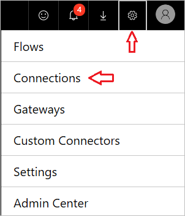
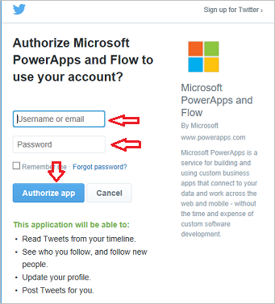
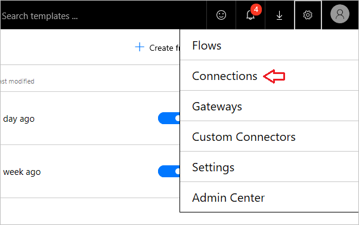
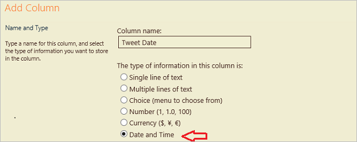
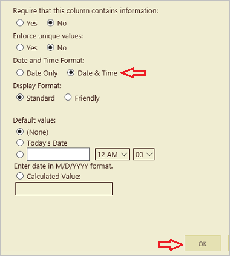
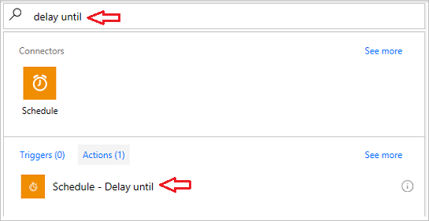
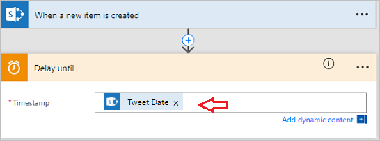
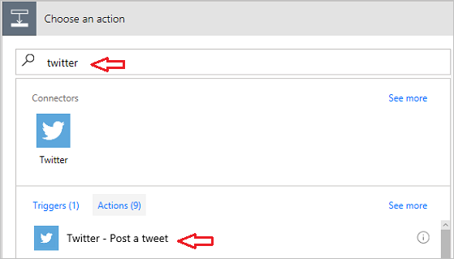
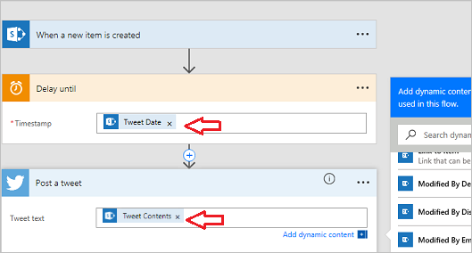
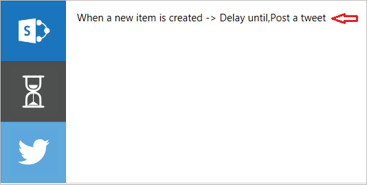

<properties
   pageTitle="Push notifications in Microsoft Flow | Microsoft Flow"
   description="Create push notifications from SharePoint to Twitter using Microsoft Flow."
   services=""
   suite="flow"
   documentationCenter="na"
   authors="msftman"
   manager="anneta"
   editor=""
   tags=""
   featuredVideoId="y1iDal8XPAo"
   courseDuration="15m"/>

<tags
   ms.service="flow"
   ms.devlang="na"
   ms.topic="get-started-article"
   ms.tgt_pltfrm="na"
   ms.workload="na"
   ms.date="08/16/2017"
   ms.author="deonhe"/>

# Create Push Notifications in Microsoft Flow #

This topic teaches you how to create push notifications. For this flow, you'll build a **SharePoint** list where the Marketing team for **Contoso Flooring** stores their **Twitter posts** and posting dates. From there, you will build a flow that will auto-Tweet the content for them. 

## Connect Microsoft Flow Services

In this topic, you'll be using the **SharePoint** and **Twitter** services. If you are using a service that's new to you, then you'll first need to connect to the new service. 

1. In Microsoft Flow, select the **gear icon**, then **Connections**,

     

1. Select **+ Create connection**.

     

1. Scroll down the list, find Twitter, and select **+**.

    

1. To authorize a Twitter account, enter your username or email, and your password, and then select **Authorize app**.

    

1. To check your connections,  select the **gear icon** and **Connections**.

    

    You should see your new Twitter connection and any other connections you have created. 

    

## Build a SharePoint List ##

The first thing you need to do is create a new SharePoint Online list for Contoso Flooring. 

1. In SharePoint Online, select **New**, and then **List**.

    

1. Name the list **Contoso Tweets**. 

1. Clear the **Show in site navigation** check box, and select **Create**.
 
    

    When you select **Create**, SharePoint takes you to your new list.

1. By default, the list has a single column - **Title**. Add another column and name it **Tweet Contents**. The things that you’ll say in your tweets will go here. 

    1. Select the plus sign, then select **More...**

        

    1. Select **Multiple lines of text**, then select **OK**.

        

1. Add a column for the tweet date and time, and name it **Tweet Date**.

    1. As with **Tweet Contents** above, select the plus sign, then select **More...**

        

    1. Scroll down to **Date and Time Format**. Select **Date & Time**, so that both are included.

        

    1. Select **OK**. You see the **Contoso Tweets** list in your SharePoint site, and you can add new items to the list.

## Build the flow ##

Your list is built, so now you can build the flow.

### Choose a trigger ###

1. In Microsoft Flow, go to **My Flows**, then select **Create from blank**.

    

1. Select **When an item is created**.

    

    We want our trigger to fire when a new row is added with tweet content.

1. Select your SharePoint site, then select the list that you set up earlier, **Contoso Tweets**.

    

Okay, that’s it for the trigger.

### Add an action to delay posting ###

1. Select **+ New step**, then select **Add an action**. 

    

1. Under the **Schedule** service, select **Delay until**. 

      

1. Set the delay value.

    1. Click or tap in the **Timestamp** field. 

    1. When the dynamic content box opens, scroll down to the bottom, and you see the three columns from the SharePoint list: **Title**,  **Tweet Date**, and **Tweet Content**.

    1. Select **Tweet Date**. 

        

        Now, when someone adds something to your SharePoint list, it will delay any action until the date and time you set in the **Tweet Date** column.

        

### Add an action to post a Tweet ### 

Now you'll add another action for the flow to take at the date and time specified in the **Tweet Date** column.

1. Select **+ New step**, **Add an action**, then search for **Twitter**.

     

1. Choose the action, **Twitter - Post a tweet**.

     

1. Click or tap in the **Tweet text** field, and in the dynamic content box, select **Tweet Contents**. Here's the sequence you have created. 

    

1. Select **Create flow...**

     

1. Select **Done**.

    

    Now the flow is complete.

    

    When a new item is created in your SharePoint list, the flow will delay posting until the pre-set date. When that date is met, the flow will post to Twitter with the text from the **Tweet Content** column in your list.

## Next lesson ##

In the next lesson, you'll learn how to **run flows on a schedule** using a trigger called **Recurrence**.