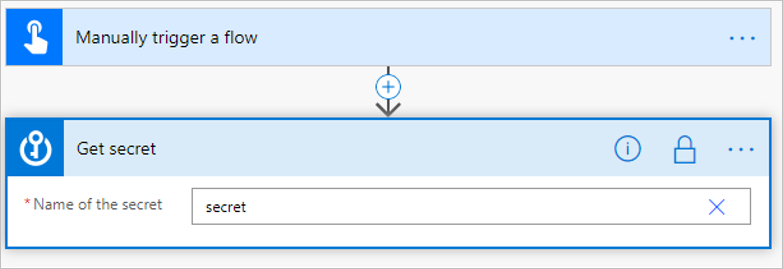
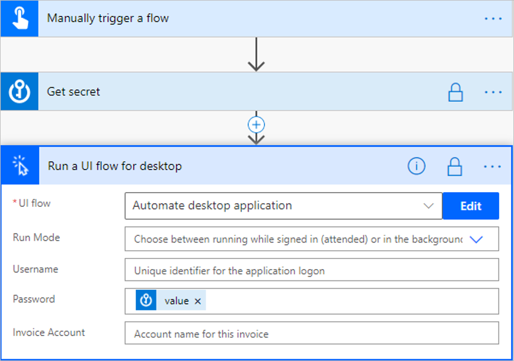

# Manage sensitive input like passwords

Some inputs like passwords need to be obfuscated and omitted from the logs. Power Automate supports inputs called **Sensitive text inputs** for storing these "private" values.

To retrieve sensitive content from another connector, turn on **Secure Inputs** and **Secure Outputs** by following these steps.

1. Select **…** on the top right corner of the action.
1.Select **Settings**.

    

1. Turn on the **Secure Inputs** and **Secure Outputs** properties to prevent these settings from being shown in the logs.

   

1.Select **Done**.

  You will notice that the action now has a lock icon on the top right, indicating special handling for input and output values.

  

      >[!TIP]
      >Follow the same steps to configure inputs as given earlier in this article to pass the output from this connector to a desktop flow, and then turn on **Secure Text** in the **Settings**.

      

[!INCLUDE[footer-include](includes/footer-banner.md)]