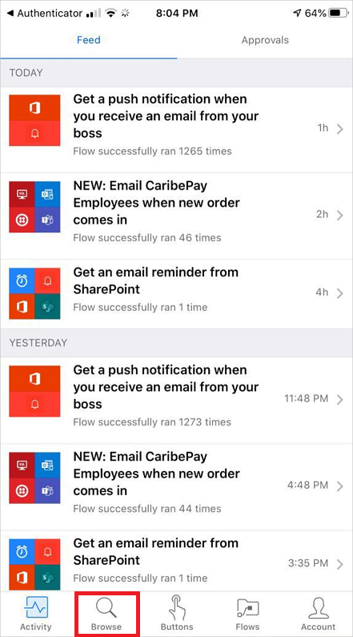
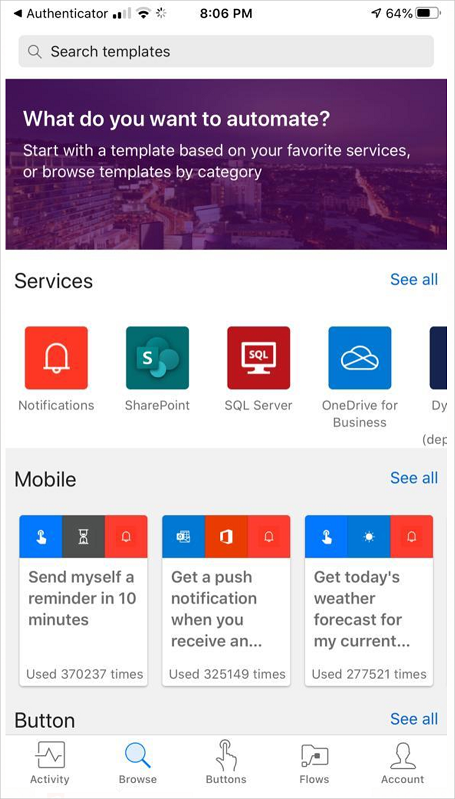
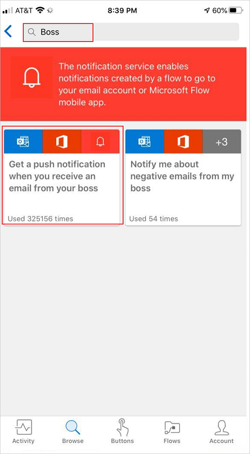
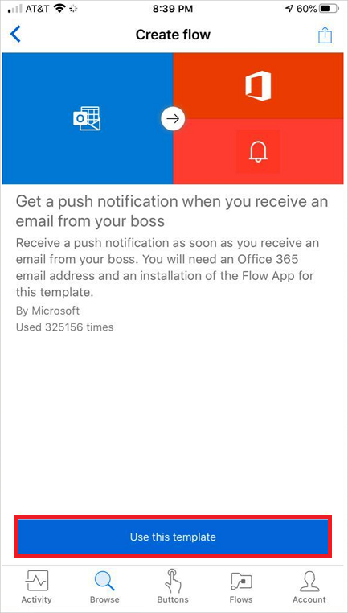
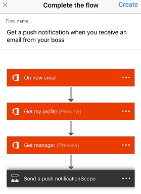

<properties
    pageTitle="Create a flow from your phone | Microsoft Flow"
    description="Create a flow from a template that, for example, sends a push notification when you receive mail from an address that you specify"
    services=""
    suite="flow"
    documentationCenter="na"
    authors="adiregev"
    manager="erikre"
    editor=""
    tags=""/>

<tags
   ms.service="flow"
   ms.devlang="na"
   ms.topic="article"
   ms.tgt_pltfrm="na"
   ms.workload="na"
   ms.date="09/18/2016"
   ms.author="adiregev"/>

# Create a flow from your phone by using Microsoft Flow #
Create a flow from your phone by using a template or starting from scratch. Find a template by searching through a list of services, browsing categories, or specifying keywords. Follow the steps in this topic to create a flow that sends a push notification to your phone when you get mail from your manager.

If you're unfamiliar with Microsoft Flow, [get an overview](getting-started.md).

## Prerequisites ##
- An [account for Microsoft Flow](sign-up-sign-in.md).
- The mobile app for Microsoft Flow installed on a [supported device](getting-started.md#use-the-mobile-app). The graphics in this topic reflect the iPhone version of the app, but they resemble the interface on an Android device.
- To use the template demonstrated in this topic, you'll also need:

	- Office 365 credentials.
	- Push notifications enabled on your phone.

## Find a template ##
1. Open the mobile app, and then tap **Browse** at the bottom of the screen.

	

	You can find a template by following any of these steps:

	- Specify a keyword in the search box at the top of the screen.
	- Tap an option in the list of services.
	- Scroll down to show a variety of categories, and tap a template in any of them.

	    

	For this tutorial, you'll open the template that sends a push notification when you get mail from your manager.

1. In the list of services, tap **See all**.

	

1. Tap the icon for **Push notifications**.

	

1. In the search bar, type **email**, and then tap the template to send a push notification when you receive a message from your manager.

	

1. In the screen that gives details about the template that you've selected, tap **Use this template**.

	

## Finish the flow ##
1. If prompted, tap **Sign in** and provide your credentials for Office 365 Outlook, Office 365 Users, or both.

	

	You can use the same connections when you create other flows.

1. In the upper-right corner, tap **Next**.

	

	The next screen shows the trigger event and all of the resulting actions.

	

	For this template, new mail triggers the flow, which retrieves your information (including your manager's address) and sends you a push notification when you get mail from that address. Some templates require some customization to work properly, but this template doesn't.

1. (optional) Near the top of the screen, type a different name for the flow.

	

1. In the upper-right corner, tap **Create**.

	

	Your flow is created and will check for mail from your manager until you pause or delete the flow.

## Next steps ##
- [Monitor your flow activity](mobile-monitor-activity.md).
- [Manage your flows](mobile-manage-flows.md).
